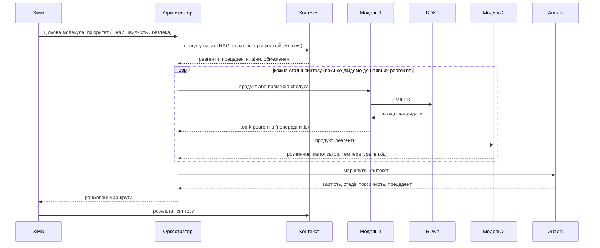

# Звіт про результати

## Довідка

- `ReactionT5` (Sagawa & Kojima, 2025) — T5-модель, попередньо натренована на хімічних даних.
- `SMILES` — текстовий запис структури молекули. Одна молекула може мати кілька рівнозначних записів; `канонічний` запис — єдиний стандартизований варіант, за яким звіряються відповіді.
- `чекпоінт` — стан моделі, збережений на певному етапі тренування.
- `beam search` — алгоритм генерації, що повертає кілька найімовірніших варіантів відповіді замість одного.
- `exact_match` — усі передбачені реагенти повністю збігаються з еталонними.
- `core_exact_match` — те саме без урахування допоміжних речовин (солей, каталізаторів).
- `top-k` — правильна відповідь присутня серед k найкращих варіантів (див. `beam search`).
- `lr` — learning rate, швидкість навчання.
- `eval_loss` (валідаційна втрата) — похибка моделі на валідаційних даних під час тренування; за нею вибирається найкращий чекпоінт.
- `ORD` (Open Reaction Database) — джерело даних для дотренування Моделі 1 (тест — 300 реакцій) і навчання Моделі 2 (тест — 5687 реакцій).
- `USPTO` (USPTO-50K) — дотренування на ній не проводилось, лише незалежний тест на узагальнення (300 реакцій).

## Виконані роботи

1. Порівняно два опубліковані чекпоінти ReactionT5 на обох тестових наборах.
2. Дотреновано ReactionT5 (**Модель 1**) на даних ORD для передбачення реагентів.
3. Навчено t5-small (**Модель 2**) для передбачення умов реакції (розчинник, каталізатор, температура, вихід).
4. Запропоновано схему повноцінної системи синтезу навколо цих моделей (нижче).

## Огляд існуючих рішень

| Чекпоінт | Тест | exact_match | core_exact_match |
|---|---|---|---|
| дотренований авторами на USPTO-50K | USPTO | 85,0% | 85,7% |
| дотренований авторами на USPTO-50K | ORD | 25,7% | 48,0% |
| без дотренування на USPTO (лише хімічне претренування) | USPTO | 16,3% | 38,3% |
| без дотренування на USPTO (лише хімічне претренування) | ORD | **43,7%** | **54,7%** |

На ORD USPTO-дотренований чекпоінт (25,7% exact_match) поступається чекпоінту без USPTO-дотренування (43,7%). Відправна точка для Моделі 1 — другий чекпоінт (43,7% exact_match, 54,7% core_exact_match на ORD).

## Модель 1 — передбачення реагентів

### До дотренування (базовий чекпоінт)

Обсяг тренування: 0 (без дотренування, опублікований чекпоінт).

| Тест | Метрика | top-1 | top-3 | top-5 |
|---|---|---|---|---|
| ORD | exact_match | 43,7% | 67,0% | 71,7% |
| ORD | core_exact_match | 54,7% | 74,3% | 78,0% |
| USPTO | exact_match | 16,3% | — | — |
| USPTO | core_exact_match | 38,3% | — | — |

### 1. Суміш ORD+USPTO, lr=3e-4

Обсяг тренування: 96 736 реакцій (57 000 ORD + 39 736 USPTO), Google Colab T4.

| Тест | Метрика | top-1 | top-3 | top-5 |
|---|---|---|---|---|
| ORD | exact_match | 32,0% | 46,7% | 51,0% |
| ORD | core_exact_match | 43,7% | 57,3% | 62,0% |
| USPTO | exact_match | 54,0% | 69,0% | 74,3% |
| USPTO | core_exact_match | 59,3% | 75,0% | 79,7% |

Точність на ORD нижча за базовий чекпоінт (43,7%→32,0%) — конфлікт конвенцій запису допоміжних речовин між ORD і USPTO; на USPTO, навпаки, дотренування підвищує точність до 54,0%.

### 2. Лише ORD, lr=5e-5 (обрана конфігурація для подальших порівнянь)

Обсяг тренування: 57 000 реакцій ORD, Google Colab T4. Відбір найкращого чекпоінта за валідаційною втратою. Нижчий `lr` (проти варіанта 1) дає найкращий top-1 серед окремих чекпоінтів (43,7%→50,3%). Ця конфігурація — точка порівняння для варіантів 3–6 і один з двох чекпоінтів у фінальному об'єднанні прогнозів (нижче).

| Тест | Метрика | top-1 | top-3 | top-5 |
|---|---|---|---|---|
| ORD | exact_match | 50,3% | 66,7% | **73,0%** |
| ORD | core_exact_match | 62,7% | 76,7% | **79,7%** |
| USPTO | exact_match | 22,7% | 28,7% | 31,0% |
| USPTO | core_exact_match | 43,7% | 56,7% | 62,0% |

### 3. SMILES-аугментація (без покращення)

Обсяг тренування: 57 000 реакцій ORD, повторно — 147 000 (Google Colab T4). Мета — аугментація даних неканонічними SMILES замість фіксованого запису (Bjerrum, 2017); для трансформерів ретросинтезу приріст точності досягається при одночасній аугментації входу й цілі (Tetko et al., Nature Communications, 2020). Аугментація 100% часу спричинила швидке перенавчання (`eval_loss` зростав з першого кроку) — точність не вимірювалась. Знижений `lr` (5e-5→2e-5) і аугментація 50% часу усунули ознаки перенавчання (`eval_loss` монотонно спадав), але `exact_match` лишився нижче варіанта 2 на обох обсягах: 36,7% (57 000) і 39,3% (147 000) проти 50,3% ORD top-1.

### 4. 150k, lr=5e-5, 3 епохи

Обсяг тренування: 147 000 реакцій ORD (2,5× більше за варіант 2, ~3 год 56 хв, Kaggle T4×2, DDP).

| Тест | Метрика | top-1 | top-3 | top-5 |
|---|---|---|---|---|
| ORD | exact_match | 47,3% | 69,7% | 73,7% |
| ORD | core_exact_match | 57,7% | 78,3% | **81,7%** |
| USPTO | exact_match | 18,3% | 28,3% | 30,0% |
| USPTO | core_exact_match | 37,3% | 57,0% | 61,3% |

top-1 нижчий за варіант 2 (47,3% проти 50,3%), але top-5 core_exact_match на ORD — найкращий серед окремих чекпоінтів (81,7% проти 79,7%).

### 5. 300k, lr=5e-5, 3 епохи

Обсяг тренування: 297 000 реакцій ORD (2× більше за варіант 4, ~8 год 02 хв, Kaggle T4×2, DDP).

| Тест | Метрика | top-1 | top-3 | top-5 |
|---|---|---|---|---|
| ORD | exact_match | 47,3% | 63,0% | 70,0% |
| ORD | core_exact_match | 56,7% | 72,7% | 78,0% |
| USPTO | exact_match | 17,3% | 23,7% | 29,0% |
| USPTO | core_exact_match | 34,3% | 52,3% | 61,3% |

Гірше за варіант 4 на top-3/top-5 при вдвічі більших даних (ORD top-5 core_exact_match: 78,0% проти 81,7%) — подальше нарощування обсягу без зміни інших факторів приросту на цьому тестовому наборі не дає.

### 6. Root-Aligned SMILES (57k, ті самі гіперпараметри що варіант 2, ~1 год 31 хв, Kaggle T4×2, DDP)

Обсяг тренування: 57 000 реакцій ORD, реагенти переписані у "кореневому" (root-aligned) форматі: фрагмент реагентів, що містить атом, відповідний початковому атому канонічного запису продукту, переписано так, щоб починатися з того самого атома (метод Zhong et al., Chemical Science, 2022; зіставлення атомів між продуктом і реагентами — RXNMapper). Мета — максимізувати спільний префікс між входом і виходом моделі; за літературними даними цей самий прийом дає приріст точності без зміни архітектури чи обсягу даних.

| Тест | Метрика | top-1 | top-3 | top-5 |
|---|---|---|---|---|
| ORD | exact_match | 40,7% | 55,0% | 59,3% |
| ORD | core_exact_match | 49,7% | 65,3% | 69,0% |
| USPTO | exact_match | 20,0% | 28,3% | 30,7% |
| USPTO | core_exact_match | 43,7% | 57,0% | 59,7% |

Гірше за варіант 2 на обох тестах і всіх k (наприклад, ORD top-1 exact_match: 40,7% проти 50,3%; ORD top-5 core_exact_match: 69,0% проти 79,7%). Негативний результат: базовий чекпоінт вже попередньо натренований генерувати канонічний запис SMILES, і 57 000 прикладів за 3 епохи виявилось недостатньо, щоб перенавчити його на іншу (кореневу) конвенцію запису. Задокументовано для повноти; варіант 2 лишається обраною конфігурацією Моделі 1.

### Об'єднання прогнозів двох незалежно дотренованих варіантів моделі

Варіанти 2 і 4 дотреновані на різних обсягах даних з однаковими гіперпараметрами й генерують частково незалежні помилки. Кандидатів beam search обох варіантів об'єднано в один пул (чергування виходів, дедуплікація за канонічним набором реагентів) без додаткового тренування: правильна відповідь, пропущена одним варіантом, може бути присутня в іншого, що підвищує top-k.

| Тест | Метрика | top-1 | top-3 | top-5 |
|---|---|---|---|---|
| ORD | exact_match | 50,3% | 68,7% | 75,0% |
| ORD | core_exact_match | 62,7% | 78,3% | **82,3%** |
| USPTO | exact_match | 22,7% | 29,7% | 31,3% |
| USPTO | core_exact_match | 43,7% | 57,3% | 62,0% |

Найвищий отриманий результат: 82,3% core_exact_match top-5 на ORD — вище за кожен з варіантів окремо (79,7% і 81,7%).

### Перевірені post-processing кроки без покращення

Над цим об'єднанням додатково перевірено два прийоми з літератури; жоден не перевершив базове об'єднання, тому в фінальну конфігурацію не ввійшли.

1. **Round-trip верифікація.** Кожного кандидата реагентів прогнано через модель прямого напрямку (`ReactionT5v2-forward`, реагенти→продукт); кандидатів, що не відтворюють вхідний продукт, понижено в ранзі. Результат на ORD: 49,0% exact_match top-1 і 80,0% core_exact_match top-5 — нижче за об'єднання без верифікації (50,3% і 82,3%). Forward-модель помилково понижує частину правильних кандидатів.
2. **Diverse beam search** (`num_beam_groups=5`, `diversity_penalty=0.5`) на варіанті 4: 49,0% exact_match top-1 (проти 47,3% зі звичайним beam search), але 77,0% core_exact_match top-5 (проти 81,7%) — приріст top-1 ціною top-5.

Об'єднання прогнозів варіантів 2 і 4 без додаткових post-processing кроків лишається фінальною конфігурацією Моделі 1 (82,3% core_exact_match top-5 на ORD).

## Модель 2 — передбачення умов реакції

Навчання: t5-small на даних ORD (реакції з хоча б одним заповненим полем умов), Kaggle T4. Порівняно два обсяги навчальних даних; більший додатково дедупльовано — вилучено повтори реакцій з однаковим набором продукту й реагентів за канонічним SMILES. Обидві моделі оцінено на тому самому тесті з 5687 реакцій — `data/v2_ord_conditions_test_clean.jsonl` (`scripts/build_clean_conditions_test.py`, ноутбук `kaggle/08_eval_conditions_t5small_clean_test.ipynb`). Це тестова частина 300k-пулу без рядків, що входять до навчальної вибірки 41k-конфігурації: пули семплились незалежними прогонами, а спліт conditions робиться всередині кожного пулу, тому тест 300k-пулу перетинався з train 60k-пулу на 2027 рядках. На цьому тесті перетин за продуктом з навчальними вибірками обох моделей — 0. Знаменники метрик: розчинник 5077, каталізатор 941, температура 1579, вихід 3440.

Для кожного поля наведено дві метрики: **строга** — точний збіг (розчинник, каталізатор) або похибка в межах допуску (температура ±10 °C, вихід ±10 процентних пунктів); **послаблена** — той самий тип речовини (розчинник, каталізатор) або той самий діапазон значень (температура, вихід).

**Базовий чекпоінт t5-small (без дотренування)**

Жодна з 5687 відповідей не парситься як JSON (`json_valid_rate_top1` = 0,0%): модель повторює текст інструкції або копіює вхідний SMILES. Усі метрики за всіма полями — 0,0%. Точка відліку для обох конфігурацій нижче; `experiments/v2_model2_topk/conditions_t5small_baseline_summary.json`, ноутбук `kaggle/11_eval_conditions_baseline_t5small.ipynb`.

**Навчання на 41 139 реакціях**

| Що передбачається | строга, top-1 | строга, top-5 | послаблена, top-1 | послаблена, top-5 |
|---|---|---|---|---|
| розчинник | 23,8% | 44,8% | 33,1% | 58,3% |
| каталізатор | 17,0% | 20,7% | 21,8% | 26,3% |
| температура | 3,0% | 5,7% | 3,7% | 6,6% |
| вихід реакції | 0,0% | 1,0% | 0,0% | 1,1% |

**Навчання на 138 869 реакціях (300k-пул, дедупльований)**

| Що передбачається | строга, top-1 | строга, top-5 | послаблена, top-1 | послаблена, top-5 |
|---|---|---|---|---|
| розчинник | 29,5% | 49,5% | 38,8% | **61,3%** |
| каталізатор | 22,3% | 31,5% | 27,8% | **39,8%** |
| температура | 3,6% | 14,9% | 4,4% | 17,0% |
| вихід реакції | 0,6% | 5,6% | 0,8% | 7,4% |

Збільшення обсягу дедупльованих даних у 3,4× підвищило точність на всіх полях і всіх метриках, найбільше на top-5.

Умови реакції неоднозначні (кільком розчинникам чи каталізаторам може відповідати той самий продукт, а ORD фіксує лише один) — тому точний збіг занижує реальну якість моделі, а збіг за типом речовини (для розчинника/каталізатора) чи за діапазоном (для температури/виходу) інформативніший. Межі діапазонів для метрики «той самий діапазон»:

| Поле | Діапазони |
|---|---|
| температура, °C | `<0` · `0–30` · `30–80` · `80–150` · `>150` |
| вихід, % | `<25` · `25–50` · `50–75` · `>75` |

Температура й вихід лишаються найскладнішими — вони слабо визначаються структурою реагентів.

## Запропонована схема системи

# Частина 2 — Модель 1 на базовому чекпоінті без ORD

## Довідка до частини 2

- `CompoundT5` (`sagawa/CompoundT5`) — базовий чекпоінт, з якого автори ReactionT5 стартували: претренований span-MLM на 24 млн молекул ZINC20, реакцій не бачив. Архітектура ідентична `ReactionT5v2-retrosynthesis` (`T5ForConditionalGeneration`, d_model 768, d_ff 2048, 12+12 шарів, 12 голів); словник 221 проти 268.
- `контамінація` — присутність тестових прикладів у даних претренування базового чекпоінта.
- `McNemar` — парний тест значущості різниці двох класифікаторів на тих самих записах; тут точний біноміальний варіант (`scripts/models/mcnemar_topk.py`), бо кількість дискордантних пар мала (3–65) і наближення хі-квадрат ненадійне. Позначка `*` — p < 0,05.
- `оракул` — частка записів, де правильна відповідь є в top-k **хоча б однієї** з двох моделей; верхня межа для будь-якої стратегії об'єднання (`scripts/models/oracle_ceiling_topk.py`).
- `валідність top-1` — частка записів, де перший кандидат є синтаксично коректним SMILES.

## Постановка задачі частини 2

Базовий чекпоінт Моделі 1 (`sagawa/ReactionT5v2-retrosynthesis`) претренований на ~1,5 млн реакцій ORD (знімок 2024‑05‑06, спліт 80/10/10). Тестовий набір `data/v2_ord_eval_targets.json` семплиться з того самого джерела `Open-Reaction-Database/ord-data`. Автори ReactionT5 виключали з претренування перетини лише з тестами USPTO‑50K і C‑N cross-coupling; тесту цієї роботи на той момент не існувало. Отже ORD-метрики частини 1 є верхньою межею невідомої точності.

Замість вимірювання перетину обрано заміну базового чекпоінта на такий, що реакцій не бачив. За статтею авторів, ReactionT5 ініціалізовано вагами CompoundT5 і донавчено на реакційних даних, тобто CompoundT5 — той самий чекпоінт до контамінації. З ним ORD-тест коректний за побудовою.

## Ремонт словника

Словник CompoundT5 навчений на ZINC20 — бібліотеці окремих drug-like молекул. У ньому відсутній символ `.` (роздільник фрагментів, 158 963 входження в даних цієї роботи), а також літери, з яких складаються позначення металів і протиіонів. 61 067 із 115 200 рядків SMILES у `data/v2_ord_eval_targets.json`, `data/v2_uspto_eval_targets.json` і `data/v2_ord_train/reactants_train.jsonl` токенізуються щонайменше з одним `<unk>`; для `ReactionT5v2-retrosynthesis` таких рядків 40, для `t5-small` — 1 341.

Без виправлення модель не може згенерувати набір реагентів із кількох фрагментів, тобто `exact_match` дорівнює нулю за побудовою. `scripts/train_reactant_model_ord.py` викликає `retro_eval.tokenizer_coverage.ensure_full_char_coverage` — функцію, раніше застосовану для Моделі 2: додаються лише ті символи, що справді кодуються в `<unk>` поодинці, після чого матриця ембедінгів розширюється з `mean_resizing=False`. Розмір словника після ремонту: 251 (пули 57k), 255 (147k), 257 (297k).

Для чекпоінтів ReactionT5 виклик інертний: перетокенізація всіх 114 000 навчальних рядків до і після дає рівно 40 відмінних — ті самі, що вже містили `<unk>`, кожен виправлено (`[La]`: `['[', '<unk>', ']']` → `['[', 'L', 'a', ']']`). Багатосимвольні токени не розщеплюються: `[Si]`, `[Na]`, `[Mg+2]` лишаються `Si`, `Na`, `Mg`.

## Умови експериментів частини 2

Усі прогони: `sagawa/CompoundT5`, `lr=5e-4`, 3 епохи, `--no-augment` (крім прогону з аугментацією), Kaggle T4×2, `torchrun --nproc_per_node=2`. Тести ті самі, що в частині 1: ORD 300 реакцій, USPTO 300 реакцій, beam search на 10 променів.

Ставка `lr=5e-4` замість `5e-5` частини 1: CompoundT5 вчить задачу разом із 30 випадково ініціалізованими рядками ембедінгів, серед яких `.` — найчастіший символ у цілях. Прецедент — Модель 2, де загальний `t5-small` потребував саме `5e-4`.

| Прогін | Обсяг | Тривалість | Ноутбук |
|---|---|---|---|
| база без дотренування | 0 | ~10 хв (лише оцінка) | `kaggle/12_train_reactant_compoundt5_57k.ipynb` |
| канонічний 57k | 57 000 | 1 год 29 хв | `kaggle/12_train_reactant_compoundt5_57k.ipynb` |
| root-aligned 57k | 57 000 | 1 год 30 хв | `kaggle/14_train_reactant_compoundt5_rootaligned57k.ipynb` |
| аугментований 57k | 57 000 | 1 год 32 хв | `kaggle/15_train_reactant_compoundt5_augmented57k.ipynb` |
| канонічний 147k | 147 000 | 3 год 38 хв | `kaggle/13_train_reactant_compoundt5_150k.ipynb` |
| канонічний 297k | 297 000 | 7 год 40 хв | `kaggle/16_train_reactant_compoundt5_300k.ipynb` |

## Результати на ORD (300 реакцій)

| Прогін | exact top-1 | top-3 | top-5 | core top-1 | top-3 | top-5 | валідність top-1 |
|---|---|---|---|---|---|---|---|
| база без дотренування | 0,0% | 0,0% | 0,0% | 0,3% | 0,3% | 0,3% | 14,7% |
| канонічний 57k | 17,0% | 22,0% | 23,7% | 23,0% | 30,0% | 34,0% | 91,7% |
| root-aligned 57k | 17,7% | 23,3% | 25,0% | 25,0% | 32,3% | 34,0% | 91,0% |
| аугментований 57k | 11,3% | 17,0% | 19,0% | 16,0% | 24,7% | 28,0% | 94,3% |
| канонічний 147k | **19,7%** | **25,7%** | **28,3%** | **29,7%** | **36,0%** | **39,7%** | 99,0% |
| канонічний 297k | 19,0% | 24,0% | 26,7% | 25,3% | 32,3% | 34,7% | 98,0% |

## Результати на USPTO (300 реакцій)

| Прогін | exact top-1 | top-3 | top-5 | core top-1 | top-3 | top-5 | валідність top-1 |
|---|---|---|---|---|---|---|---|
| база без дотренування | 0,0% | 0,0% | 0,0% | 0,0% | 0,0% | 0,0% | 14,7% |
| канонічний 57k | 14,0% | 22,0% | 26,0% | 17,7% | 26,0% | 31,7% | 95,3% |
| root-aligned 57k | 16,3% | 27,3% | 31,3% | 21,7% | 34,0% | 38,3% | 93,3% |
| аугментований 57k | 10,0% | 18,3% | 22,3% | 15,0% | 25,7% | 30,0% | 93,0% |
| канонічний 147k | 18,3% | 25,3% | 29,0% | 30,0% | 44,0% | 46,7% | 98,7% |
| канонічний 297k | **20,0%** | **30,7%** | **34,0%** | **34,0%** | **48,3%** | **54,7%** | 95,3% |

## Базовий чекпоінт без дотренування

Жодного точного збігу на обох тестах; валідних SMILES серед перших кандидатів 14,7%, решта — переважно порожні рядки. Один випадковий збіг `core_exact_match` на ORD (1 запис із 300). CompoundT5 навчали лише відновлювати замасковані фрагменти молекул, задачі «продукт → реагенти» він не виконував, а до ремонту словника не міг і виразити багатофрагментну відповідь. Уся точність дотренованих моделей отримана на цьому дотренуванні, а не успадкована від претренування.

## Валідаційна втрата

| Прогін | eval_loss (найкращий чекпоінт) |
|---|---|
| канонічний 57k | 0,5678 |
| root-aligned 57k | 0,5424 |
| аугментований 57k | 0,6386 |
| канонічний 147k | 0,4185 |
| канонічний 297k | **0,3532** |

У всіх п'яти прогонах `eval_loss` спадав монотонно до останнього кроку, найкращим чекпоінтом щоразу виявлявся останній. Сплощення наприкінці збігається із затуханням лінійного планувальника `lr` до нуля на третій епосі (57k: 4,5e-4 на епосі 0,45 проти 1,5e-5 на епосі 2,92), тому виходу на плато жоден прогін не досяг — усі моделі недотреновані.

## Обсяг даних

McNemar, ORD і USPTO, крок 57k → 147k:

| Тест | Метрика | 57k | 147k | p |
|---|---|---|---|---|
| ORD | exact top-5 | 23,7% | 28,3% | 0,029 * |
| ORD | core top-1 | 23,0% | 29,7% | 0,0066 * |
| ORD | core top-3 | 30,0% | 36,0% | 0,0064 * |
| ORD | core top-5 | 34,0% | 39,7% | 0,0076 * |
| ORD | exact top-1 | 17,0% | 19,7% | 0,230 |
| USPTO | core top-1 | 17,7% | 30,0% | <0,0001 * |
| USPTO | core top-3 | 26,0% | 44,0% | <0,0001 * |
| USPTO | core top-5 | 31,7% | 46,7% | <0,0001 * |
| USPTO | exact top-1 | 14,0% | 18,3% | 0,066 |

Крок 147k → 297k:

| Тест | Метрика | 147k | 297k | p |
|---|---|---|---|---|
| ORD | core top-1 | 29,7% | 25,3% | 0,015 * (гірше) |
| ORD | core top-5 | 39,7% | 34,7% | 0,0059 * (гірше) |
| ORD | exact top-1 | 19,7% | 19,0% | 0,824 |
| USPTO | exact top-3 | 25,3% | 30,7% | 0,0052 * |
| USPTO | exact top-5 | 29,0% | 34,0% | 0,020 * |
| USPTO | core top-5 | 46,7% | 54,7% | 0,0015 * |

Перший крок покращує обидва тести, значуще за core-метриками. Другий крок розходиться: на USPTO приріст лишається значущим, на ORD core-метрики значуще падають при кращій валідаційній втраті (0,3532 проти 0,4185). Причина розходження не встановлена; правдоподібне пояснення — зміна складу пулу, оскільки семплінг обмежений на кожен вихідний файл ORD і більший пул охоплює більше джерел, зсуваючи розподіл відносно тестового набору.

У частині 1 на ReactionT5 той самий перший крок **знижував** ORD top-1 (50,3% → 47,3%), а другий не давав приросту (47,3%, core top-5 81,7% → 78,0%). На чистій базі перший крок дає значущий приріст; другий відтворює падіння ORD core-метрик, але не падіння на USPTO.

## Root-Aligned SMILES

Прогін зіставлений із канонічним 57k по всьому, крім представлення цілей (`--augment-prob` не використовується, той самий `lr`, ті самі 3 епохи, той самий обсяг). Дані — `scripts/build_root_aligned_data.py`, пул ідентичний варіанту 2 частини 1.

| Тест | Метрика | канонічний 57k | root-aligned 57k | p |
|---|---|---|---|---|
| ORD | exact top-1 | 17,0% | 17,7% | 0,845 |
| ORD | core top-1 | 23,0% | 25,0% | 0,418 |
| ORD | core top-5 | 34,0% | 34,0% | 1,000 |
| USPTO | exact top-3 | 22,0% | 27,3% | 0,033 * |
| USPTO | exact top-5 | 26,0% | 31,3% | 0,044 * |
| USPTO | core top-3 | 26,0% | 34,0% | 0,0032 * |
| USPTO | core top-5 | 31,7% | 38,3% | 0,014 * |

На ORD усі шість метрик не гірші за канонічний прогін, жодна різниця не значуща. На USPTO чотири з шести значущі, приріст +5,3…+8,0 в.п. Валідаційна втрата нижча (0,5424 проти 0,5678).

У частині 1 варіант 6 на ReactionT5 програвав варіанту 2 на обох тестах і всіх k (ORD top-1 40,7% проти 50,3%). Пояснення, наведене там — базовий чекпоінт уже натренований генерувати канонічний запис, і 57 000 прикладів недостатньо для перенавчання на іншу конвенцію — узгоджується з цим результатом: на базі без такого пріора метод дає приріст, причому лише на незалежному тесті, де модель не може спиратися на збіг розподілів.

## SMILES-аугментація

Прогін зіставлений із канонічним 57k по всьому, крім увімкненої аугментації (`--augment-prob 0.5`, онлайн, на обидва боки, лише навчальна вибірка; валідація лишається канонічною, тому `eval_loss` порівнюваний напряму).

| Тест | Метрика | канонічний 57k | аугментований 57k | p |
|---|---|---|---|---|
| ORD | exact top-1 | 17,0% | 11,3% | 0,0009 * (гірше) |
| ORD | exact top-3 | 22,0% | 17,0% | 0,0007 * (гірше) |
| ORD | exact top-5 | 23,7% | 19,0% | 0,0026 * (гірше) |
| ORD | core top-1 | 23,0% | 16,0% | 0,0008 * (гірше) |
| ORD | core top-3 | 30,0% | 24,7% | 0,0052 * (гірше) |
| ORD | core top-5 | 34,0% | 28,0% | 0,0021 * (гірше) |
| USPTO | exact top-1 | 14,0% | 10,0% | 0,043 * (гірше) |
| USPTO | core top-3 | 26,0% | 25,7% | 1,000 |
| USPTO | core top-5 | 31,7% | 30,0% | 0,576 |

На ORD значуще гірше за всіма шістьма метриками, на USPTO значуще гірше лише за однією. Негативний результат частини 1 (варіант 3) відтворився, але механізм інший: там `eval_loss` зростав з першого вимірювання (швидке перенавчання), тут спадав монотонно до 0,6386 без жодного розвороту. Тобто аугментація не спричинила перенавчання, а сповільнила збіжність — при фіксованому бюджеті у 3 епохи на й без того недотренованій моделі це чистий програш. Коректне формулювання: при однаковому бюджеті у 3 епохи аугментація програє; питання її користі за більшого бюджету лишається відкритим.

## Об'єднання прогнозів

Метод той самий, що в частині 1 (`scripts/models/ensemble_topk.py`, чергування кандидатів, дедуплікація за канонічним набором реагентів, без додаткового тренування).

| Тест | Комбінація | краща одиночна | об'єднання | p |
|---|---|---|---|---|
| ORD | 147k + 297k | 39,7% core top-5 | 39,0% | 0,774 |
| ORD | 297k + root-aligned | 39,7% core top-5 | 38,7% | 0,678 |
| ORD | 297k + root-aligned | 29,7% core top-1 | 25,3% | 0,015 * (гірше) |
| USPTO | 297k + 147k | 54,7% core top-5 | 55,0% | 1,000 |
| USPTO | 297k + root-aligned | 34,0% exact top-5 | **39,3%** | **0,0037 *** |
| USPTO | 297k + root-aligned | 54,7% core top-5 | 55,3% | 0,851 |
| USPTO | 297k + root-aligned + 147k | 34,0% exact top-5 | 36,0% | 0,345 |

З дванадцяти перевірених порівнянь значущий приріст один: USPTO exact top-5, 34,0% → 39,3% (22 записи здобуто, 6 втрачено). Об'єднання двох канонічних прогонів, що відрізняються лише обсягом даних, не дає нічого — їхні помилки корельовані. Приріст з'являється лише при об'єднанні моделей із різним представленням цілей. Тришляхове об'єднання гірше за двошляхове: додавання третьої корельованої моделі розбавляє пул кандидатів. Просідання ORD core top-1 механічне — первинною в тій комбінації стоїть 297k, слабша за 147k саме за цією метрикою.

Оракульна межа (частка записів, де відповідь є в top-k хоча б однієї моделі) для пари 297k + root-aligned:

| Тест | Метрика | краща одиночна | об'єднання | оракул |
|---|---|---|---|---|
| ORD | core top-1 | 25,3% | 25,3% | 32,0% |
| USPTO | exact top-3 | 30,7% | 31,3% | 40,3% |
| USPTO | core top-1 | 34,0% | 34,0% | 41,3% |
| USPTO | core top-5 | 54,7% | 55,3% | 61,3% |

Запас між досягнутим і оракулом — 2,0…9,0 в.п. Обмеження лежить у самих моделях, а не в стратегії злиття: досконалий селектор моделі для кожного запису дав би небагато.

## Зіставлення з частиною 1

Порівняння при однаковому обсязі навчальних даних (300 реакцій кожного тесту):

| Тест | Метрика | ReactionT5 147k (варіант 4) | CompoundT5 147k | різниця |
|---|---|---|---|---|
| ORD | exact top-1 | 47,3% | 19,7% | 27,6 |
| ORD | core top-5 | 81,7% | 39,7% | 42,0 |
| USPTO | exact top-1 | 18,3% | 18,3% | 0,0 |
| USPTO | core top-5 | 61,3% | 46,7% | 14,6 |

| Тест | Метрика | ReactionT5 297k (варіант 5) | CompoundT5 297k | різниця |
|---|---|---|---|---|
| ORD | exact top-1 | 47,3% | 19,0% | 28,3 |
| ORD | core top-5 | 78,0% | 34,7% | 43,3 |
| USPTO | exact top-1 | 17,3% | **20,0%** | −2,7 |
| USPTO | exact top-3 | 23,7% | **30,7%** | −7,0 |
| USPTO | exact top-5 | 29,0% | **34,0%** | −5,0 |
| USPTO | core top-1 | 34,3% | 34,0% | 0,3 |
| USPTO | core top-5 | 61,3% | 54,7% | 6,6 |

На ORD чекпоінт із претренуванням на 1,5 млн реакцій ORD випереджає чекпоінт без нього на 27,6–43,3 в.п. На USPTO при обсязі 297 000 той самий чекпоінт **поступається** за `exact_match` на всіх k, а за core-метриками випереджає на 0,3–6,6 в.п. Одна й та сама пара моделей, ті самі навчальні дані, протилежний знак різниці залежно від тестового набору.

Пояснення, за яким перевага ReactionT5 є перенесеним хімічним знанням, такої залежності від тестового набору не передбачає. Пояснення через контамінацію ORD-тесту даними претренування — передбачає.

## Підсумок перевірки негативних результатів частини 1

| Варіант частини 1 | Висновок частини 1 | На базі без ORD |
|---|---|---|
| 4 — обсяг 147k | більше даних не допомагає (50,3% → 47,3%) | не підтвердився: значущий приріст, найбільший на USPTO core |
| 5 — обсяг 297k | подальше нарощування не дає приросту | підтвердився частково: на ORD core падіння відтворилось, на USPTO приріст значущий |
| 6 — root-aligned | гірше за канонічний на обох тестах і всіх k | не підтвердився: на ORD нічия, на USPTO значущий приріст |
| 3 — аугментація | гірше за канонічний | підтвердився, але через сповільнену збіжність, а не перенавчання |
| об'єднання прогнозів | +0,6 в.п. над кращим компонентом | той самий порядок: один значущий приріст +5,3 в.п. лише при різному представленні |

## Обмеження частини 2

- Тестові набори по 300 записів; різниці менші за ~5 в.п. здебільшого не досягають значущості (див. стовпці p).
- Усі моделі частини 2 недотреновані: `eval_loss` спадав до останнього кроку в кожному прогоні. Абсолютні значення є нижньою межею для обраних конфігурацій.
- `lr` частини 2 (5e-4) відрізняється від частини 1 (5e-5), тому порівняння «CompoundT5 проти ReactionT5» містить дві відмінності, а не одну. Ablation при `lr=5e-5` не проводився.
- ~~Тестовий набір USPTO (`data/v2_uspto_eval_targets.json`) зібраний із усіх сплітів `pingzhili/uspto-50k`, тому рядок 85,0% у таблиці «Огляд існуючих рішень» завищений.~~ **Спростовано в частині 3 прямим вимірюванням:** усі 300 пар (продукт, реагенти) цього набору лежать усередині канонічного `test`-спліту `bisectgroup/USPTO_50K`, а з канонічним `train` він перетинається у 2 записах із 300. Тобто USPTO-числа частин 1 і 2 були чистими від початку, і набір із 300 записів є підмножиною тесту частини 3.
- Розширення словника CompoundT5 додає 30–36 випадково ініціалізованих рядків ембедінгів. Це не «чистий CompoundT5», хоча реакційних даних і не додає.
- CompoundT5 бачив 24 млн молекул ZINC20 і міг бачити тестові продукти як окремі молекули; реакцій, тобто перетворень, він не бачив.

## Відтворення

Результати: `experiments/v2_model1_topk/compoundt5_*.json` (по два файли на прогін, ORD і USPTO, плюс чотири файли об'єднань). Формат той самий, що в частини 1: `summary` і `records` з переліком кандидатів на кожен запис.

Ядра Kaggle: `kuzmenkooleh/retro-planner-model1-compoundt5-{57k,150k,300k,rootaligned57k,augmented57k}`; метадані — `kaggle/compoundt5_*/kernel-metadata.json`.

Аналіз: `scripts/models/mcnemar_topk.py` (парний тест значущості) і `scripts/models/oracle_ceiling_topk.py` (верхня межа об'єднання), обидва приймають файли `run_reactiont5_topk.py` і працюють без GPU.

# Частина 3 — чистий бенчмарк USPTO-50K

## Довідка до частини 3

- `канонічний спліт` — поділ USPTO-50K на 40 008 / 5 001 / 5 007 (train / val / test), яким користується література з ретросинтезу; дзеркало `bisectgroup/USPTO_50K`.
- `root-aligned` (R-SMILES, Zhong et al., Chemical Science 2022) — ціль переписана так, щоб починатися з того самого атома, з якого починається канонічний SMILES продукту.
- `рендеринг` — один запис реакції у вигляді пари рядків; та сама реакція може бути записана багатьма рендерингами з різними кореневими атомами.
- `код досліду` — `<база>.<дотренування>.<техніка>.<епохи> → <тест>`; `C` = CompoundT5, `U40k` = train-спліт USPTO-50K, `Ut` = test-спліт USPTO-50K.

## Постановка задачі частини 3

Частина 2 усунула контамінацію з боку базового чекпоінта, але тест лишився ORD-івським, а разом із ним лишилось питання, наскільки взагалі можна довіряти ORD як тестовому джерелу. Перевірено прямий спосіб зробити ORD-тест чистим за часом — узяти лише реакції, додані після знімка претренування 2024‑05‑06. Вимірювання на локальному знімку `Open-Reaction-Database/ord-data`: із 2 428 291 запису після цієї дати створено 148 тис., але після дедуплікації за парою (продукт, реагенти) лишається **1 303 унікальні реакції**, з них 632 — амідні сполучення з одного HTE-набору, 602 — Pfizer HTE, 32 — Chan-Lam. Три класи реакцій зі скринінгів умов; як бенчмарк ретросинтезу це непридатне, а висока точність на такому наборі була б завищенням іншого роду — через тривіальність задачі, а не через витік.

Тому головний експеримент перенесено туди, де витік неможливий за побудовою: база `sagawa/CompoundT5` (реакцій не бачила, див. частину 2) плюс канонічний спліт USPTO-50K. Правило, якого дотримано в усій частині: **дотренування і тест походять з одного джерела**, перехресних прогонів немає.

## Формування наборів

`scripts/build_eval_targets_uspto_test_holdout.py` (відновлений з `bb698c3^`) бере лише `test`-спліт: 5 007 рядків, 5 003 унікальні продукти. Семплювання — засіяне перемішування з відбором першого входження кожного продукту, тому менший `--count` є строгим префіксом більшого: набір на 1 000 записів є підмножиною набору на 5 003, і числа на них порівнювані напряму.

Канонічний спліт не є ідеально роз'єднаним: 69 продуктів `test` трапляються і в `train`, 48 із них тією самою парою (продукт, реагенти). Це властивість самого USPTO-50K. Тест лишено стандартним заради порівнюваності з літературою, а 82 відповідні рядки вилучено з навчального боку (`--exclude-file`), тому перетин рівно нульовий: 39 667 навчальних рядків і 4 986 валідаційних.

`scripts/build_root_aligned_uspto.py` будує представлення. На відміну від ORD-аналога, тут не потрібен RXNMapper: USPTO-50K постачається з atom-map, тож вирівнювання точне — **39 667 із 39 667 рядків, жодного відкату**, проти 99,6% через нейромапер на ORD. Механізм, на який спирається техніка, вимірний: середній спільний префікс входу й цілі становить 9,4 символа для канонічних SMILES, 17,6 для root-aligned і 19,0 для розкладки на кілька рендерингів.

| Набір | Рядків | Як побудовано |
|---|---|---|
| канонічний | 39 667 | `build_train_data_uspto.py --exclude-file` |
| root-aligned | 39 667 | `build_root_aligned_uspto.py` (один рендеринг, корінь канонічний) |
| R-SMILES ×5 | 198 324 | `--copies 5`, випадкові корені, обидві сторони вкорінені узгоджено |
| R-SMILES ×10 | 396 589 | `--copies 10` |

## Умови експериментів частини 3

Усі прогони: `sagawa/CompoundT5`, `lr=5e-4`, Kaggle T4×2, `torchrun --nproc_per_node=2`, beam search на 10 променів. Ремонт словника той самий, що в частині 2 (`ensure_full_char_coverage`, +12 символів, 221 → 233).

| Дослід | Код | Епох | Час ядра | Ноутбук |
|---|---|---|---|---|
| A0 | `C.—.— → Ut` | 0 | 19 хв | `kaggle/17_A0_compoundt5_base_uspto.ipynb` |
| A1 | `C.U40k.can.e5 → Ut` | 5 | 1 год 56 хв | `kaggle/18_A1_compoundt5_uspto_canonical.ipynb` |
| A2 | `C.U40k.ra.e5 → Ut` | 5 | не збережено (рецепт і обсяг як A1) | `kaggle/19_A2_compoundt5_uspto_rootaligned.ipynb` |
| A3 | `C.U40k.aug.e10 → Ut` | 10 | 3 год 44 хв | `kaggle/20_A3_compoundt5_uspto_augmented.ipynb` |
| A4 | `C.U40k.rsmiles5.e3 → Ut` | 3 | 5 год 06 хв | `kaggle/21_A4_compoundt5_uspto_rsmiles5.ipynb` |
| A5 | `C.U40k.rsmiles10.e2 → Ut` | 2 | 8 год 43 хв | `kaggle/22_A5_compoundt5_uspto_rsmiles10.ipynb` |

Час ядра включає встановлення залежностей, тренування й оцінювання. A3 використовує онлайн-рандомізацію SMILES (`--augment-prob 0.5`, та сама, що варіант 3 частини 1); A4 і A5 — офлайн-розкладку на рендеринги з `--no-augment`, бо рандомізація цілі під час тренування зруйнувала б вирівнювання, закодоване у файлі.

## Результати (тест 1 000 записів)

| Дослід | exact top-1 | top-3 | top-5 | core top-5 | валідність top-1 |
|---|---|---|---|---|---|
| A0 база без дотренування | 0,0% | 0,0% | 0,0% | 0,0% | 14,5% |
| A1 канонічний | 39,3% | 56,9% | 63,7% | 63,7% | 97,9% |
| A2 root-aligned | 44,2% | 62,9% | 69,5% | 69,6% | 98,3% |
| A3 аугментація | 43,8% | 64,3% | 70,9% | 71,1% | 99,2% |
| A4 R-SMILES ×5 | 48,4% | 69,9% | 76,8% | 76,9% | 99,4% |
| A5 R-SMILES ×10 | **50,6%** | **71,1%** | **78,6%** | **78,7%** | 99,0% |

## Головний результат (повний тест 5 003 записи)

| Дослід | exact top-1 | top-3 | top-5 | core top-1 | top-3 | top-5 | валідність top-1 |
|---|---|---|---|---|---|---|---|
| A5 R-SMILES ×10 | **50,8%** | **72,5%** | **79,4%** | 50,8% | 72,7% | **79,6%** | 99,1% |

Різниця з підвибіркою на 1 000 записів не перевищує 1,4 в.п. за жодною метрикою, що узгоджується з довірчим інтервалом ±3 в.п. при n = 1 000.

На цьому наборі `core`-метрики майже збігаються з `exact`: реагенти USPTO-50K не містять реагентів-допоміжників, тому послаблення, яке відкидає протиіони й неорганічні солі, майже нічого не змінює. На ORD різниця між тими самими метриками сягала 10–12 в.п.

## Значущість (McNemar, n = 1 000)

| Порівняння | exact top-1 | top-3 | top-5 | Висновок |
|---|---|---|---|---|
| A1 → A2 (root-aligned) | 39,3 → 44,2, p=0,0006 * | 56,9 → 62,9, p<0,0001 * | 63,7 → 69,5, p<0,0001 * | значуще на всіх шести метриках |
| A1 → A3 (аугментація) | 39,3 → 43,8, p=0,0034 * | 56,9 → 64,3, p<0,0001 * | 63,7 → 70,9, p<0,0001 * | значуще на всіх шести метриках |
| A2 → A3 | 44,2 → 43,8, p=0,85 | 62,9 → 64,3, p=0,34 | 69,5 → 70,9, p=0,32 | не значуще ніде |
| A2 → A4 | 44,2 → 48,4, p=0,0030 * | 62,9 → 69,9, p<0,0001 * | 69,5 → 76,8, p<0,0001 * | значуще на всіх шести метриках |
| A3 → A4 | 43,8 → 48,4, p=0,0039 * | 64,3 → 69,9, p=0,0001 * | 70,9 → 76,8, p<0,0001 * | значуще на всіх шести метриках |
| A4 → A5 | 48,4 → 50,6, p=0,13 | 69,9 → 71,1, p=0,34 | 76,8 → 78,6, p=0,12 | не значуще ніде |

Дві техніки поодинці дають приріст однакового порядку і між собою не розрізняються, але складаються: A4 значуще перевершує обидві свої компоненти. Наступний крок цією ж віссю (×5 → ×10) уже не досягає значущості — віддача від кількості рендерингів вичерпується.

## Об'єднання прогнозів

`scripts/models/ensemble_topk.py`, перемежовування кандидатів із дедуплікацією за канонічним набором, без тренування.

| Об'єднання | exact top-1 | top-3 | top-5 | Проти кращої компоненти |
|---|---|---|---|---|
| A4 + A3 | 48,4% | 70,6% | 78,2% | +1,4 в.п. над A4 |
| A5 + A4 | 50,6% | 72,8% | 79,5% | +0,9 в.п. над A5, p=0,32 |
| A5 + A3 | 50,6% | 72,1% | 78,3% | −0,3 в.п. |
| A5 + A2 | 50,6% | 71,3% | 78,8% | +0,2 в.п. |

Об'єднання A5 + A4 на повному тесті дало б приблизно 80,3%, тобто формально перетнуло б поріг 80%. Воно **не заявляється як результат**: McNemar дає p = 0,32 при 28/37 дискордантних парах, тобто від A5 наодинці цей результат нерозрізнюваний. Оракул для цієї ж пари — 83,6% top-5 (запас 4,1 в.п. над реально отриманими 79,5%), отже вичерпано не інформацію в парі моделей, а конкретну стратегію перемежовування.

## Зіставлення з літературою

Той самий канонічний спліт, ті самі метрики `exact_match`:

| Джерело | top-1 | top-5 | Умови |
|---|---|---|---|
| R-SMILES (Zhong et al., 2022) | 56,3% | 86,2% | 20 рендерингів, тренування з нуля, довший бюджет |
| RetroKNN | 57,2% | — | top-10 = 92,7% |
| A5 (ця робота) | 50,8% | 79,4% | 10 рендерингів, 2 епохи, дві T4, ~8,7 год |

## Зіставлення з частинами 1 і 2

| Твердження частини 1 | Що показала частина 3 |
|---|---|
| root-aligned гірший за канонічний на обох тестах і всіх k | перевернулось: +4,9…+5,8 в.п., p ≤ 0,0006 на всіх метриках |
| аугментація гірша за канонічний | перевернулось: +4,5…+7,2 в.п., p ≤ 0,0034 на всіх метриках |
| об'єднання прогнозів дає +0,6 в.п. над кращим компонентом | той самий порядок величини, але тут явно не значуще (p = 0,32) |

Обидва «негативні результати» частин 1 і 2 виявились наслідком розбіжності джерел, а не властивостями технік. У частині 1 модель дотреновувалась на ORD і оцінювалась на USPTO та ORD; у частині 3 тренування і тест походять з одного спліту, і це змінює знак висновку. Величина ефекту від самого лише вирівнювання джерел: CompoundT5, дотренований на ORD, давав на USPTO 14,0–20,0% exact top-1 (частина 2), тут — 39,3% на тій самій базі з тим самим рецептом.

## Перехресна перевірка: A5 на ORD-300

A5 дотренована виключно на USPTO-50K. Прогін тієї самої моделі на ORD-тесті (300 записів,
`data/v2_ord_eval_targets.json`, ті самі метрики й beam 10) заповнює другу клітинку порівняння.

| Модель | Дотренування | ORD-300 exact top-1 | top-5 | core top-5 | USPTO exact top-1 | top-5 |
|---|---|---|---|---|---|---|
| `ReactionT5v2-retrosynthesis` | немає (претренування на ~1,5 млн реакцій ORD) | **43,7%** | **71,7%** | **78,0%** | 16,3% | — |
| A5 (`CompoundT5`) | USPTO-50K, R-SMILES ×10 | 12,0% | 17,7% | 31,3% | **50,8%** | **79,4%** |

Кожна модель домінує на своєму джерелі й програє на чужому, причому з великим відривом:
71,7% проти 17,7% на ORD і 79,4% проти 16,3% на USPTO. Різниця не пояснюється якістю моделі
як такою — жодна з двох не є «кращою».

Провал A5 на ORD не є деградацією генерації: валідність top-1 становить 97,0% проти 99,1% на
USPTO, тобто модель упевнено видає коректні SMILES, які просто не збігаються з ORD-конвенцією
запису реагентів і допоміжних речовин. Це видно і з розриву між `exact` і `core` метриками —
на ORD він 13,6 в.п. (17,7% проти 31,3%), на USPTO 0,2 в.п.: майже половина «помилок» A5 на
ORD — це присутність або відсутність протиіонів і неорганічних солей, а не інший розрив зв'язку.

**Практичний висновок.** Точність тут — властивість пари (модель, хімія), а не моделі. Тому
розгортання на підприємстві означає не пошук одного універсального чекпоінта, а дотренування
під конкретний напрямок: лабораторія, що робить сульфохлориди й сульфофториди, і лабораторія
пептидного синтезу отримують два різні чекпоінти з того самого рецепта. Вартість такого
дотренування виміряна: ~8,7 год на двох T4 для повного циклу A5.

Файл: `experiments/v2_model1_uspto50k/A5_rsmiles10_e2_ord300_topk.json`; ядро
`kuzmenkooleh/retro-planner-a5-eval-on-ord`.

**Застереження до таблиці.** Колонка USPTO змішує два тестові набори: 16,3% базового чекпоінта
виміряні на `data/v2_uspto_eval_targets.json` (300 записів, частина 1), 50,8%/79,4% — на
`data/v2_uspto_test_holdout.json` (5 003 записи, частина 3). Обидва походять з USPTO-50K, але
це різні вибірки. Колонка ORD-300 таких розбіжностей не має — обидва числа з одного файла.

## Криві навчання

| Дослід | Найкращий `eval_loss` | Епоха мінімуму | Поведінка далі |
|---|---|---|---|
| A1 канонічний | 0,2319 | 3,8 | зростає (0,248 на 4,2) |
| A2 root-aligned | 0,1742 | 3,8 | зростає (0,187 на 4,2) |
| A3 аугментація | 0,2602 | 9,3 | спадає до останнього кроку |
| A4 R-SMILES ×5 | 0,1260 | 2,0 | плато й повільне зростання |
| A5 R-SMILES ×10 | 0,1221 | 1,6 | зростає до 0,1271 на епосі 2,0 |

Неаугментовані конфігурації розвертаються на епосі ~3,8, тобто п'ять епох — правильний бюджет для них. A3 не зійшовся й за десять епох: аугментація не погіршує якість, а сповільнює збіжність — саме те, що в частині 1 було прочитане як поразка техніки. A5 зійшовся й пройшов мінімум у межах своїх двох епох, отже 79,4% не є числом, обмеженим бюджетом: подовження тренування при ×10 не допоможе.

## Обмеження частини 3

- Порівняння A0–A5 виконані на підвибірці 1 000 записів; довірчий інтервал ±3 в.п., тому різниці менші за ~4 в.п. значущості не досягають. Головне число перевірене на повних 5 003.
- A2 і A3 відрізняються від A1 одним чинником кожен, але A4 і A5 змінюють водночас представлення й обсяг переглянутих прикладів, тому їхній приріст не розкладається на «техніка» і «обчислення».
- Канонічний спліт USPTO-50K містить 48 пар (продукт, реагенти), присутніх і в `train`, і в `test`. Вилучені з навчального боку; у літературних числах, з якими йде порівняння, вони, найімовірніше, лишались.
- CompoundT5 бачив 24 млн молекул ZINC20 і міг бачити тестові продукти як окремі молекули; перетворень він не бачив. Це те саме застереження, що в частині 2.
- Розширення словника додає 12 випадково ініціалізованих рядків ембедінгів (221 → 233).
- Не перевірено: 20 рендерингів (налаштування, за якого література отримує 86,2% top-5), інші стратегії об'єднання при оракулі 83,6%, `lr` інший за 5e-4.

## Відтворення

Результати: `experiments/v2_model1_uspto50k/A{0..5}_*_uspto1000_topk.json`, `A5_rsmiles10_e2_uspto5003_topk.json` і чотири файли об'єднань `ens_*`. Формат `summary` + `records` той самий, що в частинах 1 і 2.

Ядра Kaggle: `kuzmenkooleh/retro-planner-a{0..5}-compoundt5-uspto-*`; метадані — `kaggle/a{0..5}-*/kernel-metadata.json`. Датасети: `kuzmenkooleh/retro-planner-uspto50k-{canonical,rootaligned,rsmiles5,rsmiles10}`.

Тестові набори (`data/v2_uspto_test_holdout.json`, `data/v2_uspto_test_holdout_1000.json`) закомічені; навчальні відтворюються детерміновано зі скриптів побудови.
