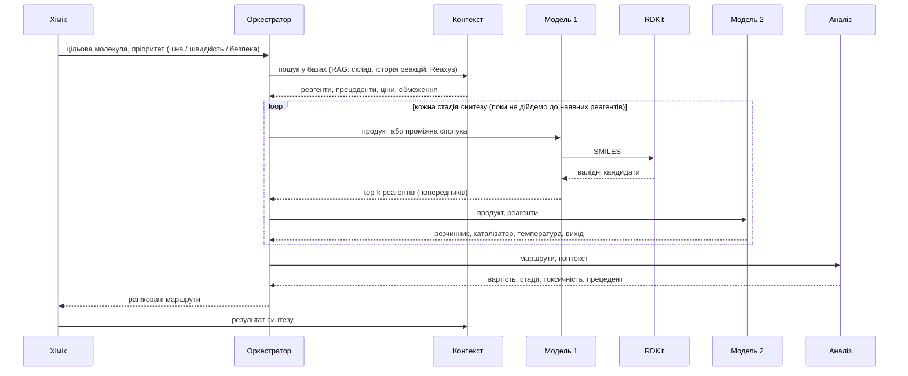

# Звіт про результати

## Довідка

- `ReactionT5` (Sagawa & Kojima, 2025) — T5-модель, попередньо натренована на хімічних даних.
- `SMILES` — текстовий запис структури молекули. Одна молекула може мати кілька рівнозначних записів; `канонічний` запис — єдиний стандартизований варіант, за яким звіряються відповіді.
- `чекпоінт` — стан моделі, збережений на певному етапі тренування.
- `beam search` — алгоритм генерації, що повертає кілька найімовірніших варіантів відповіді замість одного.
- `exact_match` — усі передбачені реагенти повністю збігаються з еталонними.
- `core_exact_match` — те саме без урахування допоміжних речовин (солей, каталізаторів).
- `top-k` — правильна відповідь присутня серед k найкращих варіантів (див. `beam search`).
- `lr` — learning rate, швидкість навчання.
- `eval_loss` (валідаційна втрата) — похибка моделі на валідаційних даних під час тренування; за нею вибирається найкращий чекпоінт.
- `ORD` (Open Reaction Database) — джерело даних для дотренування Моделі 1 (тест — 300 реакцій) і навчання Моделі 2 (тест — 5687 реакцій).
- `USPTO` (USPTO-50K) — дотренування на ній не проводилось, лише незалежний тест на узагальнення (300 реакцій).

## Виконані роботи

1. Порівняно два опубліковані чекпоінти ReactionT5 на обох тестових наборах.
2. Дотреновано ReactionT5 (**Модель 1**) на даних ORD для передбачення реагентів.
3. Навчено t5-small (**Модель 2**) для передбачення умов реакції (розчинник, каталізатор, температура, вихід).
4. Запропоновано схему повноцінної системи синтезу навколо цих моделей (нижче).

## Огляд існуючих рішень

| Чекпоінт | Тест | exact_match | core_exact_match |
|---|---|---|---|
| дотренований авторами на USPTO-50K | USPTO | 85,0% | 85,7% |
| дотренований авторами на USPTO-50K | ORD | 25,7% | 48,0% |
| без дотренування на USPTO (лише хімічне претренування) | USPTO | 16,3% | 38,3% |
| без дотренування на USPTO (лише хімічне претренування) | ORD | **43,7%** | **54,7%** |

На ORD USPTO-дотренований чекпоінт (25,7% exact_match) поступається чекпоінту без USPTO-дотренування (43,7%). Відправна точка для Моделі 1 — другий чекпоінт (43,7% exact_match, 54,7% core_exact_match на ORD).

## Модель 1 — передбачення реагентів

### До дотренування (базовий чекпоінт)

Обсяг тренування: 0 (без дотренування, опублікований чекпоінт).

| Тест | Метрика | top-1 | top-3 | top-5 |
|---|---|---|---|---|
| ORD | exact_match | 43,7% | 67,0% | 71,7% |
| ORD | core_exact_match | 54,7% | 74,3% | 78,0% |
| USPTO | exact_match | 16,3% | — | — |
| USPTO | core_exact_match | 38,3% | — | — |

### 1. Суміш ORD+USPTO, lr=3e-4

Обсяг тренування: 96 736 реакцій (57 000 ORD + 39 736 USPTO), Google Colab T4.

| Тест | Метрика | top-1 | top-3 | top-5 |
|---|---|---|---|---|
| ORD | exact_match | 32,0% | 46,7% | 51,0% |
| ORD | core_exact_match | 43,7% | 57,3% | 62,0% |
| USPTO | exact_match | 54,0% | 69,0% | 74,3% |
| USPTO | core_exact_match | 59,3% | 75,0% | 79,7% |

Точність на ORD нижча за базовий чекпоінт (43,7%→32,0%) — конфлікт конвенцій запису допоміжних речовин між ORD і USPTO; на USPTO, навпаки, дотренування підвищує точність до 54,0%.

### 2. Лише ORD, lr=5e-5 (обрана конфігурація для подальших порівнянь)

Обсяг тренування: 57 000 реакцій ORD, Google Colab T4. Відбір найкращого чекпоінта за валідаційною втратою. Нижчий `lr` (проти варіанта 1) дає найкращий top-1 серед окремих чекпоінтів (43,7%→50,3%). Ця конфігурація — точка порівняння для варіантів 3–6 і один з двох чекпоінтів у фінальному об'єднанні прогнозів (нижче).

| Тест | Метрика | top-1 | top-3 | top-5 |
|---|---|---|---|---|
| ORD | exact_match | 50,3% | 66,7% | **73,0%** |
| ORD | core_exact_match | 62,7% | 76,7% | **79,7%** |
| USPTO | exact_match | 22,7% | 28,7% | 31,0% |
| USPTO | core_exact_match | 43,7% | 56,7% | 62,0% |

### 3. SMILES-аугментація (без покращення)

Обсяг тренування: 57 000 реакцій ORD, повторно — 147 000 (Google Colab T4). Мета — аугментація даних неканонічними SMILES замість фіксованого запису (Bjerrum, 2017); для трансформерів ретросинтезу приріст точності досягається при одночасній аугментації входу й цілі (Tetko et al., Nature Communications, 2020). Аугментація 100% часу спричинила швидке перенавчання (`eval_loss` зростав з першого кроку) — точність не вимірювалась. Знижений `lr` (5e-5→2e-5) і аугментація 50% часу усунули ознаки перенавчання (`eval_loss` монотонно спадав), але `exact_match` лишився нижче варіанта 2 на обох обсягах: 36,7% (57 000) і 39,3% (147 000) проти 50,3% ORD top-1.

### 4. 150k, lr=5e-5, 3 епохи

Обсяг тренування: 147 000 реакцій ORD (2,5× більше за варіант 2, ~3 год 56 хв, Kaggle T4×2, DDP).

| Тест | Метрика | top-1 | top-3 | top-5 |
|---|---|---|---|---|
| ORD | exact_match | 47,3% | 69,7% | 73,7% |
| ORD | core_exact_match | 57,7% | 78,3% | **81,7%** |
| USPTO | exact_match | 18,3% | 28,3% | 30,0% |
| USPTO | core_exact_match | 37,3% | 57,0% | 61,3% |

top-1 нижчий за варіант 2 (47,3% проти 50,3%), але top-5 core_exact_match на ORD — найкращий серед окремих чекпоінтів (81,7% проти 79,7%).

### 5. 300k, lr=5e-5, 3 епохи

Обсяг тренування: 297 000 реакцій ORD (2× більше за варіант 4, ~8 год 02 хв, Kaggle T4×2, DDP).

| Тест | Метрика | top-1 | top-3 | top-5 |
|---|---|---|---|---|
| ORD | exact_match | 47,3% | 63,0% | 70,0% |
| ORD | core_exact_match | 56,7% | 72,7% | 78,0% |
| USPTO | exact_match | 17,3% | 23,7% | 29,0% |
| USPTO | core_exact_match | 34,3% | 52,3% | 61,3% |

Гірше за варіант 4 на top-3/top-5 при вдвічі більших даних (ORD top-5 core_exact_match: 78,0% проти 81,7%) — подальше нарощування обсягу без зміни інших факторів приросту на цьому тестовому наборі не дає.

### 6. Root-Aligned SMILES (57k, ті самі гіперпараметри що варіант 2, ~1 год 31 хв, Kaggle T4×2, DDP)

Обсяг тренування: 57 000 реакцій ORD, реагенти переписані у "кореневому" (root-aligned) форматі: фрагмент реагентів, що містить атом, відповідний початковому атому канонічного запису продукту, переписано так, щоб починатися з того самого атома (метод Zhong et al., Chemical Science, 2022; зіставлення атомів між продуктом і реагентами — RXNMapper). Мета — максимізувати спільний префікс між входом і виходом моделі; за літературними даними цей самий прийом дає приріст точності без зміни архітектури чи обсягу даних.

| Тест | Метрика | top-1 | top-3 | top-5 |
|---|---|---|---|---|
| ORD | exact_match | 40,7% | 55,0% | 59,3% |
| ORD | core_exact_match | 49,7% | 65,3% | 69,0% |
| USPTO | exact_match | 20,0% | 28,3% | 30,7% |
| USPTO | core_exact_match | 43,7% | 57,0% | 59,7% |

Гірше за варіант 2 на обох тестах і всіх k (наприклад, ORD top-1 exact_match: 40,7% проти 50,3%; ORD top-5 core_exact_match: 69,0% проти 79,7%). Негативний результат: базовий чекпоінт вже попередньо натренований генерувати канонічний запис SMILES, і 57 000 прикладів за 3 епохи виявилось недостатньо, щоб перенавчити його на іншу (кореневу) конвенцію запису. Задокументовано для повноти; варіант 2 лишається обраною конфігурацією Моделі 1.

### Об'єднання прогнозів двох незалежно дотренованих варіантів моделі

Варіанти 2 і 4 дотреновані на різних обсягах даних з однаковими гіперпараметрами й генерують частково незалежні помилки. Кандидатів beam search обох варіантів об'єднано в один пул (чергування виходів, дедуплікація за канонічним набором реагентів) без додаткового тренування: правильна відповідь, пропущена одним варіантом, може бути присутня в іншого, що підвищує top-k.

| Тест | Метрика | top-1 | top-3 | top-5 |
|---|---|---|---|---|
| ORD | exact_match | 50,3% | 68,7% | 75,0% |
| ORD | core_exact_match | 62,7% | 78,3% | **82,3%** |
| USPTO | exact_match | 22,7% | 29,7% | 31,3% |
| USPTO | core_exact_match | 43,7% | 57,3% | 62,0% |

Найвищий отриманий результат: 82,3% core_exact_match top-5 на ORD — вище за кожен з варіантів окремо (79,7% і 81,7%).

### Перевірені post-processing кроки без покращення

Над цим об'єднанням додатково перевірено два прийоми з літератури; жоден не перевершив базове об'єднання, тому в фінальну конфігурацію не ввійшли.

1. **Round-trip верифікація.** Кожного кандидата реагентів прогнано через модель прямого напрямку (`ReactionT5v2-forward`, реагенти→продукт); кандидатів, що не відтворюють вхідний продукт, понижено в ранзі. Результат на ORD: 49,0% exact_match top-1 і 80,0% core_exact_match top-5 — нижче за об'єднання без верифікації (50,3% і 82,3%). Forward-модель помилково понижує частину правильних кандидатів.
2. **Diverse beam search** (`num_beam_groups=5`, `diversity_penalty=0.5`) на варіанті 4: 49,0% exact_match top-1 (проти 47,3% зі звичайним beam search), але 77,0% core_exact_match top-5 (проти 81,7%) — приріст top-1 ціною top-5.

Об'єднання прогнозів варіантів 2 і 4 без додаткових post-processing кроків лишається фінальною конфігурацією Моделі 1 (82,3% core_exact_match top-5 на ORD).

## Модель 2 — передбачення умов реакції

Навчання: t5-small на даних ORD (реакції з хоча б одним заповненим полем умов), Kaggle T4. Порівняно два обсяги навчальних даних; більший додатково дедупльовано — вилучено повтори реакцій з однаковим набором продукту й реагентів за канонічним SMILES. Обидві моделі оцінено на тому самому тесті з 5687 реакцій — `data/v2_ord_conditions_test_clean.jsonl` (`scripts/build_clean_conditions_test.py`, ноутбук `kaggle/08_eval_conditions_t5small_clean_test.ipynb`). Це тестова частина 300k-пулу без рядків, що входять до навчальної вибірки 41k-конфігурації: пули семплились незалежними прогонами, а спліт conditions робиться всередині кожного пулу, тому тест 300k-пулу перетинався з train 60k-пулу на 2027 рядках. На цьому тесті перетин за продуктом з навчальними вибірками обох моделей — 0. Знаменники метрик: розчинник 5077, каталізатор 941, температура 1579, вихід 3440.

Для кожного поля наведено дві метрики: **строга** — точний збіг (розчинник, каталізатор) або похибка в межах допуску (температура ±10 °C, вихід ±10 процентних пунктів); **послаблена** — той самий тип речовини (розчинник, каталізатор) або той самий діапазон значень (температура, вихід).

**Базовий чекпоінт t5-small (без дотренування)**

Жодна з 5687 відповідей не парситься як JSON (`json_valid_rate_top1` = 0,0%): модель повторює текст інструкції або копіює вхідний SMILES. Усі метрики за всіма полями — 0,0%. Точка відліку для обох конфігурацій нижче; `experiments/v2_model2_topk/conditions_t5small_baseline_summary.json`, ноутбук `kaggle/11_eval_conditions_baseline_t5small.ipynb`.

**Навчання на 41 139 реакціях**

| Що передбачається | строга, top-1 | строга, top-5 | послаблена, top-1 | послаблена, top-5 |
|---|---|---|---|---|
| розчинник | 23,8% | 44,8% | 33,1% | 58,3% |
| каталізатор | 17,0% | 20,7% | 21,8% | 26,3% |
| температура | 3,0% | 5,7% | 3,7% | 6,6% |
| вихід реакції | 0,0% | 1,0% | 0,0% | 1,1% |

**Навчання на 138 869 реакціях (300k-пул, дедупльований)**

| Що передбачається | строга, top-1 | строга, top-5 | послаблена, top-1 | послаблена, top-5 |
|---|---|---|---|---|
| розчинник | 29,5% | 49,5% | 38,8% | **61,3%** |
| каталізатор | 22,3% | 31,5% | 27,8% | **39,8%** |
| температура | 3,6% | 14,9% | 4,4% | 17,0% |
| вихід реакції | 0,6% | 5,6% | 0,8% | 7,4% |

Збільшення обсягу дедупльованих даних у 3,4× підвищило точність на всіх полях і всіх метриках, найбільше на top-5.

Умови реакції неоднозначні (кільком розчинникам чи каталізаторам може відповідати той самий продукт, а ORD фіксує лише один) — тому точний збіг занижує реальну якість моделі, а збіг за типом речовини (для розчинника/каталізатора) чи за діапазоном (для температури/виходу) інформативніший. Межі діапазонів для метрики «той самий діапазон»:

| Поле | Діапазони |
|---|---|
| температура, °C | `<0` · `0–30` · `30–80` · `80–150` · `>150` |
| вихід, % | `<25` · `25–50` · `50–75` · `>75` |

Температура й вихід лишаються найскладнішими — вони слабо визначаються структурою реагентів.

## Запропонована схема системи

# Частина 2 — Модель 1 на базовому чекпоінті без ORD

## Довідка до частини 2

- `CompoundT5` (`sagawa/CompoundT5`) — базовий чекпоінт, з якого автори ReactionT5 стартували: претренований span-MLM на 24 млн молекул ZINC20, реакцій не бачив. Архітектура ідентична `ReactionT5v2-retrosynthesis` (`T5ForConditionalGeneration`, d_model 768, d_ff 2048, 12+12 шарів, 12 голів); словник 221 проти 268.
- `контамінація` — присутність тестових прикладів у даних претренування базового чекпоінта.
- `McNemar` — парний тест значущості різниці двох класифікаторів на тих самих записах; тут точний біноміальний варіант (`scripts/models/mcnemar_topk.py`), бо кількість дискордантних пар мала (3–65) і наближення хі-квадрат ненадійне. Позначка `*` — p < 0,05.
- `оракул` — частка записів, де правильна відповідь є в top-k **хоча б однієї** з двох моделей; верхня межа для будь-якої стратегії об'єднання (`scripts/models/oracle_ceiling_topk.py`).
- `валідність top-1` — частка записів, де перший кандидат є синтаксично коректним SMILES.

## Постановка задачі частини 2

Базовий чекпоінт Моделі 1 (`sagawa/ReactionT5v2-retrosynthesis`) претренований на ~1,5 млн реакцій ORD (знімок 2024‑05‑06, спліт 80/10/10). Тестовий набір `data/v2_ord_eval_targets.json` семплиться з того самого джерела `Open-Reaction-Database/ord-data`. Автори ReactionT5 виключали з претренування перетини лише з тестами USPTO‑50K і C‑N cross-coupling; тесту цієї роботи на той момент не існувало. Отже ORD-метрики частини 1 є верхньою межею невідомої точності.

Замість вимірювання перетину обрано заміну базового чекпоінта на такий, що реакцій не бачив. За статтею авторів, ReactionT5 ініціалізовано вагами CompoundT5 і донавчено на реакційних даних, тобто CompoundT5 — той самий чекпоінт до контамінації. З ним ORD-тест коректний за побудовою.

## Ремонт словника

Словник CompoundT5 навчений на ZINC20 — бібліотеці окремих drug-like молекул. У ньому відсутній символ `.` (роздільник фрагментів, 158 963 входження в даних цієї роботи), а також літери, з яких складаються позначення металів і протиіонів. 61 067 із 115 200 рядків SMILES у `data/v2_ord_eval_targets.json`, `data/v2_uspto_eval_targets.json` і `data/v2_ord_train/reactants_train.jsonl` токенізуються щонайменше з одним `<unk>`; для `ReactionT5v2-retrosynthesis` таких рядків 40, для `t5-small` — 1 341.

Без виправлення модель не може згенерувати набір реагентів із кількох фрагментів, тобто `exact_match` дорівнює нулю за побудовою. `scripts/train_reactant_model_ord.py` викликає `retro_eval.tokenizer_coverage.ensure_full_char_coverage` — функцію, раніше застосовану для Моделі 2: додаються лише ті символи, що справді кодуються в `<unk>` поодинці, після чого матриця ембедінгів розширюється з `mean_resizing=False`. Розмір словника після ремонту: 251 (пули 57k), 255 (147k), 257 (297k).

Для чекпоінтів ReactionT5 виклик інертний: перетокенізація всіх 114 000 навчальних рядків до і після дає рівно 40 відмінних — ті самі, що вже містили `<unk>`, кожен виправлено (`[La]`: `['[', '<unk>', ']']` → `['[', 'L', 'a', ']']`). Багатосимвольні токени не розщеплюються: `[Si]`, `[Na]`, `[Mg+2]` лишаються `Si`, `Na`, `Mg`.

## Умови експериментів частини 2

Усі прогони: `sagawa/CompoundT5`, `lr=5e-4`, 3 епохи, `--no-augment` (крім прогону з аугментацією), Kaggle T4×2, `torchrun --nproc_per_node=2`. Тести ті самі, що в частині 1: ORD 300 реакцій, USPTO 300 реакцій, beam search на 10 променів.

Ставка `lr=5e-4` замість `5e-5` частини 1: CompoundT5 вчить задачу разом із 30 випадково ініціалізованими рядками ембедінгів, серед яких `.` — найчастіший символ у цілях. Прецедент — Модель 2, де загальний `t5-small` потребував саме `5e-4`.

| Прогін | Обсяг | Тривалість | Ноутбук |
|---|---|---|---|
| база без дотренування | 0 | ~10 хв (лише оцінка) | `kaggle/12_train_reactant_compoundt5_57k.ipynb` |
| канонічний 57k | 57 000 | 1 год 29 хв | `kaggle/12_train_reactant_compoundt5_57k.ipynb` |
| root-aligned 57k | 57 000 | 1 год 30 хв | `kaggle/14_train_reactant_compoundt5_rootaligned57k.ipynb` |
| аугментований 57k | 57 000 | 1 год 32 хв | `kaggle/15_train_reactant_compoundt5_augmented57k.ipynb` |
| канонічний 147k | 147 000 | 3 год 38 хв | `kaggle/13_train_reactant_compoundt5_150k.ipynb` |
| канонічний 297k | 297 000 | 7 год 40 хв | `kaggle/16_train_reactant_compoundt5_300k.ipynb` |

## Результати на ORD (300 реакцій)

| Прогін | exact top-1 | top-3 | top-5 | core top-1 | top-3 | top-5 | валідність top-1 |
|---|---|---|---|---|---|---|---|
| база без дотренування | 0,0% | 0,0% | 0,0% | 0,3% | 0,3% | 0,3% | 14,7% |
| канонічний 57k | 17,0% | 22,0% | 23,7% | 23,0% | 30,0% | 34,0% | 91,7% |
| root-aligned 57k | 17,7% | 23,3% | 25,0% | 25,0% | 32,3% | 34,0% | 91,0% |
| аугментований 57k | 11,3% | 17,0% | 19,0% | 16,0% | 24,7% | 28,0% | 94,3% |
| канонічний 147k | **19,7%** | **25,7%** | **28,3%** | **29,7%** | **36,0%** | **39,7%** | 99,0% |
| канонічний 297k | 19,0% | 24,0% | 26,7% | 25,3% | 32,3% | 34,7% | 98,0% |

## Результати на USPTO (300 реакцій)

| Прогін | exact top-1 | top-3 | top-5 | core top-1 | top-3 | top-5 | валідність top-1 |
|---|---|---|---|---|---|---|---|
| база без дотренування | 0,0% | 0,0% | 0,0% | 0,0% | 0,0% | 0,0% | 14,7% |
| канонічний 57k | 14,0% | 22,0% | 26,0% | 17,7% | 26,0% | 31,7% | 95,3% |
| root-aligned 57k | 16,3% | 27,3% | 31,3% | 21,7% | 34,0% | 38,3% | 93,3% |
| аугментований 57k | 10,0% | 18,3% | 22,3% | 15,0% | 25,7% | 30,0% | 93,0% |
| канонічний 147k | 18,3% | 25,3% | 29,0% | 30,0% | 44,0% | 46,7% | 98,7% |
| канонічний 297k | **20,0%** | **30,7%** | **34,0%** | **34,0%** | **48,3%** | **54,7%** | 95,3% |

## Базовий чекпоінт без дотренування

Жодного точного збігу на обох тестах; валідних SMILES серед перших кандидатів 14,7%, решта — переважно порожні рядки. Один випадковий збіг `core_exact_match` на ORD (1 запис із 300). CompoundT5 навчали лише відновлювати замасковані фрагменти молекул, задачі «продукт → реагенти» він не виконував, а до ремонту словника не міг і виразити багатофрагментну відповідь. Уся точність дотренованих моделей отримана на цьому дотренуванні, а не успадкована від претренування.

## Валідаційна втрата

| Прогін | eval_loss (найкращий чекпоінт) |
|---|---|
| канонічний 57k | 0,5678 |
| root-aligned 57k | 0,5424 |
| аугментований 57k | 0,6386 |
| канонічний 147k | 0,4185 |
| канонічний 297k | **0,3532** |

У всіх п'яти прогонах `eval_loss` спадав монотонно до останнього кроку, найкращим чекпоінтом щоразу виявлявся останній. Сплощення наприкінці збігається із затуханням лінійного планувальника `lr` до нуля на третій епосі (57k: 4,5e-4 на епосі 0,45 проти 1,5e-5 на епосі 2,92), тому виходу на плато жоден прогін не досяг — усі моделі недотреновані.

## Обсяг даних

McNemar, ORD і USPTO, крок 57k → 147k:

| Тест | Метрика | 57k | 147k | p |
|---|---|---|---|---|
| ORD | exact top-5 | 23,7% | 28,3% | 0,029 * |
| ORD | core top-1 | 23,0% | 29,7% | 0,0066 * |
| ORD | core top-3 | 30,0% | 36,0% | 0,0064 * |
| ORD | core top-5 | 34,0% | 39,7% | 0,0076 * |
| ORD | exact top-1 | 17,0% | 19,7% | 0,230 |
| USPTO | core top-1 | 17,7% | 30,0% | <0,0001 * |
| USPTO | core top-3 | 26,0% | 44,0% | <0,0001 * |
| USPTO | core top-5 | 31,7% | 46,7% | <0,0001 * |
| USPTO | exact top-1 | 14,0% | 18,3% | 0,066 |

Крок 147k → 297k:

| Тест | Метрика | 147k | 297k | p |
|---|---|---|---|---|
| ORD | core top-1 | 29,7% | 25,3% | 0,015 * (гірше) |
| ORD | core top-5 | 39,7% | 34,7% | 0,0059 * (гірше) |
| ORD | exact top-1 | 19,7% | 19,0% | 0,824 |
| USPTO | exact top-3 | 25,3% | 30,7% | 0,0052 * |
| USPTO | exact top-5 | 29,0% | 34,0% | 0,020 * |
| USPTO | core top-5 | 46,7% | 54,7% | 0,0015 * |

Перший крок покращує обидва тести, значуще за core-метриками. Другий крок розходиться: на USPTO приріст лишається значущим, на ORD core-метрики значуще падають при кращій валідаційній втраті (0,3532 проти 0,4185). Причина розходження не встановлена; правдоподібне пояснення — зміна складу пулу, оскільки семплінг обмежений на кожен вихідний файл ORD і більший пул охоплює більше джерел, зсуваючи розподіл відносно тестового набору.

У частині 1 на ReactionT5 той самий перший крок **знижував** ORD top-1 (50,3% → 47,3%), а другий не давав приросту (47,3%, core top-5 81,7% → 78,0%). На чистій базі перший крок дає значущий приріст; другий відтворює падіння ORD core-метрик, але не падіння на USPTO.

## Root-Aligned SMILES

Прогін зіставлений із канонічним 57k по всьому, крім представлення цілей (`--augment-prob` не використовується, той самий `lr`, ті самі 3 епохи, той самий обсяг). Дані — `scripts/build_root_aligned_data.py`, пул ідентичний варіанту 2 частини 1.

| Тест | Метрика | канонічний 57k | root-aligned 57k | p |
|---|---|---|---|---|
| ORD | exact top-1 | 17,0% | 17,7% | 0,845 |
| ORD | core top-1 | 23,0% | 25,0% | 0,418 |
| ORD | core top-5 | 34,0% | 34,0% | 1,000 |
| USPTO | exact top-3 | 22,0% | 27,3% | 0,033 * |
| USPTO | exact top-5 | 26,0% | 31,3% | 0,044 * |
| USPTO | core top-3 | 26,0% | 34,0% | 0,0032 * |
| USPTO | core top-5 | 31,7% | 38,3% | 0,014 * |

На ORD усі шість метрик не гірші за канонічний прогін, жодна різниця не значуща. На USPTO чотири з шести значущі, приріст +5,3…+8,0 в.п. Валідаційна втрата нижча (0,5424 проти 0,5678).

У частині 1 варіант 6 на ReactionT5 програвав варіанту 2 на обох тестах і всіх k (ORD top-1 40,7% проти 50,3%). Пояснення, наведене там — базовий чекпоінт уже натренований генерувати канонічний запис, і 57 000 прикладів недостатньо для перенавчання на іншу конвенцію — узгоджується з цим результатом: на базі без такого пріора метод дає приріст, причому лише на незалежному тесті, де модель не може спиратися на збіг розподілів.

## SMILES-аугментація

Прогін зіставлений із канонічним 57k по всьому, крім увімкненої аугментації (`--augment-prob 0.5`, онлайн, на обидва боки, лише навчальна вибірка; валідація лишається канонічною, тому `eval_loss` порівнюваний напряму).

| Тест | Метрика | канонічний 57k | аугментований 57k | p |
|---|---|---|---|---|
| ORD | exact top-1 | 17,0% | 11,3% | 0,0009 * (гірше) |
| ORD | exact top-3 | 22,0% | 17,0% | 0,0007 * (гірше) |
| ORD | exact top-5 | 23,7% | 19,0% | 0,0026 * (гірше) |
| ORD | core top-1 | 23,0% | 16,0% | 0,0008 * (гірше) |
| ORD | core top-3 | 30,0% | 24,7% | 0,0052 * (гірше) |
| ORD | core top-5 | 34,0% | 28,0% | 0,0021 * (гірше) |
| USPTO | exact top-1 | 14,0% | 10,0% | 0,043 * (гірше) |
| USPTO | core top-3 | 26,0% | 25,7% | 1,000 |
| USPTO | core top-5 | 31,7% | 30,0% | 0,576 |

На ORD значуще гірше за всіма шістьма метриками, на USPTO значуще гірше лише за однією. Негативний результат частини 1 (варіант 3) відтворився, але механізм інший: там `eval_loss` зростав з першого вимірювання (швидке перенавчання), тут спадав монотонно до 0,6386 без жодного розвороту. Тобто аугментація не спричинила перенавчання, а сповільнила збіжність — при фіксованому бюджеті у 3 епохи на й без того недотренованій моделі це чистий програш. Коректне формулювання: при однаковому бюджеті у 3 епохи аугментація програє; питання її користі за більшого бюджету лишається відкритим.

## Об'єднання прогнозів

Метод той самий, що в частині 1 (`scripts/models/ensemble_topk.py`, чергування кандидатів, дедуплікація за канонічним набором реагентів, без додаткового тренування).

| Тест | Комбінація | краща одиночна | об'єднання | p |
|---|---|---|---|---|
| ORD | 147k + 297k | 39,7% core top-5 | 39,0% | 0,774 |
| ORD | 297k + root-aligned | 39,7% core top-5 | 38,7% | 0,678 |
| ORD | 297k + root-aligned | 29,7% core top-1 | 25,3% | 0,015 * (гірше) |
| USPTO | 297k + 147k | 54,7% core top-5 | 55,0% | 1,000 |
| USPTO | 297k + root-aligned | 34,0% exact top-5 | **39,3%** | **0,0037 *** |
| USPTO | 297k + root-aligned | 54,7% core top-5 | 55,3% | 0,851 |
| USPTO | 297k + root-aligned + 147k | 34,0% exact top-5 | 36,0% | 0,345 |

З дванадцяти перевірених порівнянь значущий приріст один: USPTO exact top-5, 34,0% → 39,3% (22 записи здобуто, 6 втрачено). Об'єднання двох канонічних прогонів, що відрізняються лише обсягом даних, не дає нічого — їхні помилки корельовані. Приріст з'являється лише при об'єднанні моделей із різним представленням цілей. Тришляхове об'єднання гірше за двошляхове: додавання третьої корельованої моделі розбавляє пул кандидатів. Просідання ORD core top-1 механічне — первинною в тій комбінації стоїть 297k, слабша за 147k саме за цією метрикою.

Оракульна межа (частка записів, де відповідь є в top-k хоча б однієї моделі) для пари 297k + root-aligned:

| Тест | Метрика | краща одиночна | об'єднання | оракул |
|---|---|---|---|---|
| ORD | core top-1 | 25,3% | 25,3% | 32,0% |
| USPTO | exact top-3 | 30,7% | 31,3% | 40,3% |
| USPTO | core top-1 | 34,0% | 34,0% | 41,3% |
| USPTO | core top-5 | 54,7% | 55,3% | 61,3% |

Запас між досягнутим і оракулом — 2,0…9,0 в.п. Обмеження лежить у самих моделях, а не в стратегії злиття: досконалий селектор моделі для кожного запису дав би небагато.

## Зіставлення з частиною 1

Порівняння при однаковому обсязі навчальних даних (300 реакцій кожного тесту):

| Тест | Метрика | ReactionT5 147k (варіант 4) | CompoundT5 147k | різниця |
|---|---|---|---|---|
| ORD | exact top-1 | 47,3% | 19,7% | 27,6 |
| ORD | core top-5 | 81,7% | 39,7% | 42,0 |
| USPTO | exact top-1 | 18,3% | 18,3% | 0,0 |
| USPTO | core top-5 | 61,3% | 46,7% | 14,6 |

| Тест | Метрика | ReactionT5 297k (варіант 5) | CompoundT5 297k | різниця |
|---|---|---|---|---|
| ORD | exact top-1 | 47,3% | 19,0% | 28,3 |
| ORD | core top-5 | 78,0% | 34,7% | 43,3 |
| USPTO | exact top-1 | 17,3% | **20,0%** | −2,7 |
| USPTO | exact top-3 | 23,7% | **30,7%** | −7,0 |
| USPTO | exact top-5 | 29,0% | **34,0%** | −5,0 |
| USPTO | core top-1 | 34,3% | 34,0% | 0,3 |
| USPTO | core top-5 | 61,3% | 54,7% | 6,6 |

На ORD чекпоінт із претренуванням на 1,5 млн реакцій ORD випереджає чекпоінт без нього на 27,6–43,3 в.п. На USPTO при обсязі 297 000 той самий чекпоінт **поступається** за `exact_match` на всіх k, а за core-метриками випереджає на 0,3–6,6 в.п. Одна й та сама пара моделей, ті самі навчальні дані, протилежний знак різниці залежно від тестового набору.

Пояснення, за яким перевага ReactionT5 є перенесеним хімічним знанням, такої залежності від тестового набору не передбачає. Пояснення через контамінацію ORD-тесту даними претренування — передбачає.

## Підсумок перевірки негативних результатів частини 1

| Варіант частини 1 | Висновок частини 1 | На базі без ORD |
|---|---|---|
| 4 — обсяг 147k | більше даних не допомагає (50,3% → 47,3%) | не підтвердився: значущий приріст, найбільший на USPTO core |
| 5 — обсяг 297k | подальше нарощування не дає приросту | підтвердився частково: на ORD core падіння відтворилось, на USPTO приріст значущий |
| 6 — root-aligned | гірше за канонічний на обох тестах і всіх k | не підтвердився: на ORD нічия, на USPTO значущий приріст |
| 3 — аугментація | гірше за канонічний | підтвердився, але через сповільнену збіжність, а не перенавчання |
| об'єднання прогнозів | +0,6 в.п. над кращим компонентом | той самий порядок: один значущий приріст +5,3 в.п. лише при різному представленні |

## Обмеження частини 2

- Тестові набори по 300 записів; різниці менші за ~5 в.п. здебільшого не досягають значущості (див. стовпці p).
- Усі моделі частини 2 недотреновані: `eval_loss` спадав до останнього кроку в кожному прогоні. Абсолютні значення є нижньою межею для обраних конфігурацій.
- `lr` частини 2 (5e-4) відрізняється від частини 1 (5e-5), тому порівняння «CompoundT5 проти ReactionT5» містить дві відмінності, а не одну. Ablation при `lr=5e-5` не проводився.
- ~~Тестовий набір USPTO (`data/v2_uspto_eval_targets.json`) зібраний із усіх сплітів `pingzhili/uspto-50k`, тому рядок 85,0% у таблиці «Огляд існуючих рішень» завищений.~~ **Спростовано в частині 3 прямим вимірюванням:** усі 300 пар (продукт, реагенти) цього набору лежать усередині канонічного `test`-спліту `bisectgroup/USPTO_50K`, а з канонічним `train` він перетинається у 2 записах із 300. Тобто USPTO-числа частин 1 і 2 були чистими від початку, і набір із 300 записів є підмножиною тесту частини 3.
- Розширення словника CompoundT5 додає 30–36 випадково ініціалізованих рядків ембедінгів. Це не «чистий CompoundT5», хоча реакційних даних і не додає.
- CompoundT5 бачив 24 млн молекул ZINC20 і міг бачити тестові продукти як окремі молекули; реакцій, тобто перетворень, він не бачив.

## Відтворення

Результати: `experiments/v2_model1_topk/compoundt5_*.json` (по два файли на прогін, ORD і USPTO, плюс чотири файли об'єднань). Формат той самий, що в частини 1: `summary` і `records` з переліком кандидатів на кожен запис.

Ядра Kaggle: `kuzmenkooleh/retro-planner-model1-compoundt5-{57k,150k,300k,rootaligned57k,augmented57k}`; метадані — `kaggle/compoundt5_*/kernel-metadata.json`.

Аналіз: `scripts/models/mcnemar_topk.py` (парний тест значущості) і `scripts/models/oracle_ceiling_topk.py` (верхня межа об'єднання), обидва приймають файли `run_reactiont5_topk.py` і працюють без GPU.

# Частина 3 — чистий бенчмарк USPTO-50K

## Довідка до частини 3

- `канонічний спліт` — поділ USPTO-50K на 40 008 / 5 001 / 5 007 (train / val / test), яким користується література з ретросинтезу; дзеркало `bisectgroup/USPTO_50K`.
- `root-aligned` (R-SMILES, Zhong et al., Chemical Science 2022) — ціль переписана так, щоб починатися з того самого атома, з якого починається канонічний SMILES продукту.
- `рендеринг` — один запис реакції у вигляді пари рядків; та сама реакція може бути записана багатьма рендерингами з різними кореневими атомами.
- `код досліду` — `<база>.<дотренування>.<техніка>.<епохи> → <тест>`; `C` = CompoundT5, `U40k` = train-спліт USPTO-50K, `Ut` = test-спліт USPTO-50K.

## Постановка задачі частини 3

Частина 2 усунула контамінацію з боку базового чекпоінта, але тест лишився ORD-івським, а разом із ним лишилось питання, наскільки взагалі можна довіряти ORD як тестовому джерелу. Перевірено прямий спосіб зробити ORD-тест чистим за часом — узяти лише реакції, додані після знімка претренування 2024‑05‑06. Вимірювання на локальному знімку `Open-Reaction-Database/ord-data`: із 2 428 291 запису після цієї дати створено 148 тис., але після дедуплікації за парою (продукт, реагенти) лишається **1 303 унікальні реакції**, з них 632 — амідні сполучення з одного HTE-набору, 602 — Pfizer HTE, 32 — Chan-Lam. Три класи реакцій зі скринінгів умов; як бенчмарк ретросинтезу це непридатне, а висока точність на такому наборі була б завищенням іншого роду — через тривіальність задачі, а не через витік.

Тому головний експеримент перенесено туди, де витік неможливий за побудовою: база `sagawa/CompoundT5` (реакцій не бачила, див. частину 2) плюс канонічний спліт USPTO-50K. Правило, якого дотримано в усій частині: **дотренування і тест походять з одного джерела**, перехресних прогонів немає.

## Формування наборів

`scripts/build_eval_targets_uspto_test_holdout.py` (відновлений з `bb698c3^`) бере лише `test`-спліт: 5 007 рядків, 5 003 унікальні продукти. Семплювання — засіяне перемішування з відбором першого входження кожного продукту, тому менший `--count` є строгим префіксом більшого: набір на 1 000 записів є підмножиною набору на 5 003, і числа на них порівнювані напряму.

Канонічний спліт не є ідеально роз'єднаним: 69 продуктів `test` трапляються і в `train`, 48 із них тією самою парою (продукт, реагенти). Це властивість самого USPTO-50K. Тест лишено стандартним заради порівнюваності з літературою, а 82 відповідні рядки вилучено з навчального боку (`--exclude-file`), тому перетин рівно нульовий: 39 667 навчальних рядків і 4 986 валідаційних.

`scripts/build_root_aligned_uspto.py` будує представлення. На відміну від ORD-аналога, тут не потрібен RXNMapper: USPTO-50K постачається з atom-map, тож вирівнювання точне — **39 667 із 39 667 рядків, жодного відкату**, проти 99,6% через нейромапер на ORD. Механізм, на який спирається техніка, вимірний: середній спільний префікс входу й цілі становить 9,4 символа для канонічних SMILES, 17,6 для root-aligned і 19,0 для розкладки на кілька рендерингів.

| Набір | Рядків | Як побудовано |
|---|---|---|
| канонічний | 39 667 | `build_train_data_uspto.py --exclude-file` |
| root-aligned | 39 667 | `build_root_aligned_uspto.py` (один рендеринг, корінь канонічний) |
| R-SMILES ×5 | 198 324 | `--copies 5`, випадкові корені, обидві сторони вкорінені узгоджено |
| R-SMILES ×10 | 396 589 | `--copies 10` |

## Умови експериментів частини 3

Усі прогони: `sagawa/CompoundT5`, `lr=5e-4`, Kaggle T4×2, `torchrun --nproc_per_node=2`, beam search на 10 променів. Ремонт словника той самий, що в частині 2 (`ensure_full_char_coverage`, +12 символів, 221 → 233).

| Дослід | Код | Епох | Час ядра | Ноутбук |
|---|---|---|---|---|
| A0 | `C.—.— → Ut` | 0 | 19 хв | `kaggle/17_A0_compoundt5_base_uspto.ipynb` |
| A1 | `C.U40k.can.e5 → Ut` | 5 | 1 год 56 хв | `kaggle/18_A1_compoundt5_uspto_canonical.ipynb` |
| A2 | `C.U40k.ra.e5 → Ut` | 5 | не збережено (рецепт і обсяг як A1) | `kaggle/19_A2_compoundt5_uspto_rootaligned.ipynb` |
| A3 | `C.U40k.aug.e10 → Ut` | 10 | 3 год 44 хв | `kaggle/20_A3_compoundt5_uspto_augmented.ipynb` |
| A4 | `C.U40k.rsmiles5.e3 → Ut` | 3 | 5 год 06 хв | `kaggle/21_A4_compoundt5_uspto_rsmiles5.ipynb` |
| A5 | `C.U40k.rsmiles10.e2 → Ut` | 2 | 8 год 43 хв | `kaggle/22_A5_compoundt5_uspto_rsmiles10.ipynb` |

Час ядра включає встановлення залежностей, тренування й оцінювання. A3 використовує онлайн-рандомізацію SMILES (`--augment-prob 0.5`, та сама, що варіант 3 частини 1); A4 і A5 — офлайн-розкладку на рендеринги з `--no-augment`, бо рандомізація цілі під час тренування зруйнувала б вирівнювання, закодоване у файлі.

## Результати (тест 1 000 записів)

| Дослід | exact top-1 | top-3 | top-5 | core top-5 | валідність top-1 |
|---|---|---|---|---|---|
| A0 база без дотренування | 0,0% | 0,0% | 0,0% | 0,0% | 14,5% |
| A1 канонічний | 39,3% | 56,9% | 63,7% | 63,7% | 97,9% |
| A2 root-aligned | 44,2% | 62,9% | 69,5% | 69,6% | 98,3% |
| A3 аугментація | 43,8% | 64,3% | 70,9% | 71,1% | 99,2% |
| A4 R-SMILES ×5 | 48,4% | 69,9% | 76,8% | 76,9% | 99,4% |
| A5 R-SMILES ×10 | **50,6%** | **71,1%** | **78,6%** | **78,7%** | 99,0% |

## Головний результат (повний тест 5 003 записи)

| Дослід | exact top-1 | top-3 | top-5 | core top-1 | top-3 | top-5 | валідність top-1 |
|---|---|---|---|---|---|---|---|
| A5 R-SMILES ×10 | **50,8%** | **72,5%** | **79,4%** | 50,8% | 72,7% | **79,6%** | 99,1% |

Різниця з підвибіркою на 1 000 записів не перевищує 1,4 в.п. за жодною метрикою, що узгоджується з довірчим інтервалом ±3 в.п. при n = 1 000.

На цьому наборі `core`-метрики майже збігаються з `exact`: реагенти USPTO-50K не містять реагентів-допоміжників, тому послаблення, яке відкидає протиіони й неорганічні солі, майже нічого не змінює. На ORD різниця між тими самими метриками сягала 10–12 в.п.

## Значущість (McNemar, n = 1 000)

| Порівняння | exact top-1 | top-3 | top-5 | Висновок |
|---|---|---|---|---|
| A1 → A2 (root-aligned) | 39,3 → 44,2, p=0,0006 * | 56,9 → 62,9, p<0,0001 * | 63,7 → 69,5, p<0,0001 * | значуще на всіх шести метриках |
| A1 → A3 (аугментація) | 39,3 → 43,8, p=0,0034 * | 56,9 → 64,3, p<0,0001 * | 63,7 → 70,9, p<0,0001 * | значуще на всіх шести метриках |
| A2 → A3 | 44,2 → 43,8, p=0,85 | 62,9 → 64,3, p=0,34 | 69,5 → 70,9, p=0,32 | не значуще ніде |
| A2 → A4 | 44,2 → 48,4, p=0,0030 * | 62,9 → 69,9, p<0,0001 * | 69,5 → 76,8, p<0,0001 * | значуще на всіх шести метриках |
| A3 → A4 | 43,8 → 48,4, p=0,0039 * | 64,3 → 69,9, p=0,0001 * | 70,9 → 76,8, p<0,0001 * | значуще на всіх шести метриках |
| A4 → A5 | 48,4 → 50,6, p=0,13 | 69,9 → 71,1, p=0,34 | 76,8 → 78,6, p=0,12 | не значуще ніде |

Дві техніки поодинці дають приріст однакового порядку і між собою не розрізняються, але складаються: A4 значуще перевершує обидві свої компоненти. Наступний крок цією ж віссю (×5 → ×10) уже не досягає значущості — віддача від кількості рендерингів вичерпується.

## Об'єднання прогнозів

`scripts/models/ensemble_topk.py`, перемежовування кандидатів із дедуплікацією за канонічним набором, без тренування.

| Об'єднання | exact top-1 | top-3 | top-5 | Проти кращої компоненти |
|---|---|---|---|---|
| A4 + A3 | 48,4% | 70,6% | 78,2% | +1,4 в.п. над A4 |
| A5 + A4 | 50,6% | 72,8% | 79,5% | +0,9 в.п. над A5, p=0,32 |
| A5 + A3 | 50,6% | 72,1% | 78,3% | −0,3 в.п. |
| A5 + A2 | 50,6% | 71,3% | 78,8% | +0,2 в.п. |

Об'єднання A5 + A4 на повному тесті дало б приблизно 80,3%, тобто формально перетнуло б поріг 80%. Воно **не заявляється як результат**: McNemar дає p = 0,32 при 28/37 дискордантних парах, тобто від A5 наодинці цей результат нерозрізнюваний. Оракул для цієї ж пари — 83,6% top-5 (запас 4,1 в.п. над реально отриманими 79,5%), отже вичерпано не інформацію в парі моделей, а конкретну стратегію перемежовування.

## Зіставлення з літературою

Той самий канонічний спліт, ті самі метрики `exact_match`:

| Джерело | top-1 | top-5 | Умови |
|---|---|---|---|
| R-SMILES (Zhong et al., 2022) | 56,3% | 86,2% | 20 рендерингів, тренування з нуля, довший бюджет |
| RetroKNN | 57,2% | — | top-10 = 92,7% |
| A5 (ця робота) | 50,8% | 79,4% | 10 рендерингів, 2 епохи, дві T4, ~8,7 год |

## Зіставлення з частинами 1 і 2

| Твердження частини 1 | Що показала частина 3 |
|---|---|
| root-aligned гірший за канонічний на обох тестах і всіх k | перевернулось: +4,9…+5,8 в.п., p ≤ 0,0006 на всіх метриках |
| аугментація гірша за канонічний | перевернулось: +4,5…+7,2 в.п., p ≤ 0,0034 на всіх метриках |
| об'єднання прогнозів дає +0,6 в.п. над кращим компонентом | той самий порядок величини, але тут явно не значуще (p = 0,32) |

Обидва «негативні результати» частин 1 і 2 виявились наслідком розбіжності джерел, а не властивостями технік. У частині 1 модель дотреновувалась на ORD і оцінювалась на USPTO та ORD; у частині 3 тренування і тест походять з одного спліту, і це змінює знак висновку. Величина ефекту від самого лише вирівнювання джерел: CompoundT5, дотренований на ORD, давав на USPTO 14,0–20,0% exact top-1 (частина 2), тут — 39,3% на тій самій базі з тим самим рецептом.

## Перехресна перевірка: A5 на ORD-300

A5 дотренована виключно на USPTO-50K. Прогін тієї самої моделі на ORD-тесті (300 записів,
`data/v2_ord_eval_targets.json`, ті самі метрики й beam 10) заповнює другу клітинку порівняння.

| Модель | Дотренування | ORD-300 exact top-1 | top-5 | core top-5 | USPTO exact top-1 | top-5 |
|---|---|---|---|---|---|---|
| `ReactionT5v2-retrosynthesis` | немає (претренування на ~1,5 млн реакцій ORD) | **43,7%** | **71,7%** | **78,0%** | 16,3% | — |
| A5 (`CompoundT5`) | USPTO-50K, R-SMILES ×10 | 12,0% | 17,7% | 31,3% | **50,8%** | **79,4%** |

Кожна модель домінує на своєму джерелі й програє на чужому, причому з великим відривом:
71,7% проти 17,7% на ORD і 79,4% проти 16,3% на USPTO. Різниця не пояснюється якістю моделі
як такою — жодна з двох не є «кращою».

Провал A5 на ORD не є деградацією генерації: валідність top-1 становить 97,0% проти 99,1% на
USPTO, тобто модель упевнено видає коректні SMILES, які просто не збігаються з ORD-конвенцією
запису реагентів і допоміжних речовин. Це видно і з розриву між `exact` і `core` метриками —
на ORD він 13,6 в.п. (17,7% проти 31,3%), на USPTO 0,2 в.п.: майже половина «помилок» A5 на
ORD — це присутність або відсутність протиіонів і неорганічних солей, а не інший розрив зв'язку.

**Практичний висновок.** Точність тут — властивість пари (модель, хімія), а не моделі. Тому
розгортання на підприємстві означає не пошук одного універсального чекпоінта, а дотренування
під конкретний напрямок: лабораторія, що робить сульфохлориди й сульфофториди, і лабораторія
пептидного синтезу отримують два різні чекпоінти з того самого рецепта. Вартість такого
дотренування виміряна: ~8,7 год на двох T4 для повного циклу A5.

Файл: `experiments/v2_model1_uspto50k/A5_rsmiles10_e2_ord300_topk.json`; ядро
`kuzmenkooleh/retro-planner-a5-eval-on-ord`.

### Розклад розриву: конвенція, контамінація, домен

Число 17,7% змішує дві незалежні невдачі — «записано інакше» і «запропоновано іншу хімію».
Щоб їх розділити, потрібне джерело-незалежне означення того, що взагалі є реагентом:

> **Субстрат — молекула, яка віддає продукту щонайменше один важкий атом. Решта — реагенти.**

Це означення не постулюється, а перевіряється: у test-спліті USPTO-50K з 8 580 фрагментів
**жоден** не є таким, що не віддає жодного відображеного атома. Тобто джерело саме дотримується
цього правила, і воно ж робить два набори порівнюваними. Наслідок, який приймається свідомо:
Boc₂O потрапляє до субстратів, бо його атоми опиняються в продукті, хоча хімік назве його
реагентом — атомні відображення USPTO погоджуються з означенням, а не з термінологією.

ORD атомних відображень не має (0 з 2 000 перевірених рядків), тому там правило застосовується
через проксі з чотирьох шарів, де хімія стоїть перед геометрією: ручні мітки діють у обидва боки
(перелік розчинників, основ і сполучних агентів плюс 200 найчастотніших речовин, розмічених
вручну — додаток); безвуглецеві нуклеофіли, які сам USPTO лишає серед реагентів (амоніак,
гідразин, азид), є субстратами, каталітичні метали — реагентами, а головногрупова
металоорганіка з вуглецевим скелетом є субстратом попри геометрію, бо піна́колова частина
боронату більша за арил, який вона віддає; одноатомні й безвуглецеві частинки — реагенти;
решту вирішує максимальна спільна підструктура з продуктом (≥3 атоми і ≥50% фрагмента).

Правило перевірено двома способами. На 1 485 парах з упорснутими негативами, яких свідомо нема
в жодному переліку (DBU, N-метилморфолін, лутидин, DABCO, TMEDA, хінолін, біпіридин,
три-о-толілфосфін): повнота за субстратами 97,8%, за реагентами 66,5%, точність за реагентами
97,3%. Сильніша перевірка — правило має бути майже холостим на самому USPTO, чиї ліві частини
вже і є субстратами: воно хибно відкидає **1,6%** фрагментів проти 11,1% до того, як ручні мітки
стали пріоритетними. Залишок — справжня двозначність, де одна речовина грає різні ролі в різних
записах: DMF віддає форміл у реакції Вільсмаєра, метанол етерифікує.

Кожен прогін оцінено двічі — проти еталона як записано і проти обох боків, зведених до
субстратів (`scripts/models/substrate_role_analysis.py`):

| Модель | Еталон | top-1 | top-3 | top-5 |
|---|---|---|---|---|
| ReactionT5 база (претренована на ORD) | як записано | 44,0% | 67,3% | 72,0% |
| ReactionT5 база | лише субстрати | 73,0% | 82,0% | **83,3%** |
| CompoundT5 + ORD 147k | як записано | 19,7% | 25,7% | 28,3% |
| CompoundT5 + ORD 147k | лише субстрати | 37,0% | 43,7% | **47,7%** |
| CompoundT5 + USPTO (A5) | як записано | 12,0% | 15,7% | 17,7% |
| CompoundT5 + USPTO (A5) | лише субстрати | 27,3% | 36,3% | **40,3%** |

Сирий розрив між базовим чекпоінтом і A5 становить 54,3 в.п. top-5. Він розкладається так:

1. **Конвенція запису — близько 24 в.п. рівня, а не розриву.** Зведення до субстратів піднімає
   A5 з 17,7% до 40,3%, а найкращу ORD-дотреновану модель з 28,3% до 47,7%. Чверть «помилок» обох
   моделей — протиіони й дисоційовані солі. Це зсув рівня для всіх, він розриву не пояснює.
2. **Контамінація — 35,6 в.п.** На шкалі субстратів базовий чекпоінт дає 83,3%, а найкраща
   CompoundT5, дотренована на ORD, — 47,7%. Обидва «знають» ORD; різниця між ними в тому,
   що перший бачив ці реакції в претренуванні.
3. **Різниця доменів — 7,4 в.п.** Це те, що лишається при однаковій базі: CompoundT5+ORD проти
   CompoundT5+USPTO на ORD-тесті, +9,7 в.п. top-1 і +7,4 в.п. top-5.

**Це змінює формулювання висновку попереднього підрозділу.** Дотренування під домен дає 7–10 в.п.,
а не 40; спостережувані 40 були переважно контамінацією базового чекпоінта. Теза про гнучкість
лишається правильною за напрямком, але її величина інша, і сам результат стає цікавішим:
перенесення між джерелами коштує на диво мало, щойно прибрано два артефакти — конвенцію запису
й контаміновану базу. Модель, навчена на патентній хімії, працює на промисловому ORD майже так
само, як навчена на самому ORD.

Застереження: CompoundT5+ORD навчалась на 297 000 записів, A5 — на 40 000 у десяти рендерингах,
тож порівняння контрольоване за базою й тестом, але не за обсягом і технікою.

**Застереження до таблиці.** Колонка USPTO змішує два тестові набори: 16,3% базового чекпоінта
виміряні на `data/v2_uspto_eval_targets.json` (300 записів, частина 1), 50,8%/79,4% — на
`data/v2_uspto_test_holdout.json` (5 003 записи, частина 3). Обидва походять з USPTO-50K, але
це різні вибірки. Колонка ORD-300 таких розбіжностей не має — обидва числа з одного файла.

## Криві навчання

| Дослід | Найкращий `eval_loss` | Епоха мінімуму | Поведінка далі |
|---|---|---|---|
| A1 канонічний | 0,2319 | 3,8 | зростає (0,248 на 4,2) |
| A2 root-aligned | 0,1742 | 3,8 | зростає (0,187 на 4,2) |
| A3 аугментація | 0,2602 | 9,3 | спадає до останнього кроку |
| A4 R-SMILES ×5 | 0,1260 | 2,0 | плато й повільне зростання |
| A5 R-SMILES ×10 | 0,1221 | 1,6 | зростає до 0,1271 на епосі 2,0 |

Неаугментовані конфігурації розвертаються на епосі ~3,8, тобто п'ять епох — правильний бюджет для них. A3 не зійшовся й за десять епох: аугментація не погіршує якість, а сповільнює збіжність — саме те, що в частині 1 було прочитане як поразка техніки. A5 зійшовся й пройшов мінімум у межах своїх двох епох, отже 79,4% не є числом, обмеженим бюджетом: подовження тренування при ×10 не допоможе.

## Обмеження частини 3

- Порівняння A0–A5 виконані на підвибірці 1 000 записів; довірчий інтервал ±3 в.п., тому різниці менші за ~4 в.п. значущості не досягають. Головне число перевірене на повних 5 003.
- A2 і A3 відрізняються від A1 одним чинником кожен, але A4 і A5 змінюють водночас представлення й обсяг переглянутих прикладів, тому їхній приріст не розкладається на «техніка» і «обчислення».
- Канонічний спліт USPTO-50K містить 48 пар (продукт, реагенти), присутніх і в `train`, і в `test`. Вилучені з навчального боку; у літературних числах, з якими йде порівняння, вони, найімовірніше, лишались.
- CompoundT5 бачив 24 млн молекул ZINC20 і міг бачити тестові продукти як окремі молекули; перетворень він не бачив. Це те саме застереження, що в частині 2.
- Розширення словника додає 12 випадково ініціалізованих рядків ембедінгів (221 → 233).
- Не перевірено: 20 рендерингів (налаштування, за якого література отримує 86,2% top-5), інші стратегії об'єднання при оракулі 83,6%, `lr` інший за 5e-4.

## Відтворення

Результати: `experiments/v2_model1_uspto50k/A{0..5}_*_uspto1000_topk.json`, `A5_rsmiles10_e2_uspto5003_topk.json` і чотири файли об'єднань `ens_*`. Формат `summary` + `records` той самий, що в частинах 1 і 2.

Ядра Kaggle: `kuzmenkooleh/retro-planner-a{0..5}-compoundt5-uspto-*`; метадані — `kaggle/a{0..5}-*/kernel-metadata.json`. Датасети: `kuzmenkooleh/retro-planner-uspto50k-{canonical,rootaligned,rsmiles5,rsmiles10}`.

Тестові набори (`data/v2_uspto_test_holdout.json`, `data/v2_uspto_test_holdout_1000.json`) закомічені; навчальні відтворюються детерміновано зі скриптів побудови.

# Зведення: усі прогони Моделі 1 в одній таблиці

Частини 1–3 міряли різні речі різними метриками на різних наборах, і зіставити їх поглядом
неможливо. Тут усі прогони зведено до однієї шкали.

**Як рахуються числа.** Метрика одна — точний збіг множини молекул, зведеної до канонічного
запису. На **ORD** порівнюються лише субстрати: обидва боки, і еталон, і прогноз, проганяються
через означення з підрозділу «Розклад розриву» (субстрат віддає продукту атом), тому протиіони,
солі й основи не впливають на результат. На **USPTO** зведення нічого не змінює, бо в цьому
джерелі не-субстратів нема взагалі — 0 з 8 580 фрагментів test-спліту, — тому там наведено
числа за повним записом, і вони тотожні. Колонка «top-5 як записано» показує, скільки ORD-число
втрачає без цього зведення; для USPTO вона порожня за тотожністю.

Числа можуть відрізнятися від таблиць частин 1–3 у межах ~0,5 в.п.: тут порівнюються множини
канонічних молекул, а посписковий оцінювач частин 1–2 порівнював канонічні рядки.

Тестові набори: **ORD-300** — `data/v2_ord_eval_targets.json`; **USPTO-300** —
`data/v2_uspto_eval_targets.json` (усі 300 записів є підмножиною наступного);
**USPTO-1000 / USPTO-5003** — `data/v2_uspto_test_holdout{_1000,}.json` з канонічного
`test`-спліту.

| Код | База | Дотренування | Тест | n | top-1 | top-3 | top-5 | top-5 як записано |
|---|---|---|---|---:|---:|---:|---:|---:|
| R.—.— | ReactionT5v2 (претрен. 1,5 млн реакцій ORD) | нема | ORD-300 | 300 | 73,0% | 82,0% | 83,3% | 72,0% |
| R.O57k.can | ReactionT5v2 | 57 000 ORD, канонічні, lr 5e-5 | ORD-300 | 300 | 73,7% | 80,7% | 82,0% | 73,3% |
| R.O147k.can | ReactionT5v2 | 147 000 ORD, канонічні | ORD-300 | 300 | 72,7% | 82,3% | 84,7% | 74,0% |
| R.O297k.can | ReactionT5v2 | 297 000 ORD, канонічні | ORD-300 | 300 | 73,7% | 81,7% | 84,0% | 70,7% |
| R.O57k.ra | ReactionT5v2 | 57 000 ORD, root-aligned | ORD-300 | 300 | 59,0% | 72,3% | 75,7% | 59,3% |
| R.O57k.aug | ReactionT5v2 | 57 000 ORD, аугментація 50% | ORD-300 | 300 | 63,3% | 74,3% | 76,3% | 59,7% |
| R.O147k.aug | ReactionT5v2 | 147 000 ORD, аугментація 50% | ORD-300 | 300 | 64,3% | 76,0% | 79,0% | 62,7% |
| R.mix96k.can | ReactionT5v2 | 96 736 (57 000 ORD + 39 736 USPTO), lr 3e-4 | ORD-300 | 300 | 52,7% | 65,3% | 68,7% | 51,0% |
| C.—.— | CompoundT5 (претрен. 24 млн молекул ZINC20) | нема | ORD-300 | 300 | 0,0% | 0,0% | 0,0% | 0,0% |
| C.O57k.can | CompoundT5 | 57 000 ORD, канонічні, lr 5e-4 | ORD-300 | 300 | 28,0% | 36,3% | 40,7% | 23,7% |
| C.O147k.can | CompoundT5 | 147 000 ORD, канонічні | ORD-300 | 300 | 37,0% | 43,7% | 47,7% | 28,3% |
| C.O297k.can | CompoundT5 | 297 000 ORD, канонічні | ORD-300 | 300 | 35,0% | 41,7% | 44,0% | 26,7% |
| C.O57k.ra | CompoundT5 | 57 000 ORD, root-aligned | ORD-300 | 300 | 31,0% | 39,3% | 41,0% | 25,0% |
| C.O57k.aug | CompoundT5 | 57 000 ORD, аугментація 50% | ORD-300 | 300 | 21,0% | 30,0% | 32,7% | 19,0% |
| C.U40k.rs10 | CompoundT5 | 39 667 USPTO, 10 рендерингів R-SMILES, 2 епохи | ORD-300 | 300 | 27,3% | 36,3% | 40,3% | 17,7% |
| R.O57k.can | ReactionT5v2 | 57 000 ORD, канонічні, lr 5e-5 | USPTO-300 | 300 | 22,7% | 28,7% | 31,0% | — |
| R.O147k.can | ReactionT5v2 | 147 000 ORD, канонічні | USPTO-300 | 300 | 18,3% | 28,3% | 30,0% | — |
| R.O297k.can | ReactionT5v2 | 297 000 ORD, канонічні | USPTO-300 | 300 | 17,3% | 23,7% | 29,0% | — |
| R.O57k.ra | ReactionT5v2 | 57 000 ORD, root-aligned | USPTO-300 | 300 | 20,0% | 28,3% | 30,7% | — |
| R.O147k.aug | ReactionT5v2 | 147 000 ORD, аугментація 50% | USPTO-300 | 300 | 17,7% | 26,3% | 29,3% | — |
| R.mix96k.can | ReactionT5v2 | 96 736 (57 000 ORD + 39 736 USPTO), lr 3e-4 | USPTO-300 | 300 | **54,0%** | 69,0% | 74,3% | — |
| C.U40k.rs10 | CompoundT5 | 39 667 USPTO, 10 рендерингів R-SMILES, 2 епохи | USPTO-300 | 300 | 46,3% | **72,7%** | **80,0%** | — |
| C.—.— | CompoundT5 | нема | USPTO-300 | 300 | 0,0% | 0,0% | 0,0% | — |
| C.O57k.can | CompoundT5 | 57 000 ORD, канонічні, lr 5e-4 | USPTO-300 | 300 | 14,0% | 22,0% | 26,0% | — |
| C.O147k.can | CompoundT5 | 147 000 ORD, канонічні | USPTO-300 | 300 | 18,3% | 25,3% | 29,0% | — |
| C.O297k.can | CompoundT5 | 297 000 ORD, канонічні | USPTO-300 | 300 | 20,0% | 30,7% | 34,0% | — |
| C.O57k.ra | CompoundT5 | 57 000 ORD, root-aligned | USPTO-300 | 300 | 16,3% | 27,3% | 31,3% | — |
| C.O57k.aug | CompoundT5 | 57 000 ORD, аугментація 50% | USPTO-300 | 300 | 10,0% | 18,3% | 22,7% | — |
| C.—.— | CompoundT5 | нема | USPTO-1000 | 1000 | 0,0% | 0,0% | 0,0% | — |
| C.U40k.can | CompoundT5 | 39 667 USPTO, канонічні, 5 епох | USPTO-1000 | 1000 | 39,4% | 56,9% | 63,7% | — |
| C.U40k.ra | CompoundT5 | 39 667 USPTO, root-aligned, 5 епох | USPTO-1000 | 1000 | 44,2% | 62,9% | 69,5% | — |
| C.U40k.aug | CompoundT5 | 39 667 USPTO, аугментація 50%, 10 епох | USPTO-1000 | 1000 | 43,8% | 64,3% | 70,9% | — |
| C.U40k.rs5 | CompoundT5 | 39 667 USPTO, 5 рендерингів R-SMILES, 3 епохи | USPTO-1000 | 1000 | 48,4% | 69,9% | 76,8% | — |
| C.U40k.rs10 | CompoundT5 | 39 667 USPTO, 10 рендерингів R-SMILES, 2 епохи | USPTO-1000 | 1000 | 50,6% | 71,1% | 78,6% | — |
| C.U40k.rs10 | CompoundT5 | 39 667 USPTO, 10 рендерингів R-SMILES, 2 епохи | USPTO-5003 | 5003 | 50,8% | 72,5% | **79,4%** | — |

Що видно лише в зведеному вигляді:

1. **Дотренування контамінованої бази на ORD не додає нічого.** 83,3% без дотренування проти
   82,0–84,7% після 57 000, 147 000 і 297 000 прикладів. Приріст у межах похибки при
   п'ятикратному нарощуванні даних — це і є вимірювання контамінації, а не невдале дотренування.
2. **Чиста база порожня і насичується на ~150 000.** 0,0% → 40,7% → 47,7% → 44,0%.
3. **Перенесення між джерелами коштує мало.** Модель, навчена на 39 667 патентних реакціях
   USPTO, дає на ORD 40,3% — рівно стільки ж, скільки навчена на 57 000 реакціях самого ORD
   (40,7%), і на 7,4 в.п. менше за найкращу ORD-модель.
4. **Сильні сторони двох рецептів різні.** На тих самих 300 записах USPTO реакційне
   претренування виграє top-1 (54,0% проти 46,3%), а чистий рецепт з R-SMILES виграє top-3 і
   top-5 (72,7% і 80,0% проти 69,0% і 74,3%). Претренування дає точність першого кандидата,
   R-SMILES — різноманіття списку. Порівняння коректне: автори ReactionT5 виключали з
   претренування перетини саме з тестом USPTO-50K, тож на цьому тесті їхній чекпоінт чистий,
   хоча на ORD контамінований.
5. **Root-aligned і аугментація змінюють знак разом із джерелом.** На ORD обидві техніки
   програють канонічному запису на обох базах; на USPTO обидві виграють (63,7% → 69,5% і
   70,9%). Причина — розбіжність джерел тренування й тесту, розібрана в частині 3.

Таблиця відтворюється скриптом `scripts/models/substrate_role_analysis.py` з файлів
`experiments/v2_model1_{eval,topk,uspto50k}/`.

# Частина 4 — Модель 2 після поділу ролей

## Що змінилося проти частини 1

Три зміни, усі наслідок одного поділу ролей (`scripts/build_conditions_roles.py`, правило —
`scripts/models/substrate_role_analysis.py`).

1. **Вхід став таким самим, як вихід Моделі 1.** Досі Модель 2 навчалася на всьому
   завантаженні реактора — 3,46 молекули на запис, — а на службі отримувала вихід Моделі 1 з
   1,67 молекули. Тепер у вході лише субстрати: 1,71 молекули на запис проти 1,71 в USPTO-50K.
2. **Реагенти стали цільовим полем.** K₂CO₃, NaH, EDC, джерела галогену жили в реактантному
   полі ORD і не передбачалися жодною з двох моделей; із полями умов вони дублюються лише в
   0,7% випадків, тож нічого іншого в записі їх не покриває.
3. **Вихід реакції вилучено з цілі.** Чотириполева модель частини 1 назвала число виходу 61
   раз із 5 687 і промовчала 5 234 рази, хоча 60,7% навчальних рядків його мають.

Формат цілі — позиційний: `реагенти|розчинник|каталізатор|температура`, `?` на місці
відсутнього. Тест той самий, що й у частині 1, — 5 687 записів
(`data/v2_ord_conditions_test_clean.jsonl`), знаменники: реагенти 4 579, розчинник 5 077,
каталізатор 941, температура 1 579.

## Вибір бази: CompoundT5 проти t5-small

Обидві бази дотреновано на однакових даних, полях і форматі (138 869 записів, три поля,
повний реактантний бік — до поділу ролей), тому порівняння одноразове.

| База | розчинник top-5 | каталізатор top-5 | температура ±10 °C top-5 |
|---|---:|---:|---:|
| CompoundT5 (220 млн) | 43,1% | 42,6% | 25,0% |
| t5-small (60 млн) | **45,2%** | **46,9%** | 22,4% |

Парний McNemar (`scripts/models/mcnemar_conditions.py`, top-5): t5-small виграє розчинник
(p = 3,1·10⁻⁵) і каталізатор (p = 1,5·10⁻⁴), **програє температуру** (25,0% проти 22,4%,
p = 4,7·10⁻³). Раніше тут стояло «нічия на температурі, p = 0,80» — перерахунок зі скрипта
цього не підтверджує, і нічиєю різниця є лише на top-1 (p = 0,27) і top-3 (p = 0,53). Менша
база виграє два поля з трьох і вчетверо дешевша за пам'яттю, тож усі подальші прогони — на
t5-small; програш на температурі знімає не база, а склад корпусу (розділ про схему префіксів).

## Переагрегація зведень B2 (2026-08-20)

`scripts/models/reaggregate_conditions_topk.py` перераховує зведення topk-файла з уже
збережених генерацій (`records[*].candidates_raw`) і **відмовляється писати файл, якщо
перерахунок розходиться зі збереженими числами**. На M3 відтворено всі 39 збережених
ключів один в один, тож розбір довірений; після цього ним дораховано шкали, яких не було
у версії оцінювача, що рахувала B2:

| Прогін | вірне мовчання, каталізатор | по всіх 5 687, каталізатор top-5 | вірне мовчання, розчинник | по всіх 5 687, розчинник top-5 |
|---|---:|---:|---:|---:|
| B2-CompoundT5 | 89,9% | 82,1% | 31,1% | 41,8% |
| B2-t5small | 89,2% | 82,2% | 29,8% | 43,5% |
| M3 | 90,1% | 79,7% | 0,0% | 29,4% |

Скрипт додає й метрику, якої в оцінювачі немає: `{field}_abstain_share_top1` — частка **всіх**
записів, чия найкраща відповідь не називає числа. Для температури вона й показує механізм,
який лікує схема префіксів: 95,8% у B2-t5small проти 7,0% у M3 (у M3 весь залишок — це записи,
чия відповідь узагалі не розібралася на три поля). Якщо рахувати лише розібрані відповіді:
B2-t5small лишає позицію температури порожньою в 5 246 випадках з 5 484, а позицію розчинника
— у 351; M3 — у 5 і 0 відповідно.

**Парний McNemar B2-t5small → M3** (той самий чекпоінт, той самий повний вхід, ті самі три
поля, той самий тест; різняться корпус і схема префіксів), top-5:

| Поле | n | B2-t5small | M3 | розбіжні | p |
|---|---:|---:|---:|---:|---:|
| розчинник | 5 077 | 45,2% | 32,9% | 747/123 | 1,1·10⁻¹⁰⁹ |
| каталізатор | 941 | 46,9% | 27,3% | 209/25 | 2,4·10⁻³⁷ |
| температура | 1 579 | 22,4% | **58,3%** | 67/634 | 1,0·10⁻¹¹⁶ |

Обмін реальний в обидва боки й не є коливанням вибірки. Це і є пара, на якій тримається
розділ 3.7 пояснювальної записки; B3, T1, T2 і M2 до записки не увійшли й лишаються тільки тут.

## Переоцінка з beam 5 (2026-08-20)

Зведення M3 існувало у двох варіантах — beam 5 і beam 10, — і beam 5 вигравав за всіма трьома
полями. У записці стояв beam 10, бо з ним оцінено конфігурації B2, і зміна однієї сторони
зруйнувала б контрольоване порівняння. Тому B2 переоцінено з beam 5 на тому самому чистому
тесті, і **весь розділ 3 записки переведено на beam 5**.

Прогони виконано на Colab T4 через `colab` CLI, репозиторій на коміті `b0d33fd`, ноутбук —
`colab/13_reeval_b2_beam5.ipynb`. Перед головним прогоном 20 записів проганялися з beam 10 і
звірялися з `B2_conditions_t5small_3f_clean_topk.json` посимвольно: **20/20 збіг**, тобто
transformers 5.15 на Colab проти 4.57.6 локально результату не змінює й beam-5 числа зіставні
з попередніми. Розмір батча на результат не впливає; батч 24 виявився **повільнішим** за 8
через падінг за `--max-target-length 200`.

**B2-t5small, beam 10 → beam 5** (той самий чекпоінт, той самий тест), top-5:

| Поле | строга | послаблена |
|---|---|---|
| розчинник | 45,2% → **47,9%** | 60,7% → **63,1%** |
| каталізатор | 46,9% → 46,4% | 65,8% → 64,7% |
| температура | 22,4% → **27,9%** | 27,0% → **33,2%** |
| розбірність | 96,4% → **98,4%** | |

**Парний McNemar B2-t5small → M3 на beam 5**, top-5:

| Поле | n | B2-t5small | M3 | розбіжні | p |
|---|---:|---:|---:|---:|---:|
| розчинник | 5 077 | 47,9% | 34,7% | 809/139 | 1,5·10⁻¹¹⁵ |
| каталізатор | 941 | 46,4% | 29,8% | 193/36 | 3,8·10⁻²⁷ |
| температура | 1 579 | 27,9% | **63,8%** | 37/603 | 7,9·10⁻¹³³ |

Обмін між полями зберігся: −13,2 / −16,7 / +35,8 процентного пункту проти −12,3 / −19,6 /
+35,9 на beam 10.

**Дві зміни, які beam 5 вніс у зміст, а не лише в числа.**

1. Шкала каталізатора на всіх 5 687 записах: B2-t5small **84,8%**, M3 **82,0%**. Тривіальна
   стратегія «завжди мовчати» дає 83,5%, тобто тепер вона перевершує підсумкову конфігурацію,
   але не перевершує конфігурацію на корпусі, взятому як є. На beam 10 вона обходила обидві.
2. M3 з beam 5 лишає позицію температури порожньою в **жодному** з 5 375 розібраних записів
   (на beam 10 було п'ять із 5 294).

Показник правильного мовчання за каталізатором збігся в обох конфігураціях — 4 383 з 4 746, —
і це **випадковість, а не помилка**: перевірено незалежним перерахунком із `records` через
`normalize_components`. На beam 10 конфігурації розходилися (4 234 проти 4 275).

**Стеля показника 27,9% за температурою в B2-t5small на beam 5** (перераховано 2026-08-22
прямо з `candidates_raw` того самого файлу; знадобилося для підрозділу 3.6 записки, де
поруч стояли top-1 і top-5 без застереження):

| Що виміряно | Знаменник | Значення |
|---|---:|---:|
| перша відповідь розібралася на три поля | 5 687 | 5 598 (98,4%) |
| з них температура = `?` | 5 598 | 5 358 (**95,7%**) |
| еталон називає температуру | 5 687 | 1 579 |
| з них хоча б один із 5 кандидатів називає число | 1 579 | 725 (**45,9%**) |
| з них перший кандидат називає число | 1 579 | 160 (10,1%) |
| точність ±10 °C, top-5 | 1 579 | 27,9% |

Тобто 95,7% — це top-1, а 27,9% — top-5, і суперечності між ними немає: показник за п'ятьма
кандидатами обмежений згори тими 45,9%, де модель узагалі назвала число. Поле зведення
`temperature_celsius_abstain_share_top1` = 95,78% дає ту саму частку з дещо іншим
знаменником (5 595 проти 5 598) — розбіжність у три записи йде від парсера оцінювача, на
зміст не впливає.

Файли: `experiments/v2_model2_roles/B2_conditions_t5small_3f_clean_topk_beam5.json`,
`experiments/m3_backup/M3_conditions_fullside_clean_topk.json` (beam 5; переагреговано
2026-08-20, додано `temperature_celsius_abstain_share_top1` = 5,49%).

### Вибір бази на beam 5: перевага t5-small зникає

Це найбільша змістова зміна від переходу на beam 5. На beam 10 менший чекпоінт вигравав два
поля з трьох; на beam 5 він виграє щонайбільше одне, і то на межі.

| Поле, top-5 | CompoundT5 | t5-small | розбіжні | p |
|---|---:|---:|---:|---:|
| розчинник | 46,9% | **47,9%** | 303/355 | 4,7·10⁻² |
| каталізатор | 46,3% | 46,4% | 60/61 | 1,00 |
| температура | **32,3%** | 27,9% | 156/87 | 1,1·10⁻⁵ |

Для порівняння, ті самі чекпоінти на beam 10: 43,1 / 42,6 / 25,0 проти 45,2 / 46,9 / 22,4,
де t5-small вигравав розчинник ($p = 3 \cdot 10^{-5}$) і каталізатор ($p = 1{,}5 \cdot 10^{-4}$).

Тому твердження записки переформульовано: хімічне передтренування не дає переваги на
речовинних полях, але й не програє на них, а виразну перевагу має за температурою. Вибір
t5-small тепер обґрунтований обсягом пам'яті за рівної точності, а не самою точністю.

**Як отримано.** Сесія Colab живе близько години, а повний прогін CompoundT5 за батчу 8 у неї
не вкладався — дві сесії обірвалися на 4 600 і 5 687 записах. Тест розбито навпіл (2 843 +
2 844), половини проганялися окремими сесіями й зшиті офлайн; порядок склеєних записів звірено
з `data/v2_ord_conditions_test_clean.jsonl` позиційно, а зведення перераховано функцією
`recompute` з `scripts/models/reaggregate_conditions_topk.py`, тобто тим самим кодом, що й для
цілісних файлів. Розбірність 98,3%. Файл:
`experiments/v2_model2_roles/B2_conditions_compoundt5_3f_clean_topk_beam5.json`.

## Три конфігурації на поділених ролях

Усі три — t5-small, вхід «продукт + субстрати», ціль із чотирьох полів, beam 10.

Речовинні поля наведено у двох шкалах. **Строга** рахує лише ті записи, де речовина в еталоні
є, і вірне мовчання там, де її нема, не зараховує взагалі. **З мовчанням** — по всіх 5 687
записах: вірна назва або вірне мовчання дає бал, розбіжність за самою наявністю — нуль. Друга
шкала відповідає тому, як модель використовується, але її треба читати поруч із базовою
лінією «завжди мовчати»: реагенти 19,5%, розчинник 10,7%, каталізатор 83,5%.

| Код | Навчальні дані | реагенти строга / з мовч. | розчинник строга / з мовч. | каталізатор строга / з мовч. | температура ±10 °C |
|---|---|---:|---:|---:|---:|
| B3 | 138 869 ORD (усі з хоча б одним полем умов) | **21,5% / 22,8%** | **33,8% / 31,1%** | **28,8%** / 82,0% | 15,7% |
| T1 | 38 191 ORD (лише з температурою) | 9,9% / 9,5% | 18,9% / 16,9% | 14,7% / 76,7% | 51,6% |
| T2 | 139 922 ORD (лише з температурою, пул 900 000) | 18,4% / 17,5% | 26,9% / 24,5% | 17,6% / 80,1% | **54,6%** |

Усі числа — top-5. Реагенти й розчинник у B3 перевищують свою базову лінію (22,8% проти 19,5%
і 31,1% проти 10,7%), каталізатор — ні в жодному прогоні.

Числа top-1 і послаблена метрика — у зведених файлах `experiments/v2_model2_roles/`.

**Температура вимагає відбору даних, а не декодування.** У B3 температура заповнена в 26,1%
навчальних рядків, тому `?` — відповідь, що мінімізує втрату: модель мовчить у 86,5% записів,
а примусове декодування числа піднімає результат лише до 26,1%. Досить показати моделі саму
лише підмножину з температурою, щоб те саме поле дало 51,6% при вчетверо менших даних. Парний
McNemar T2 проти B3: 624 проти 10 розбіжних записів, p ≈ 8·10⁻¹⁷⁰.

**Обсяг даних усе ще допомагає, але для температури вже слабо.** T1 → T2 — це 3,7× даних:
температура 51,6% → 54,6% (219 проти 171 розбіжних, p = 0,017), зате реагенти 9,9% → 18,4%,
розчинник 18,9% → 26,9%. Тобто температура насичується, а речовинні поля — ні.

**Просідання T2 проти B3 живе цілком поза його доменом.** Якщо розділити ті самі 5 687
записів за тим, чи є в еталоні температура:

| Поле, top-5 | записи з температурою | записи без температури |
|---|---|---|
| розчинник | B3 32,1% · T2 28,7% (n = 1 430) | B3 34,4% · T2 26,2% (n = 3 647) |
| каталізатор | B3 27,9% · T2 **32,0%** (n = 337) | B3 29,3% · T2 9,6% (n = 604) |
| реагенти | B3 20,1% · T2 **20,6%** (n = 1 344) | B3 22,1% · T2 17,5% (n = 3 235) |

На реакціях свого домену T2 не програє B3 ніде, крім розчинника (−3,4 в.п.), і виграє
каталізатор (+4,1 в.п.) та температуру (+38,9 в.п.). Уся решта різниці — на записах, яких він
не бачив під час навчання. Це і є ціна спеціалізації, виміряна прямо: модель, дотренована під
вужчу хімію, краща в ній і гірша поза нею.

Друга шкала для температури — **той самий діапазон** із межами `<0 · 0–30 · 30–80 · 80–150 ·
>150` °C (ті самі, що в частині 1). Вона зараховує відповідь, яка потрапила в потрібний
інтервал, навіть якщо промахнулася більш ніж на 10 °C: 66,0% у T2 проти 59,7% у T1 і 20,4% у
B3. Хімічно ці межі й означають режим — охолодження, кімнатна, нагрів, кипіння, високотемпературний.

## Чому розчинник у T2 гірший

Розрив із B3 (33,8% проти 26,9% строгої top-5) розкладається на дві частини, і більша з них
не про модель.

**Дві третини — це домен.** На записах із температурою відставання 3,4 в.п., без неї — 8,2 в.п.
(таблиця вище). T2 не бачив жодної реакції без температури, а таких у тесті 64%.

**Решта — не через розмітку розчинника.** Розподіли міток у двох корпусах майже тотожні:
заповненість 89,7% проти 90,7%, різних наборів 4 778 проти 5 092, частка тестових відповідей,
що взагалі зустрічаються в навчальній вибірці, 97,6% проти 97,0%, частка найчастішого набору
10,3% проти 10,1%. Тобто T2 має не гіршу й не біднішу розмітку.

Лишаються дві причини, яких наявними прогонами не роз'єднати: (1) T2 зобов'язаний назвати
число температури в кожному записі, тоді як B3 у 74% рядків пише `?`, тож частина місткості
60-мільйонної моделі йде на числове поле; (2) навчальна вибірка B3 і тест — дві частини одного
297-тисячного пулу, а корпус T2 на 75% складається з інших реакцій ширшого ORD, тому в B3
трохи ближчі сусіди: набір субстратів тестового запису зустрічається дослівно в 7,2% випадків
проти 5,5%. Різниця в сусідах мала й сама по собі 3,4 в.п. не пояснює.

## Каталізатор: чому 28,8% не є оцінкою якості

Каталізатор потрібен не завжди: у 83,5% тестових записів його нема. Строга метрика рахує
тільки 941 запис, де він є, і мовчання там, де його справді нема, не зараховується взагалі.
Правильно зарахувати обидва випадки — вірне мовчання й вірна назва:

| Прогін | вірне мовчання (з 4 746) | точний збіг (з 941) | разом по всіх 5 687 |
|---|---:|---:|---:|
| B3 | 92,6% | 28,8% | 82,0% |
| T2 | 92,5% | 17,6% | 80,1% |

Але ця сама таблиця показує й межу: **завжди мовчати** дає 83,5%, тобто більше за обидва
прогони. Число 82,0% не можна наводити як досягнення; воно означає, що модель платить за
спроби назвати каталізатор більше, ніж виграє. Інформативним лишається рішення «чи потрібен
тут каталізатор узагалі» — 88,9% у триполевому прогоні B2 на t5-small.

## Схема префіксів: одна модель на всі поля

B3 і T2 — два способи програти на одному й тому самому виборі. Поле може бути порожнім у
записі ORD з двох різних причин, і різниця вирішує, як його записувати в цілі.

- **Каталізатора справді часто нема**: 83,5% реакцій тесту обходяться без нього, тож `?` —
  правильна відповідь, і модель мусить уміти її давати.
- **Температура є завжди**, ORD її просто не зафіксував; розчинник відсутній майже ніколи.
  `?` у цих слотах навчає ухилятися від відповіді, яка насправді існує. А оскільки для
  температури `?` — це 74% рядків, ухиляння стає відповіддю, що мінімізує втрату: B3 мовчав
  у 86,5% тестових записів.

Викидання таких рядків (шлях T2) прибирає проблему разом із 71% хімії: каталізатор поза
температурною підмножиною впав до 9,6% проти 29,3% у B3.

Схема префіксів дає третій шлях: рядок лишається в корпусі й навчає все, що може, а поле,
якого він не має, **просто не з'являється в його цілі** — не як `?`, а взагалі. Який саме
розклад цілі очікується, каже код схеми у вході.

| код | частка рядків | ціль |
|---|---:|---|
| `[ST]` | 25,0% | `реагенти\|розчинник\|каталізатор\|температура` |
| `[S]` | 64,7% | `реагенти\|розчинник\|каталізатор` |
| `[T]` | 2,5% | `реагенти\|каталізатор\|температура` |
| `[0]` | 7,8% | `реагенти\|каталізатор` |

Частки перелічено для чотириполевого корпусу `data/v2_ord_roles` (138 869 рядків) —
раніше тут стояли 26,1 / 63,1 / 2,7 / 8,1, що не відповідало жодному корпусу на диску.
Змішаний корпус M3 (`data/v2_ord_roles_mixed`, 219 922 рядки, ціль із трьох полів без
реагентів) розкладається інакше: `[ST]` 126 841 (57,7%), `[S]` 70 792 (32,2%), `[T]` 13 081
(5,9%), `[0]` 9 208 (4,2%) — саме ці числа наведено в таблиці 3.12 записки.

На службі завжди запитується `[ST]`, тому модель зобов'язана назвати обидва обов'язкові поля:
прикладу з `?` у цих слотах під кодом `[ST]` вона не бачила жодного. Реалізація —
`--always-fields` у `scripts/train_conditions_model.py`; список пишеться в маркер формату, і
оцінювач читає його звідти, тож розклад цілі на навчанні й на оцінюванні не може розійтися.

**Звідки прийом.** Це рідний механізм T5: у Raffel et al. усі задачі зведено до одного
текст-у-текст формату, а яку саме задачу розв'язувати, каже префікс у вході (`translate
English to German:`, `summarize:`) — так одна модель тримає багато задач без окремих голів
[Raffel C. et al. Exploring the Limits of Transfer Learning with a Unified Text-to-Text
Transformer // Journal of Machine Learning Research. 2020. Vol. 21, № 140. P. 1–67]. Для хімії
той самий прийом застосував T5Chem: п'ять задач передбачення реакцій — класифікація типу,
прямий синтез, одностадійний ретросинтез, вихід і підбір реагентів — в одному чекпоінті, з
префіксом задачі у вході [Lu J., Zhang Y. Unified Deep Learning Model for Multitask Reaction
Predictions with Explanation // Journal of Chemical Information and Modeling. 2022. Vol. 62,
№ 6. P. 1376–1387]. Спорідене застосування до молекулярних і текстових задач разом —
[Christofidellis D. et al. Unifying Molecular and Textual Representations via Multi-task
Language Modelling // Proceedings of the 40th International Conference on Machine Learning
(ICML). 2023]. Відмінність тут одна: префікс кодує не задачу, а **повноту розмітки рядка**,
тому один і той самий запис на навчанні й на службі отримує різні коди — на службі завжди
повний.

**Корпус.** `scripts/build_conditions_mixed.py`: усі 139 922 рядки з температурою + 80 000 без
неї = 219 922 (63,6% / 36,4%), з витягу на 900 000 реакцій, за вирахуванням 5 084 рядків,
продукт яких є в чистому тесті. Пропорція — рішення про бюджет, не про хімію: температурна
розмітка коштує проходів по малому набору, широта хімії — по великому. За 3 епохи це 420 тис.
температурних прикладів і 660 тис. решти, проти 229 тис. / 832 тис. у B3 і 1 049 тис. /
1 049 тис. у T2.

## Контрольний прогін M4: той самий корпус без кодів (2026-08-21)

B2 і M3 різнилися **двома** чинниками разом — обсягом корпусу (138 869 проти 219 922) і
схемою кодів, — тому обмін між полями був виміряний як сумарний ефект пари змін. M4 прибирає
рівно один чинник: той самий змішаний корпус `data/v2_ord_roles_mixed` (219 922 рядки), той
самий чекпоінт t5-small, той самий вхід `full_reactants_smiles`, ті самі три поля, ті самі
гіперпараметри й ті самі 3 епохи, що й у M3, **без** `--always-fields`. Оцінено з beam 5 на
тому самому чистому тесті (5 687 записів).

Прогін потребував правки `scripts/train_conditions_model.py` (коміт `f9af181`): за порожнього
`--always-fields` навчання все одно ставило у вхід маркер `[0]`, тоді як оцінювач за відсутності
обов'язкових полів питає без маркера взагалі. `schema_code` тепер повертає порожній рядок, коли
схема не використовується; прогони зі схемою не зачеплені.

**Розклад обміну (строга метрика, top-5).**

| Поле | B2 138 869 без кодів | M4 219 922 без кодів | M3 219 922 з кодами | внесок обсягу | внесок схеми | разом |
|---|---:|---:|---:|---:|---:|---:|
| розчинник | 47,9% | 39,7% | 34,7% | −8,2 | −5,0 | −13,2 |
| каталізатор | 46,4% | 41,1% | 29,8% | −5,3 | −11,3 | −16,7 |
| температура ±10 °C | 27,9% | 48,9% | 63,8% | **+21,0** | **+14,9** | +35,8 |

**Парний McNemar, обидві пари, top-5** (`scripts/models/mcnemar_conditions.py`):

| Пара | розчинник | каталізатор | температура |
|---|---|---|---|
| B2 → M4 (обсяг) | 567/150, p = 7,4·10⁻⁵⁸ | 70/20, p = 1,1·10⁻⁷ | 20/351, p = 2,6·10⁻⁷⁹ |
| M4 → M3 (схема) | 444/191, p = 3,7·10⁻²⁴ | 159/52, p = 8,4·10⁻¹⁴ | 56/291, p = 2,0·10⁻³⁹ |

Значущі всі шість, тож обидва внески реальні.

**Що з цього випливає.**

1. **Більшість здобутку за температурою дає склад корпусу, а не схема.** 21,0 з 35,8 пункту
   (59%) — це перехід із корпусу, де температура задана в 26,1% рядків, на корпус, де вона
   задана в 63,6%. Схема кодів додає решту 14,9 пункту.
2. **Утрата розчинника — теж переважно обсяг**: 8,2 з 13,2 пункту. Схема коштує 5,0.
3. **Каталізатор — навпаки**: 11,3 з 16,7 пункту припадає саме на схему, тобто на змінну
   розкладку цілі.
4. **M4 не заміняє M3 як підсумкова конфігурація.** Частка відповідей, що лишають температуру
   порожньою: B2 95,8%, **M4 76,5%**, M3 5,5%. Без кодів модель усе одно ухиляється від
   відповіді в трьох чвертях записів — саме та поведінка, заради усунення якої схему й
   запроваджено. За рештою шкал M4 виграє в M3: розчинник +5,0, каталізатор +11,3, розбірність
   99,0% проти 94,5%.

**Решта шкал M4, top-5:** розчинник за групою 56,7%, каталізатор за групою 61,2%, температура
за діапазоном 57,3%, правильне мовчання за каталізатором 91,8%, каталізатор на всіх 5 687
записах 83,4% (тривіальна стратегія 83,5%).

**Як отримано.** Colab T4 через `colab` CLI, сім сесій по ~годині з відновленням із чекпоінта:
Drive не змонтувався (`mount failed` тричі), тому чекпоінти носив приватний репозиторій HF
`oleh13/retro-planner-m4-nocodes`, куди фоновий вартовий заливав `latest_checkpoint` після
кожного збереження (кожні 1 000 кроків). Навчання: 20 619 кроків, фінальна `eval_loss` 0,3648
проти 0,3419 у M3. Файл: `experiments/v2_model2_roles/M4_conditions_nocodes_clean_topk.json`,
переагреговано `reaggregate_conditions_topk.py` (усі 39 збережених ключів відтворено один в один).

## Демонстрація v7: друга ланка на п'яти променях (2026-08-22)

Причина: у ПЗ кількість променів зведено до одного значення на модель — десять для Моделі 1,
п'ять для Моделі 2 (підрозділ 2.5). Демонстрація v6 працювала на десяти променях в **обох**
ланках і лишалася єдиним місцем, де Модель 2 оцінено на десяти.

Перша ланка не перезапускалась: її вихід (`model2_input`) збережено у v6, а генерація
детермінована. Перед beam 5 відтворено beam 10 і звірено посимвольно з `predicted_conditions_raw`
файла v6 — збіг 3/3, тож локальне середовище (transformers 4.57.6, CPU) відтворює прогін Kaggle.
Чекпоінт M3 узято з набору `kuzmenkooleh/retro-planner-model2-m3-fullside`; у його
`tokenizer_config.json` ключ `extra_special_tokens` записано списком, а transformers 4.57 чекає
словника, тому перед завантаженням ключ вилучається (самі токени лишаються в `tokenizer.json`).

Що змінилося проти v6, за топ-1:

| Випадок | v6, beam 10 | v7, beam 5 | Еталон ORD |
|---|---|---|---|
| 1, алкілування піролідину | диметилформамід, 25 °C | толуол, 100 °C | ацетон, 55 °C |
| 2, ароматичне заміщення | диметилформамід, 80 °C | диметилформамід, 80 °C | диметилформамід, 120 °C |
| 3, спирт на бромід | дихлорметан, 0 °C | чотирихлористий вуглець, 0 °C | дихлорметан, 0 °C |

Випадок 3 втратив точний збіг за розчинником: чотирихлористий вуглець і дихлорметан належать
до однієї групи хлорованих, тому за послабленою метрикою поле зараховується, а за строгою — ні.
Каталізатор і температура в ньому лишилися правильними. Файл: `assets/demo/demo_cascade_v7.json`
у репозиторії записки; рисунки будує `build/make_demo_figures_v7.py`.

Скрипт `scripts/models/demo_cascade_run.py` дістав окремий `--num-beams-stage2`, тому наскрізне
відтворення v7 виконується одним викликом із `--num-beams 10 --num-beams-stage2 5`.

## Трійка B3/T1/T2 в ПЗ не наводиться (2026-08-22)

Прогони зі звуженням корпусу до реакцій із задокументованою температурою (B3, T1, T2) вилучено
з пояснювальної записки разом із додатком Г. Причина не в результатах: вони оцінені на десяти
променях і на чотириполевій цілі, а решта Моделі 2 — на п'яти й на триполевій, тому в тексті
вони читалися лише всередині власної трійки. Обґрунтування схеми кодів у ПЗ спирається тепер на
розклад M4. Числа й висновки цих трьох прогонів лишаються в цьому файлі без змін.

## Обмеження частини 4

1. **Поле реагентів не пройшло критерій.** Планка 30% строгого top-5 була зафіксована до
   прогону; B3 дав 21,5%, T2 — 18,4%. Поле лишається в моделі (без нього реакція неповна), але
   як результат не заявляється.
2. **T2 обрізано за часом на епосі 7,54 з 8**, `eval_loss` ще спадав (0,6796). Те саме
   стосується B3 (5,99 з 5,99, 0,7671) і T1 (5,86 з 5,86, 0,8961). Усі три числа — нижні межі.
3. **Розчинник просів проти частини 1** (49,5% → 33,8%) не через навчання, а через вхід: у
   частині 1 модель бачила весь реактантний бік, включно з тими самими реагентами, які тепер
   стали ціллю. Порівнювати ці два числа не можна — це різні задачі.
4. **Чистий тест умов не тримався поза навчанням Моделі 1.** 2 404 з 5 687 його записів
   (42,3%) є в `data/v2_ord_train_150k`, причому цілою реакцією, а не самим продуктом. На
   числа Моделі 2 це не впливає — її корпус від цього тесту очищено, — але наскрізний прогін
   каскаду через це подано двічі: на всьому тесті й на 3 283 записах, яких Модель 1 не бачила.
   Тестові набори підрозділу «Модель 1» (`v2_ord_eval_targets*.json`) перевірено: перетину з
   навчанням 0%.

## Наскрізний прогін каскаду: кількісне оцінювання (2026-08-21)

Обидві ланки з'єднано на чистому тесті умов. Ланка 1 — канонічний 147k
(`kuzmenkooleh/retro-planner-model1-compoundt5-150k`), beam 5; кандидати дедуплікуються за
канонічним набором фрагментів, ті, що не розбираються RDKit, відкидаються, і перший уцілілий
підставляється замість еталонного `full_reactants_smiles`
(`scripts/models/cascade_stage1_substitute.py`). Отриманий файл оцінюється тим самим
`evaluate_conditions_model_topk.py` і тим самим чекпоінтом M3 з beam 5, що й еталонний прогін,
тому два числа різняться рівно одним — звідки взято реактантний бік. Прогін: Colab T4, ланка 1
близько 30 хв, ланка 2 чотирма частинами по 1 500 записів (`merge_conditions_topk.py`), разом
близько 65 хв.

**Тест довелося звузити.** 2 404 з 5 687 записів чистого тесту умов (42,3%) присутні в
`data/v2_ord_train_150k` цілою реакцією — той самий канонічний продукт і той самий набір
реактантів. Тест умов будувався як чистий щодо корпусу Моделі 2 й ніколи не тримався поза
навчанням Моделі 1. Тому всі числа нижче — на 3 283 записах, яких Модель 1 не бачила. Тестові
набори Моделі 1 (`v2_ord_eval_targets*.json`) перевірено окремо: перетину з навчанням 0%.

**Ланка 1, 3 283 чисті записи** (перший поданий кандидат, тобто top-1 за побудовою):

| Шкала | Точність |
|---|---|
| Точний збіг набору, як записано ORD | 7,8% |
| Те саме без солей і каталізаторів | 14,0% |
| Обидва боки зведено до субстратів | 23,4% |

Шкала субстратів рахована двома незалежними шляхами — зведенням обох боків наживо
(`build_conditions_roles.split_roles`) і звіркою з полем `reactants_smiles`, яке будівник корпусу
вже записав, — і дала те саме число. Різниця між 7,8% і 23,4% — конвенція запису, а не хімія:
еталоном тут є повне завантаження реакційної суміші, 3,80 молекули на запис. Без жодного
придатного кандидата лишилося 30 записів (0,9%); їх не викидали, реактантний бік там порожній.

**Контамінація майже нічого не роздувала — розрив дає розподіл, а не запам'ятовування.** На
2 404 бачених записах ланка 1 дає 20,0% (як записано), тобто рівно стільки ж, скільки на
чистому власному тесті ORD-300 із частини 1 (19,7%). Модель, навчена три епохи, своїх
навчальних реакцій не відтворює краще за held-out того самого зрізу. Отже 7,8% проти 20,0% —
це вихід за межі зрізу на 147 000, бо решта тесту умов походить із ширшого пулу на 900 000
реакцій. Складність еталонів однакова в обох частинах (3,80 проти 3,81 фрагмента, частка
записів із чотирма й більше фрагментами 50,6% в обох), тож пояснення через довжину запису
відпадає.

**Ланка 2, той самий чекпоінт на двох входах** (3 283 чисті записи, строга метрика, beam 5,
критерій МакНемара):

| Поле | Знаменник | Еталонний вхід | Вихід Моделі 1 | Різниця, п.п. | p |
|---|---|---|---|---|---|
| Розчинник | 2 885 | 34,3% | 17,2% | −17,1 | 4,8·10⁻⁸⁴ |
| Каталізатор | 539 | 28,2% | 9,1% | −19,1 | 4,0·10⁻¹⁸ |
| Температура | 901 | 62,2% | 46,8% | −15,3 | 1,8·10⁻¹⁶ |

За одним кандидатом втрати менші: розчинник −11,7, каталізатор −11,5, температура −8,3.

**Вузьке місце — не стик.** Розклад за правильністю ланки 1 (top-5, чисті записи):

| Поле | Ланка 1 точна | Ланка 1 хибна |
|---|---|---|
| Розчинник | 41,4% → 41,4% (n = 210) | 33,8% → 15,3% (n = 2 675) |
| Каталізатор | 16,7% → 22,2% (n = 36) | 29,0% → 8,2% (n = 503) |
| Температура | 62,2% → 60,0% (n = 45) | 62,1% → 46,1% (n = 856) |

Там, де ланка 1 відтворила реактантний бік точно, ланка 2 не втрачає нічого. Знаменники цих
трьох пар малі (210, 36, 45), тому це вказівка на механізм, а не виміряна рівність; на всьому
тесті, де ті самі знаменники втричі більші, картина та сама (+0,3, +10,0, +3,5).

**Решта шкал** (на всьому тесті, бо це властивості генерації, а не вибірки). Розбірність
відповідей у каскаді вища, ніж на еталонному вході — 99,4% проти 94,5%: підставлений
реактантний бік коротший, і генерація рідше впирається в межу довжини. Правильне мовчання за
каталізатором 92,4% → 89,5%; шкала на всіх 5 687 записах 82,0% → 77,3%, тобто нижче тривіальної
стратегії «завжди мовчати» (83,5%). Шкала на всіх записах за розчинником 31,0% → 17,7%.

**Чого прогін не дає.** Збережено лише поданого кандидата, тому ланка 1 тут виміряна тільки за
одним кандидатом, тоді як уся решта роботи звітує top-1/3/5. Прогін узгоджено не подавати до
пояснювальної записки (рішення 2026-08-21): числа ланки 1 на цьому зрізі надто низькі за
найжорсткішою конвенцією, а перерахунок їх у прийняту в роботі шкалу вимагав би окремого
прогону.

Файли: `experiments/v2_model2_roles/cascade_m3_clean_topk.json` (каскад),
`experiments/v2_model2_roles/M3_reference_on_cascade_rows_topk.json` (еталонний прогін, зведений
до тих самих рядків у тому самому порядку, `subset_conditions_topk.py`).

## Наскрізний прогін каскаду: якісна демонстрація

Три реакції з чистого тесту умов пропущено через обидві ланки:
`kaggle/34_demo_cascade_v6.ipynb`, вихід — `assets/demo/demo_cascade_v6.json` у репозиторії
пояснювальної записки. Ланка 1 — канонічний 147k (ядро
`kuzmenkooleh/retro-planner-model1-compoundt5-150k`), ланка 2 — M3
(`kuzmenkooleh/retro-planner-model2-m3-fullside`, чекпоінт 20619), beam 10, між ланками —
фільтр валідності RDKit, Моделі 2 подається найкращий уцілілий набір під кодом `[ST]`.

**Чому Модель 1 тут не патентна.** M3 навчено на `full_reactants_smiles` — 3,97 молекули на
запис; патентна A5 видає лише субстрати, 1,71. Подавати одну конвенцію на вхід, навчений на
іншій, означає міряти розбіжність джерел. Канонічний 147k навчений на тому самому повному
реактантному боці ORD, тож стик узгоджений за побудовою. Еталонний бік демонстрації тепер
береться з маркера формату Моделі 2 (`reactants_field`), а не задається вручну.

| Випадок | Ліва частина | Розчинник | Каталізатор | Температура |
|---|---|---|---|---|
| 1, алкілування піролідину | мезилат замість броміду, основи немає | ДМФА проти ацетону | вірне мовчання | 25 проти 55 °C |
| 2, SNAr | фторопохідне замість хлоро-, карбонат відтворено | збіг, ДМФА | вірне мовчання | 80 проти 120 °C |
| 3, спирт у бромід | NBS з пероксидом замість SOBr₂ | збіг, ДХМ | вірне мовчання | збіг, 0 °C |

Жоден із трьох наборів лівої частини не збігся з еталоном строго — критерій тут жорсткіший за
підрозділ 3.4, бо еталоном є повний запис ORD разом із допоміжними речовинами. У випадку 2
модель відтворила карбонат калію, а другий кандидат відрізняється від еталона лише відсутністю
води. Випадок 3 показує незалежність двох частин відповіді: набір вихідних молекул хибний,
умови збіглися за всіма трьома полями. Випадок 1 виявляє межу міжланкового фільтра — другий
кандидат називає вихідними молекулами піролідин і сам продукт, і як набір молекул цей запис
валідний, тому RDKit його не відкидає.

Це ілюстрація, не вимірювання: три реакції відібрано за придатністю до друкованої схеми.

Ядра: `kuzmenkoiryna/retro-planner-{b2-conditions-compoundt5-3f,b2-conditions-t5small-3f,b3-conditions-roles,t1-conditions-temp38k,t2-conditions-temp141k}`;
ноутбуки `kaggle/2{5,6,7,8}_*.ipynb`, `kaggle/30_*.ipynb`. Пул на 900 000 реакцій зібрано на
CPU-ядрі `kaggle/29_ord_pool_900k_cpu.ipynb`; перед навчанням з нього вилучено 1 402 рядки
train і 94 val, продукт яких є в чистому тесті.

## Стеля генерації M3: усі його числа були занижені (2026-08-22)

Прогони M3 — і beam 5, і beam 10 — ішли зі стандартним `--max-target-length 128` оцінювача, бо
`colab/12_M3_conditions_fullside.ipynb` прапорця не передавав. B2 і M4 оцінено з 200. Ознака
однозначна: **всі** нерозібрані перші відповіді M3 мають рівно 128 токенів — медіана, p10 і
максимум збігаються, тобто це стеля, а не хвіст розподілу. Частка нерозібраних перших відповідей:
M3 beam 5 — 5,5%, M3 beam 10 — 6,9%, B2 — 1,6%, M4 — 1,0%.

Переоцінка змінила рівно один прапорець (ядро `kuzmenkooleh/retro-planner-m3-reeval-len200`,
ноутбук `kaggle/35_reeval_m3_len200.ipynb`, T4, 13 хв). Було → стало, top-1 / top-3 / top-5:

| Метрика | стеля 128 | стеля 200 |
|---|---|---|
| розчинник, точний збіг | 24,0 / 30,5 / 34,7 | 24,6 / 31,1 / 35,2 |
| розчинник, та сама група | 37,6 / 45,6 / 51,4 | 38,6 / 46,4 / 51,8 |
| каталізатор, точний збіг | 20,9 / 25,7 / 29,8 | 28,3 / 31,2 / 34,2 |
| каталізатор, та сама група | 29,5 / 39,8 / 49,4 | 46,6 / 49,5 / 52,1 |
| температура ±10 °C | 35,6 / 52,7 / 63,8 | 39,9 / 57,4 / 66,2 |
| температура, той самий діапазон | 47,4 / 63,8 / 73,3 | 54,7 / 68,5 / 75,4 |

Розбірність перших відповідей 94,5% → 99,5%; правильне мовчання за каталізатором 92,4% незмінне.
Найбільше постраждав був top-1: обрізана перша відповідь убиває його цілком, тоді як top-5 рятує
коротший кандидат нижчого рангу. Парний McNemar підтверджує всі три поля: розчинник
p = 1,9·10⁻⁵, каталізатор p = 3,2·10⁻⁵, температура p = 2,2·10⁻¹⁰.

**Оновлений розклад B2 → M4 → M3** (строга top-5): розчинник 47,9 → 39,7 → 35,2 (обсяг −8,2,
схема −4,5); каталізатор 46,4 → 41,1 → 34,2 (обсяг −5,3, схема −6,9); температура 27,9 → 48,9 →
66,2 (обсяг +21,0, схема +17,3). Обсяг дає 55% здобутку за температурою, не 59%; внесок схеми в
утрату каталізатора — 6,9 з 12,2, а не 11,3 з 16,7.

Файл: `experiments/v2_model2_roles/M3_conditions_fullside_clean_topk_len200.json`; старі прогони
перенесено до `experiments/m3_backup/`. Будь-яке подальше оцінювання Моделі 2 запускати з явним
`--max-target-length 200`.

## F1: повний корпус умов не викуповує ціну схеми (2026-08-22)

Гіпотеза була така. Змішаний корпус M3 (219 922) урізали заради бюджету: він бере всі рядки з
температурою і лише 80 000 без неї. Повний корпус — усі рядки поділу ролей з хоча б одним полем
умов, мінус 5 084 рядки, продукт яких є в чистому тесті, тобто **486 330** рядків
(`data/v2_ord_roles_full`, зібрано `build_conditions_mixed.py --no-temp-rows 100000000`).
Температурних рядків у ньому рівно стільки ж, скільки в M3, — 139 922, це все, що є в ORD, — а
розчинникових 433 837 проти 197 633 і каталізаторних 80 774 проти 41 152. За 3 епохи це та сама
температурна експозиція за 2,2× більшої решти. Очікувалось, що розчинник і каталізатор підтягнуться
до рівня B2, а температура втримається.

Прогін: t5-small, `compact`, три поля, коди `[ST]`/`[S]`/`[T]`/`[0]` з обов'язковими розчинником і
температурою, вхід `full_reactants_smiles`, lr 5e-4, 3 епохи, `--group-by-length`, ефективний батч
64 (32 × 2 T4, як у B2), оцінювання beam 5 зі стелею 200. Ядро
`kuzmenkooleh/retro-planner-f1-conditions-full486k`, ноутбук `kaggle/36_F1_conditions_full486k.ipynb`,
4 год 46 хв.

| Строга top-5 | B2 138 869, без кодів | M3 219 922, коди | F1 486 330, коди |
|---|---:|---:|---:|
| розчинник | **47,9** | 35,2 | 37,0 |
| каталізатор | **46,4** | 34,2 | 39,5 |
| температура ±10 °C | 27,9 | 66,2 | **67,0** |

Парний McNemar M3 → F1: розчинник +1,8 (p = 1,3·10⁻⁴), каталізатор +5,3 (p = 6,9·10⁻⁶),
температура +0,8 (**p = 0,44, незначуще**). Проти B2 розрив лишається: розчинник −10,9
(p = 9,9·10⁻⁸⁴), каталізатор −6,9 (p = 3,4·10⁻⁹).

**Гіпотеза не підтвердилась: 3,5× даних не викуповують ціну схеми.** Чотири пояснення переваги B2
перевірено й відкинуто прямим виміром:

| Пояснення | Вимір | Вердикт |
|---|---|---|
| дублікати реакцій із суперечливими мітками в більшому корпусі | обидва корпуси дедупльовані за парою (продукт, повна ліва частина): 0 повторів у 138 869 і в 486 330 | відпало |
| корпус F1 з іншого пулу, далі від тесту | мітка розчинника тесту трапляється в корпусі: B2 96,2%, M3 96,5%, F1 97,3% | відпало |
| бідніша або інакша розмітка розчинника | різних наборів 7 227 / 10 633 / 17 309; частка тестових записів, чия мітка входить у 20 найчастіших міток корпусу, — 59,9% в усіх трьох; частка найчастішої мітки 6,4 / 6,0 / 6,3% | відпало |
| менше дослівних сусідів у навчальній вибірці | набір субстратів тестового запису трапляється дослівно: B2 7,2%, M3 6,4%, F1 8,9% | відпало |

Лишається сама схема кодів, і в F1 працює механізм, якого при плануванні не врахували: **повний
корпус розбавив ту розкладку цілі, якою модель користується на службі**. На службі завжди
запитується код `[ST]`, а його частка становить 57,7% у змішаному корпусі M3 і лише **26,1%** у
повному (`[S]` 63,1%, `[T]` 2,7%, `[0]` 8,1%). Тобто корпус виріс у 2,2 раза, а прикладів у
потрібній розкладці стало приблизно стільки ж — 126 841 проти 126 841 у M3, збіг точний, бо всі
рядки з обома полями вже були в змішаному корпусі. Приріст, який усе-таки є, походить з `[S]`-рядків,
що вчать речовинних полів, і саме тому він видимий на каталізаторі й розчиннику, а не на температурі.

**Наслідок для записки.** F1 внесено до ПЗ як підсумкову конфігурацію Моделі 2, а M3 лишився
передостаннім кроком ланцюга таблиці 3.12: чотири кроки ланцюга змінюють по одному чиннику
(чекпоінт, обсяг, схема, обсяг), і F1 закриває останній. Практична цінність прогону негативна за
формою й корисна за змістом: ціна схеми за речовинними полями **не є артефактом малого корпусу**.

Файл: `experiments/v2_model2_roles/F1_conditions_full486k_clean_topk.json`; корпус
`data/v2_ord_roles_full/` (486 330 / 26 997 / тест 5 687, перетин із тестом нульовий), датасет
`kuzmenkooleh/retro-planner-ord-conditions-full`.

## F3: субстратна ціль Моделі 1 гірша за повне завантаження (2026-08-22)

Гіпотеза: Модель 1, навчена відтворювати повний склад суміші (3,98 молекули на запис), витрачає
місткість на допоміжні речовини, тож навчання на самих субстратах (1,75) мало б підняти точність
за субстратною шкалою. Прогін: CompoundT5, 147 000 реакцій ORD, ціль `reactants_smiles` замість
`full_reactants_smiles`, решта як у `C.O147k.can`. 13 651 крок, 2,94 епохи, eval_loss 0,3004.
Ядро `kuzmenkooleh/retro-planner-f3-model1-substrates147k`, ноутбук `kaggle/37_F3_model1_substrates147k.ipynb`.

| Субстратна шкала, ORD-300 | top-1 | top-3 | top-5 |
|---|---:|---:|---:|
| F3, навчена на субстратах | 27,0 | 41,2 | 46,7 |
| `C.O147k.can`, навчена на повному завантаженні | **37,0** | 43,7 | 47,7 |

На чистому тесті умов (1 000 записів, не бачених першою ланкою) F3 дає 29,3 / 47,4.
**Гіпотеза не підтвердилась**: за top-1 субстратна ціль програє 10 пунктів. Правдоподібне
пояснення — допоміжні речовини не шум, а контекст: сіль чи основа в цілі однозначно вказує на тип
перетворення, і без неї модель частіше вгадує механізм неправильно. До ПЗ не вноситься.

Файли: `experiments/v2_model1_topk/F3_substrates_{ord300,condtest1000}_topk.json`.

## F4 і F5: наскрізне вимірювання каскаду (2026-08-22, переоцінено 2026-08-23)

Тест — `conditions_test_unseen.jsonl`, 3 283 записи ORD, з яких у ПЗ беруть **3 015**: решта 268
несуть лише реагенти й вихід, тож наскрізну відповідь на них перевірити нема за чим. Жоден продукт
не входить до навчальної вибірки Моделі 1. Перша ланка — `model1_compoundt5_150k`, друга —
`model2_conditions_full486k` (F1), код `[ST]`, стеля 200.

**Ліва частина скрізь зіставляється за нормалізацією ролей** (`substrate_role_analysis.molecule_set`,
`keep_all=False`) — тією самою, що в §3.5. Шкали «точний збіг» і «за ядром» з ПЗ прибрано на вимогу
автора: у роботі має бути одна метрика лівої частини. Скрипт повільний (MCS на кожну пару),
3 283 записи × 5 кандидатів ≈ 20 хв з `lru_cache` на `is_substrate`.

**Ланка 1** (beam 5, після канонізації, дедуплікації та RDKit; 4,76 маршруту на запис, без
маршруту 28 записів): за нормалізацією ролей top-1 22,8% (686), top-3 29,5% (889),
**top-5 31,4% (948)**. Для довідки, на тих самих даних інші шкали дають top-5: точний збіг
повного складу 14,3%, за ядром 23,0%.

**Ланка 2 на записах із правильною лівою частиною.** Береться та пропозиція, чия ліва частина
збігається з еталонною за нормалізацією; її умови проти першої відповіді Моделі 2 на еталонному
вході того самого запису. По одному набору умов з кожного боку.

| Показник | вхід від ланки 1 | еталонний вхід | n | p |
|---|---:|---:|---:|---:|
| розчинник, строга | 26,5 | 31,8 | 927 | 6,5·10⁻⁵ |
| розчинник, група | 35,8 | 42,8 | 894 | 7,6·10⁻⁶ |
| каталізатор, строга | 28,1 | 34,5 | 139 | 0,16 |
| температура ±10 °C | 37,3 | 41,1 | 241 | 0,26 |
| температура, режим | 53,5 | 53,5 | 241 | 1,00 |
| повна відповідь, строга | 21,8 | 25,9 | 948 | 1,1·10⁻³ |
| повна відповідь, послаблена | 29,2 | 34,7 | 948 | 1,8·10⁻⁴ |

**Залишкова ціна стику є, і вона вся в розчиннику.** Нормалізація ролей не розрізняє записи, що
збігаються за утворювачами продукту, але різняться основою, сіллю чи протиіоном, — а саме ці
речовини вказують на середовище. За жорсткішою шкалою ядра (вхід майже байт у байт збігається з
еталонним) різниці немає взагалі: розчинник 33,1 проти 33,2 (p = 1,00), повна відповідь 28,0 проти
28,2 (p = 1,00). Тобто втрата 5,3 пункту — ціна саме тієї свободи, яку дає нормалізація.

**Наскрізно** (одна пропозиція має містити і правильну ліву частину, і всі зафіксовані поля умов):

| Крок | Записів | Частка тесту, % |
|---|---:|---:|
| тестовий набір | 3 015 | 100,0 |
| ланка 1 назвала правильну ліву частину (top-5) | 948 | 31,4 |
| ланка 2 додала всі зафіксовані поля умов | **276** | **9,2** |
| те саме за послабленими критеріями | 372 | 12,3 |

Стеля за самими умовами на еталонному вході: 31,3% строго, 45,5% послаблено. Тобто ланки
обмежують наскрізний показник майже однаково — 31,4% проти 31,3%.

**Куди витрачати ширину** (контроль F4 проти F5, «хоч одна пропозиція називає поле правильно»):
розчинник 24,6% проти 18,4% (p = 1,5·10⁻¹⁹), каталізатор 22,1% проти 12,1% (p = 2,7·10⁻¹²),
температура 45,1% проти 46,8% (**p = 0,31**). П'ять маршрутів кращі за п'ять наборів умов до
одного маршруту; температурі потрібна ширина всередині Моделі 2.

**Дві пастки в аналізі.** Перша: правильне мовчання зараховує лише **перша** відповідь
(`evaluate_conditions_model_topk.py`), а речовинний збіг — будь-яка з k; правило «мовчить хоч одна
з k» роздуває шкалу з мовчанням на 4–7 пунктів. Друга: `F4_cascade_clean_topk.json` і
`F1_reference_on_cascade_rows.json` лежать у різному порядку записів — перед парними критеріями
вирівнювати за `product_smiles`.

**Наслідок для записки.** Підрозділ 3.7 — три таблиці: 3.13 ланка 1, 3.14 ланка 2 на правильній
лівій частині, 3.15 лійка наскрізної точності. Наскрізну демонстрацію на трьох реакціях вилучено.

Файли: `experiments/v2_model2_roles/{F4_cascade_clean_topk,F1_reference_on_cascade_rows,F5_cascade_routes_topk,F5_link1_topk}.json`.

## F6/F6b: каскад на відкладеному тесті ORD (2026-08-23)

**Чому знадобився ще один прогін.** Тест F5 (`conditions_test_unseen.jsonl`, 3 283) будувався
відніманням: із тесту умов викинуто всі записи, продукт яких Модель 1 бачила, — 42,3% набору.
Викидається саме та хімія, яку модель знає, тож залишок зміщений у бік рідкісного, і ланка 1 дає
там 31,4% проти 47,7% на ORD-300 (таблиця 3.10). ORD-300 — навпаки, випадковий холдаут,
відкладений до навчання.

**Новий тест: 299 записів** (`data/v2_ord_cascade_test_clean299.jsonl`, датасет
`kuzmenkooleh/retro-planner-cascade-test-ord300`). Це `v2_ord_eval_targets.json` (250 з 300 мають
умови) плюс 49 придатних з `v2_ord_eval_targets_2000.json`. Умови відбору: продукт відсутній у
навчанні **обох** ланок і джерело фіксує хоч одне поле умов. Перевірено прямо: перетин з
`v2_ord_train_150k` і з `v2_ord_roles_full` нульовий. `full_reactants_smiles` = `reactants_smiles`
цільового файлу, тобто повне завантаження, як його записує ORD.

**Прогони.** F6 (`kaggle/40_F6_cascade_ord300.ipynb`, ядро `retro-planner-f6-cascade-ord300`):
ланка 1 на **10 променях** (ширина §2.5, F5 помилково йшла на 5), маршрути канонізовано,
дедупліковано, відфільтровано RDKit, залишено 5; Модель 2 на 1 промінь для кожного маршруту плюс
прогін на еталонному вході на 5 променів. F6b (`kaggle/41_F6b_...ipynb`) — ті самі два оцінювання
зі стелею 400 замість 200.

**Стеля 200 і колонка порівняння.** На цьому наборі багато паладієвих сполучень, чиє поле
каталізатора виписує і Pd₂(dba)₃, і фосфіновий ліганд; за стелі 200 обрізалося **5,0%** відповідей
на еталонному вході проти **0,1%** на маршрутах каскаду, і каскад «перемагав» еталонний вхід за
температурою (67,5 проти 35,0, p = 0,001) — артефакт стелі, який знімається стелею 400. На числа
самого каскаду стеля не впливає взагалі: F6 і F6b дають однакові значення до десятої частки, тож
у ПЗ лишається стандартна стеля 200 і прогін F6. Колонку порівняння з еталонним входом з ПЗ
вилучено на вимогу автора: підрозділ досліджує каскад, ланку 1 і ланку 2, а не походження
залишкової різниці між двома входами.

**Ланка 1** (role match, 4,93 маршруту на запис, без маршруту 1 запис):

| | top-1 | top-3 | top-5 | top-10 |
|---|---:|---:|---:|---:|
| маршрути після фільтра | 35,1 | 42,8 | **45,5** | — |
| сирі кандидати | 34,8 | 42,5 | 45,5 | 48,5 |

45,5% узгоджується з 47,7% таблиці 3.10 (там 300 записів без 49 доданих).

**Ланка 2 на правильній лівій частині** (136 записів; у дужках — те, що дає та сама модель на
еталонному вході, для довідки, у ПЗ цієї колонки нема):

| Показник | n | правильно, % | (еталонний вхід) | (p) |
|---|---:|---:|---:|---:|
| розчинник, exact match | 131 | 28,2 | 32,1 | 0,38 |
| розчинник, group match | 123 | 39,8 | 47,2 | 0,12 |
| каталізатор, exact match | 32 | 9,4 | 15,6 | 0,69 |
| температура, exact match | 40 | 37,5 | 45,0 | 0,45 |
| температура, range match | 40 | 67,5 | 65,0 | 1,00 |
| повна відповідь, exact match | 136 | 20,6 | 21,3 | 1,00 |
| повна відповідь, group і range match | 136 | 30,1 | 36,0 | 0,15 |

Жодна різниця між двома входами не значуща, тобто стик між ланками якості не коштує; у ПЗ це не
заявляється, бо колонку прибрано.

**Пастка зі стратумом.** Збіг за role match не означає збіг рядків: із 136 записів повністю
однакові з еталонним записом лише 57, решта 79 різняться основою, сіллю чи протиіоном.

**Лійка:** 299 → 136 (45,5%) → **41 (13,7%)** повних відповідей, 54 (18,1%) за послабленими
метриками. Стеля за самими умовами на еталонному вході: 29,4% і 42,5%.

**Наслідок для записки.** Таблиці 3.13–3.15 переписано на F6b; прогін на 3 015 записах з ПЗ
вилучено як зміщений і лишається тільки тут. F4 і F5 лишаються джерелом контролю розподілу ширини
пошуку (5 маршрутів проти 5 наборів умов).

Файли: `experiments/v2_model2_roles/{F6_link1_topk,F6_cascade_routes_topk}.json`; прогони зі стелею 400 — у виході ядра F6b.

## E0: список кандидатів Моделі 2 недобирає своє (2026-08-23)

Привід — пропозиція переписати Модель 2 на кодувальник із класифікаційними головами. Її
власні аргументи не підтвердились, але перевірка виявила інший дефект, дорожчий за них усі.

**Чого немає.** Обіцяний виграш від прибирання синтаксичних помилок і від порядку речовин у
сумішах не існує: серед 25 385 згенерованих наборів розчинника RDKit не розбирає 63, тобто
0,25%, а `normalize_components` порівнює `frozenset`, тож порядок метрика й так ігнорує.
Розклад промахів M3 за розчинником: 92,6% — інший набір усередині словника топ-50, 7,2% —
еталон поза словником, 0,2% — модель вийшла за словник. Помилка дискримінаційна, не
синтаксична, і формат виходу її не чіпає.

**Що є.** Промені розходяться в записі формули, а не в речовині. На 5 променях M3 дає в
середньому **2,84 різні розчинники** і **1,18 різного каталізатора**; розподіл за розчинником:
619 записів з одним різним значенням, 1 949 з двома, 725 з п'ятьма. Тобто «5 кандидатів» за
каталізатором — це 1,2 кандидата, і чотири слоти з п'яти витрачено намарно.

**Тривіальна база була порахована неправильно.** Найчастіший еталонний набір розчинника —
дихлорметан, 544 з 5 077 = **10,71%**, а не метанол (345 = 6,8%, четверте місце). Збіг із
`solvent_absent_share` = 10,7% (610 з 5 687) випадковий — саме він збив аудит 2026-08-22,
і запис «10,7% ≠ найчастіший розчинник» хибний. За каталізатором найчастіший набір — паладій,
201 з 941 = 21,36%. Перевірено `normalize_components` самого проєкту й підтверджено незалежно
прогоном `--prior-only`, який дає ті самі 10,71% і 21,36% за top-1.

**Стратегія E0.** `scripts/models/prior_backfill_conditions_topk.py`: ранг 1 лишається
згенерованим дослівно, слоти 2–5 перебудовуються — різні значення поля в порядку рангу, далі
добивання найчастішими наборами навчального корпусу. Це те, що класифікаційна голова дає
задарма, бо softmax не може віддати два слоти одній речовині, тому результат є **нижньою
межею** виграшу від переходу на класифікацію. Самоперевірка: з `--prior-topn 0` перебудова
відтворює кожне top-1 і top-5 число вхідного файлу до останньої цифри.

Один із результатів самоперевірки самостійний: **сам лише відсів дублів піднімає top-3**, ще
без жодного пріору — розчинник 32,5 → 36,3%, каталізатор 35,7 → 39,5%, температура ±10 °C
57,7 → 64,5%. Ці записи вже мали правильну відповідь у п'ятірці, її просто виштовхнули за
третій ранг повтори.

**Строга top-5 на чистому тесті (5 687):**

| Показник | F1 як є | пріор сам | F1 + пріор | B2 як є | B2 + пріор |
|---|---:|---:|---:|---:|---:|
| розчинник, exact match | 37,0 | 40,5 | **45,7** | 47,9 | **52,1** |
| розчинник, group match | 54,84 | 54,76 | **67,0** | 63,1 | **68,6** |
| каталізатор, exact match | 39,5 | 43,6 | **55,3** | 46,4 | **57,9** |
| каталізатор, group match | 58,0 | 60,9 | **73,1** | 64,7 | **76,9** |
| каталізатор, record match | 84,1 | 7,2 | 86,7 | 84,8 | 86,7 |
| температура ±10 °C | 67,0 | — | 67,0 | 27,9 | 27,9 |

Пріор добивався тільки за речовинними полями, тому температура незмінна. Колонка «пріор сам»
за record match каталізатора провалюється до 7,2%, бо стратегія завжди щось називає й
втрачає правильне мовчання; на цій шкалі добивання лишає перший ранг за моделлю, тому 84,1 →
86,7 без утрати мовчання.

**Два числа, які варто прочитати разом.** По-перше, підсумкова конфігурація за строгою top-5
програвала тупій частотній стратегії на 3,5 п.п. за розчинником і на 4,1 за каталізатором.
По-друге, за group match п'ять її кандидатів коштували 54,84% проти 54,76% у п'яти констант,
тобто **0,08 п.п.** — на груповій шкалі список моделі не був вартий нічого понад частоту.

**Модель усе ж читає реакцію.** McNemar пріор → F1+пріор: розчинник top-1 10,7 → 26,6
(p = 7,1·10⁻¹³⁶), top-5 40,5 → 45,7 (384/648, p = 1,9·10⁻¹⁶); каталізатор top-5 43,6 → 55,3
(6/116, p = 1,6·10⁻²⁷). Тобто дефект був у списку, не в здатності розрізняти.

McNemar F1 → F1+пріор значущий на всіх полях, але тест тут майже декоративний: стратегія
монотонна, у жодній парі немає жодного програного запису (0/444 за розчинником, 0/148 за
каталізатором).

**Наслідок.** E0 дає +8,7 п.п. за розчинником і +15,8 за каталізатором без навчання, і це
нижня межа для E1 (кодувальник із головами). Числа цієї таблиці зіставні між колонками, але
файли `*_priorfill_topk.json` містять зібрані, а не згенеровані кандидати — до демонстрації
каскаду їх не подавати.

Файли: `experiments/v2_model2_roles/{F1_priorfill_topk,B2_t5small_priorfill_topk,prior_only_topk}.json`,
скрипт `scripts/models/prior_backfill_conditions_topk.py`.

## E1: кодувальник із класифікаційними головами (2026-08-23)

Гіпотеза E0 підтвердилася з великим запасом. Відповідь Моделі 2 — вибір, а не структура, і
модель, яка обирає, б'є модель, яка пише текст, на всіх трьох полях і на всіх k.

**Конфігурація.** Кодувальник `t5-small` без декодувальника, усереднення станів по неспецільних
токенах (у T5 немає `[CLS]`), три лінійні голови. Клас — цілий *набір* компонентів, тобто рівно
те, що порівнює `exact_match`: суміші не потребують окремої обробки, а порядок запису зникає до
початку навчання. Розчинник і каталізатор — по 1 000 класів плюс клас «не вказано», температура —
200 конкретних значень без класу відсутності. Стелі словників на тесті: 95,1%, 97,1%, 99,4%.

Неповна розмітка перенесена зі схеми кодів у функцію втрати: для речовинних полів відсутність є
класом (для каталізатора це справжня відповідь, і вона займає щонайбільше один слот із п'яти),
рядки без температури маскуються з втрати цієї голови повністю. Корпус, вхідне поле й тест — F1:
486 330 рядків, `full_reactants_smiles`, чистий тест 5 687, перетин за продуктом 0.
Навчання 3 епохи, 2 год 46 хв на двох T4 проти 4 год 46 хв у F1.

**Строга top-5:**

| Показник | пріор сам | F1 як є | F1 + пріор | **E1** |
|---|---:|---:|---:|---:|
| розчинник, exact match | 40,5 | 37,0 | 45,7 | **61,8** |
| розчинник, group match | 54,8 | 54,8 | 67,0 | **72,9** |
| каталізатор, exact match | 43,6 | 39,5 | 55,3 | **76,7** |
| каталізатор, group match | 60,9 | 58,0 | 73,1 | **90,0** |
| каталізатор, record match | 7,2 | 84,1 | 86,7 | **93,8** |
| температура ±10 °C | 72,0 | 67,0 | 67,0 | **82,6** |
| температура, той самий режим | — | 76,2 | 76,2 | **88,2** |

**Температурний пріор теж обганяв генеративну модель.** П'ять найчастіших значень корпусу
(0, 80, 100, 60, 50 °C) дають 72,0% за допуску ±10 °C проти 67,0% у F1. Разом із розчинником і
каталізатором це третє поле, на якому підсумкова генеративна конфігурація не перевищувала
частотної константи за top-5.

**Перша відповідь.** Розчинник 26,6 → 32,9%, каталізатор 31,8 → 40,6%, температура 40,0 → 43,5%.
Виграш за top-1 менший, ніж за top-5, і це очікувано: список кандидатів був головним дефектом, а
не здатність розрізняти. Правильне мовчання за каталізатором 93,0 → 97,2%; частка перших
відповідей без температури 0%; розбірність відповіді 100% за побудовою — розбирати нічого.

**Значущість.** McNemar F1+пріор → E1: розчинник top-5 195/1013 (p = 1,4·10⁻¹³³), каталізатор
19/221 (p = 8,2·10⁻⁴⁵), температура 29/276 (p = 1,1·10⁻⁵¹). Проти самого пріору всі дев'ять пар
значущі, найслабша — температура top-5, 108/276, p = 4,5·10⁻¹⁸.

**Ціна.** Модель відповідає лише зі свого списку класів, тож її стеля — 95,1% за розчинником і
97,1% за каталізатором; генеративна такої межі не має, але й не користається нею: 92,6% її
промахів були вибором іншого набору всередині топ-50, а не виходом за словник (E0). Схема кодів
повноти запису в цій постановці не потрібна: маскування втрати робить те саме прямо.

**Два інфраструктурні дефекти, обидва не в задачі.** Перший прогін загинув на OOM — обидва
процеси DDP тримали корпус у пам'яті тричі; лікується `load_dataset` + `map(batched=True)`.
Другий упав, бо safetensors відмовляється писати аліас вкладень T5 (`shared.weight` і
`encoder.embed_tokens.weight` — один буфер під двома іменами), а перемикача `save_safetensors`
у версії transformers на Kaggle немає; лікується прибиранням дубльованого імені у `state_dict`.
Третій прогін навчився повністю, але оцінювання в ядрі впало, бо `reaggregate_conditions_topk.py`
не був доданий до git (див. E2) — оцінено локально на CPU з готового чекпоінта.

Файли: `experiments/v2_model2_roles/{E1_classifier_clean_topk,prior_only_3f_topk}.json`,
скрипти `scripts/{train_conditions_classifier,evaluate_conditions_classifier}.py`,
ноутбук `kaggle/42_E1_conditions_classifier.ipynb`, ядро
`kuzmenkooleh/retro-planner-e1-conditions-classifier` (версія 3).

## E2: шість епох замість трьох (2026-08-23)

E1 зупинили недонавченим — його валідаційна втрата ще падала (6,2467 → 6,2280 → 6,2220), а
навчальна 6,13 проти валідаційної 6,22 не лишала розриву, який мало б захищати раннє
зупинення. E2 змінює рівно одне: шість епох під одним розкладом кроку навчання. Продовження
чекпоінта E1 відкинуто свідомо — його розклад уже спав до 4,3·10⁻⁶, тож продовження означало
б другий розклад і розрив посеред кривої, яка йде в ПЗ рисунком.

Усе решта — E1: кодувальник `t5-small`, 1 000 класів розчинника й каталізатора плюс «не
вказано», 200 значень температури з маскуванням втрати на рядках без неї, корпус 486 330,
чистий тест 5 687, ефективна партія 64. Навчання 5 год 41 хв на двох T4.

**Валідаційна втрата.** 6,2220 (E1, кінець третьої епохи) → 5,9534. Падіння не спинилося й на
шостій епосі, але сповільнилося вчетверо: за епохи 1–3 воно склало близько 1,57, за епохи 4–6 —
0,15. Сьома епоха коштувала б години й дала б частки відсотка.

**Строга top-5:**

| Показник | E1 (3 епохи) | **E2 (6 епох)** | приріст |
|---|---:|---:|---:|
| розчинник, exact match | 61,8 | **64,4** | +2,6 |
| розчинник, group match | 72,9 | **76,0** | +3,0 |
| каталізатор, exact match | 76,7 | **80,3** | +3,6 |
| каталізатор, group match | 90,0 | **92,8** | +2,8 |
| каталізатор, record match | 93,8 | **94,2** | +0,4 |
| температура ±10 °C | 82,6 | **84,5** | +1,9 |
| температура, той самий режим | 88,2 | **89,9** | +1,7 |

**Перша відповідь.** Розчинник 32,9 → 35,7%, каталізатор 40,6 → 45,5%, температура 43,5 →
45,6%. Приріст за top-1 більший, ніж за top-5 (найбільший — каталізатор, +4,9 п.п.): список
кандидатів класифікатор виправив ще в E1, а зайві епохи додають саме розрізнення.

**Значущість.** McNemar E1 → E2 значущий на восьми парах із дев'яти: розчинник 233/373
(p = 1,4·10⁻⁸ за top-1), 227/395 (p = 1,6·10⁻¹¹ за top-3), 194/324 (p = 1,2·10⁻⁸ за top-5);
каталізатор 24/70 (p = 2,2·10⁻⁶), 32/57 (p = 1,1·10⁻²), 17/51 (p = 4,5·10⁻⁵); температура
top-5 61/91 (p = 1,8·10⁻²). Незначущі — температура за top-1 (p = 0,058) і top-3 (p = 0,089),
де знаменник 1 579 найменший.

**Ядро впало на оцінюванні, і причина була не та, що записана в E1.** `ModuleNotFoundError:
No module named 'reaggregate_conditions_topk'` виникав не через спосіб імпорту, а тому, що
`scripts/models/reaggregate_conditions_topk.py` і `mcnemar_conditions.py` ніколи не були
додані до git: кожне ядро клонувало репозиторій без них. Навчання при цьому пройшло повністю,
чекпоінт цілий, оцінено локально на CPU. Файли закомічено.

Файли: `experiments/v2_model2_roles/E2_classifier_6ep_clean_topk.json`, ноутбук
`kaggle/43_E2_classifier_6epochs.ipynb`, ядро
`kuzmenkooleh/retro-planner-e2-classifier-6epochs`.

## E3: CompoundT5 як кодувальник не окупає своєї ціни (2026-08-23)

Та сама постановка, що в E1 і E2, з єдиною заміною: замість `t5-small` кодувальник
`sagawa/CompoundT5` — модель, доучена на SMILES, а не на англійському тексті. Гіпотеза була
пряма: кодувальник, який уже бачив хімію, має читати ліву частину краще.

**Прогін не дійшов до кінця.** Бюджет 520 хвилин вичерпався на епосі 2,30 з шести —
CompoundT5 обробляє 46,7 зразка на секунду проти 142,6 у `t5-small`, тобто втричі повільніше
за той самий крок. 8 год 40 хв GPU проти 5 год 41 хв у E2, і це за 2,3 епохи проти 6.

**Валідаційна втрата справді нижча.** 5,8336 на епосі 2,24 проти 5,9534 у E2 на епосі 5,92.
За однакової кількості епох CompoundT5 стоїть відчутно вище: на епосі 2,24 E2 мав 6,2681.

**На тесті цієї переваги немає.** Строга top-5 (чистий тест 5 687):

| Показник | E2 (t5-small, 6 епох) | E3 (CompoundT5, 2,3 епохи) |
|---|---:|---:|
| розчинник, exact match | 64,4 | 65,1 |
| каталізатор, exact match | 80,3 | 79,3 |
| температура ±10 °C | 84,5 | 83,1 |

McNemar E2 → E3 дає значущу різницю на одній парі з дев'яти — каталізатор за top-1, 63/26,
p = 1,1·10⁻⁴, і вона на користь **E2** (45,5% проти 41,6%). Решта вісім пар незначущі
(p від 0,094 до 0,52). Нижча втрата не перейшла в кращі відповіді.

**Висновок.** Підсумковою конфігурацією Моделі 2 лишається E2. E3 не спростовано як гіпотезу —
його не довчили, — але перевірка коштувала б близько 22 год GPU на три сесії, а за рівного
часу він не показує переваги. Хімічне доучування кодувальника тут пришвидшує збіжність за
епохами й уповільнює її за годинами; на цьому корпусі другий ефект більший.

Файли: `experiments/v2_model2_roles/E3_classifier_compoundt5_clean_topk.json`, ноутбук
`kaggle/44_E3_classifier_compoundt5.ipynb`, ядро
`kuzmenkooleh/retro-planner-e3-classifier-compoundt5`.

## Каскад із класифікаційною ланкою 2 (2026-08-23)

Ланка 1 заморожена (`F6_link1_topk.json`, ті самі 299 відкладених записів ORD), замінено лише
ланку 2. Вимірювання — `scripts/models/cascade_funnel.py`.

| | генеративна ланка 2 | E2 |
|---|---:|---:|
| ланка 1 знайшла ліву частину, top-5 | 141 (47,2%) | 141 (47,2%) |
| одна пропозиція правильна цілком, строго | 41 (13,7%) | 41 (13,7%) |
| те саме, послаблено | 55 (18,4%) | 61 (20,4%) |

**Однакові 41 — не збіг тих самих записів.** Поіменно: спільних 31, по 10 унікальних у кожної
моделі. За першою відповіддю на цих рядках моделі нерозрізнимі: розчинник 14,3% проти 13,8%
(p = 0,65), каталізатор 4,7% проти 5,6% (p = 0,38), температура 30,4% проти 30,2% (p = 1,00).

**Причина — ліва частина, не умови.** E2 на тих самих 299 записах з еталонною лівою частиною
дає 61,9 / 69,2 / 82,8% за top-5, тобто свій звичайний рівень; на передбачених маршрутах те
саме падає до 35,2 / 27,6 / 59,7%. Коли ланка 1 помиляється, умови до її маршруту не бувають
правильними, і жодне поліпшення ланки 2 цього не рятує.

**Де приріст усе-таки видно.** За top-5 на маршрутах: розчинник 14,3 → 35,2%, каталізатор
4,7 → 27,6%, температура 30,4 → 59,7%, усі p < 10⁻¹¹. Наскрізна метрика цього не бачить, бо
свідомо бере лише ранг 1: хімік запускає одну пропозицію, а не список.

Файли: `experiments/v2_model2_roles/{E2_cascade_routes_topk,E2_gold_left_299_topk}.json`,
`data/v2_ord_cascade_expanded299.jsonl`.

## Чому кращa ланка 2 не зрушила каскаду (2026-08-24)

Питання постало з того, що заміна генеративної ланки 2 на класифікатор лишила строгий
наскрізний показник на 41 записі. Розклад причин, `scripts/models/cascade_input_gap.py`:

**Ланка 1 ставить стелю 47,2%** — 158 записів з 299 не дістають правильної лівої частини.

**Вхід у каскаді не той, на якому ланка 2 навчалась.** Метрика role match зараховує ліву
частину, яка називає ті самі молекули-донори, але не вимагає збігу решти завантаження. Серед
141 правильного маршруту лише 58 (41,1%) є тим самим набором молекул, що й еталон:

| Маршрут ланки 1 | Записів | Умови з маршруту | Умови з еталонної лівої частини |
|---|---:|---:|---:|
| той самий набір молекул | 58 | 31,0% | 31,0% |
| ті самі донори, інші супутні молекули | 83 | 9,6% | 24,1% |

На 58 записах, де вхід збігається, числа однакові за побудовою — це самоперевірка розкладу.
На 83, де він не збігається, підміна коштує 14,5 п.п. повної відповіді, тобто близько
дванадцяти записів. Разом за 141 записом: 18,4% з маршруту проти 27,0% з еталона (перший
маршрут, що збігся; лійка дає 29,1%, бо зараховує будь-який зі збіжних маршрутів).

**Наскрізна метрика читає лише ранг 1**, а перевага класифікатора зосереджена в списку: на тих
самих маршрутах за top-5 розчинник 14,3 → 35,2%, каталізатор 4,7 → 27,6%, температура
30,4 → 59,7%, усі p < 10⁻¹¹.

Отже розрив навчання й застосування, який §3.8 ПЗ досі лише називав, тепер виміряно: він
коштує вдвічі більше повних відповідей, ніж дає перехід на класифікацію.

Файли: `experiments/v2_model2_roles/E2_cascade_input_gap.json`.

## Стик ланок: конвенція та сама, склад завантаження — ні (2026-08-24)

Продовження попереднього розділу. Питання було, чи не є стик каскаду хибно спроєктованим.
Виміри кажуть: конвенція в обох ланок одна (повне завантаження, `full_reactants_smiles`), а
розходиться сам склад.

**Ланка 1 на 299 записах, дві метрики поруч:**

| Глибина | role match | точне відтворення завантаження |
|---|---:|---:|
| top-1 | 108 (36,1%) | 49 (16,4%) |
| top-3 | 131 (43,8%) | 67 (22,4%) |
| top-5 | 141 (47,2%) | 75 (25,1%) |

Тобто в 66 записах зі 141 ланка 1 «вгадала» ліву частину лише в сенсі донорів атомів.

**Коли вхід справжній, ланка 2 працює як звичайно.** На 75 записах з точним завантаженням
наскрізна строга відповідь — 24 (32,0%), послаблена 35 (46,7%). Це рівень самої Моделі 2 на
еталонному вході (27,0% на 141 записі, 29,1% за лійкою). Отже ланка 2 не ламається від
передбаченого входу — вона ламається від **іншого** входу.

**Скільки інформації несуть супутні молекули.** E2, навчений на повному завантаженні, поданий
на самі донори (той самий тест 5 687, `reactants_smiles` замість `full_reactants_smiles`):

| Поле, строга top-5 | повне завантаження | самі донори |
|---|---:|---:|
| розчинник | 64,4 | 41,9 |
| каталізатор | 80,3 | 66,1 |
| температура ±10 °C | 84,5 | 76,5 |

Це верхня оцінка шкоди, бо модель такого входу не бачила на навчанні. Але порядок ясний:
реагенти й основи, які не віддають атомів продуктові, несуть відчутну частину інформації про
умови, тому «подавати ланці 2 лише донорів» коштувало б дорого.

Файли: `scripts/models/cascade_input_gap.py`, ноутбуків не потребує.
