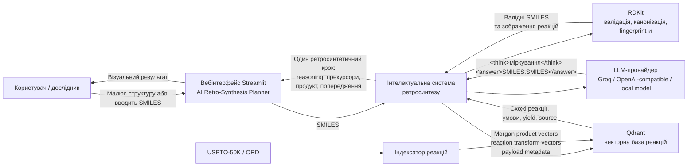
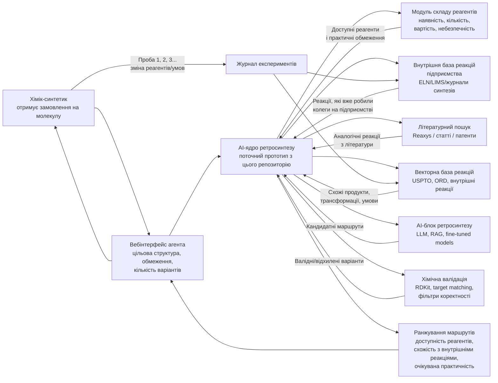
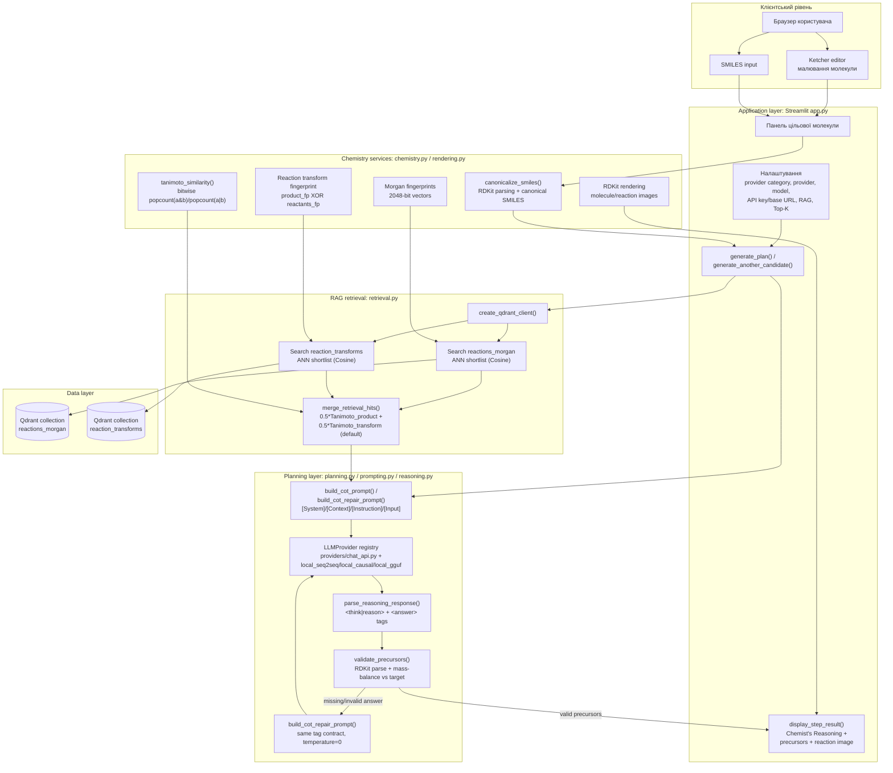
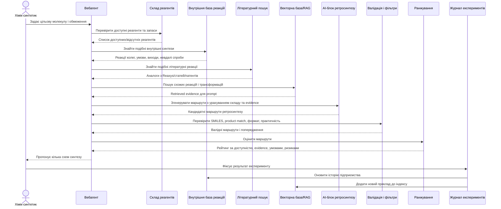
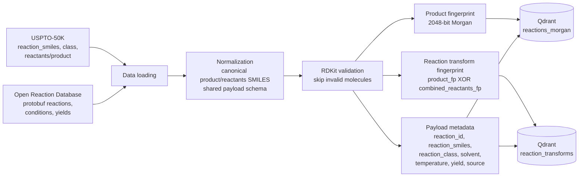
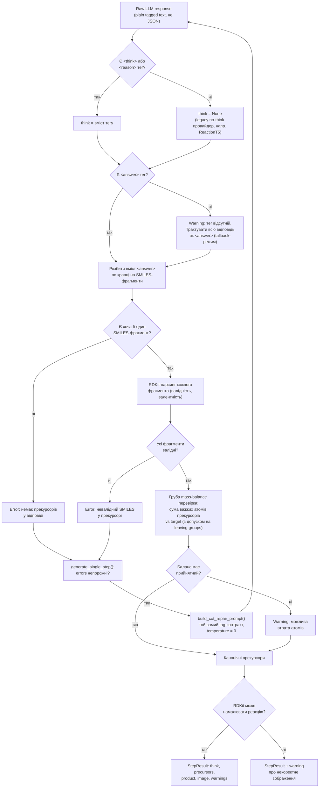
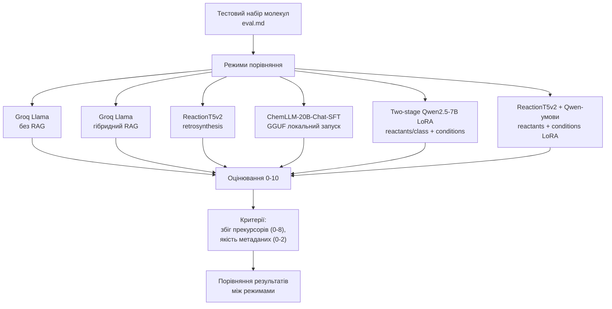

# Схеми інтелектуальної системи ретросинтезу органічних сполук

Користувач задає цільову молекулу через вебінтерфейс. Система валідовує SMILES,
отримує релевантні приклади реакцій з векторної бази, формує 4-блоковий CoT-промпт,
викликає один із зареєстрованих LLM-провайдерів, парсить відповідь за контрактом
`<think>/<reason>` + `<answer>` і відображає один ретросинтетичний крок (з опцією
згенерувати ще один кандидатний крок для того самого продукту).

У реалізації основними модулями є:

- `src/retro_planner/app.py` - Streamlit UI та оркестрація сценарію.
- `src/retro_planner/chemistry.py` - валідація, канонізація SMILES і fingerprint-и RDKit (включно з побітовим Tanimoto).
- `src/retro_planner/retrieval.py` - hybrid RAG пошук у Qdrant (Tanimoto product + transform score).
- `src/retro_planner/planning.py` - `generate_single_step()`: оркестрація виклику провайдера, парсингу й repair для одного кроку.
- `src/retro_planner/prompting.py` - 4-блоковий `[System]/[Context]/[Instruction]/[Input]` CoT-промпт і repair-промпт (англійською).
- `src/retro_planner/reasoning.py` - парсинг `<think>/<reason>` + `<answer>` тегів і хімічна валідація прекурсорів (RDKit, mass-balance).
- `src/retro_planner/providers/` - реєстр `LLMProvider`: `chat_api.py` (Groq/OpenAI/custom OpenAI-compatible) плюс `local_seq2seq.py`, `local_causal.py`, `local_gguf.py` для дослідницьких моделей поза чат-API.
- `src/retro_planner/rendering.py` і `streamlit_views.py` - візуалізація молекул, реакцій і "Chemist's Reasoning" блоку.
- `scripts/index_uspto50k_to_qdrant.py` - побудова векторної бази з USPTO-50K та ORD.
- `scripts/evaluate_retrosynthesis.py` та `src/retro_planner/evaluation.py` - автоматизоване Top-k/Structure Success Rate оцінювання на USPTO-50K.

## 1. Контекстна схема системи



## 2. Цільова схема системи для хімічного підприємства



## 3. Компонентна схема застосунку



## 4. Sequence-діаграма генерації одного ретросинтетичного кроку

```mermaid
sequenceDiagram
    actor User as Користувач
    participant UI as Streamlit UI (app.py)
    participant Chem as RDKit chemistry.py
    participant Retrieval as retrieval.py
    participant Qdrant as Qdrant vector DB
    participant Planner as planning.py<br/>generate_single_step()
    participant Prompt as prompting.py
    participant LLM as LLMProvider<br/>(chat_api / local_*)
    participant Reason as reasoning.py
    participant Render as RDKit rendering

    User->>UI: Вводить або малює цільову молекулу
    UI->>Chem: canonicalize_smiles(smiles)

    alt SMILES невалідний
        Chem-->>UI: None
        UI-->>User: Помилка "Invalid SMILES"
    else SMILES валідний
        Chem-->>UI: canonical_target_smiles
        UI->>Render: generate_molecule_image(target)
        Render-->>UI: Зображення цільової молекули
        User->>UI: Натискає Generate retrosynthesis

        alt RAG enabled
            UI->>Retrieval: retrieve_reactions_for_smiles(target, top_k)
            Retrieval->>Chem: generate_morgan_fingerprint(target)
            Chem-->>Retrieval: product vector
            Retrieval->>Chem: generate_reaction_fingerprint(target)
            Chem-->>Retrieval: transform vector
            Retrieval->>Qdrant: search reactions_morgan (ANN + vectors)
            Qdrant-->>Retrieval: product-similar hits
            Retrieval->>Qdrant: search reaction_transforms (ANN + vectors)
            Qdrant-->>Retrieval: transform-similar hits
            Retrieval->>Chem: tanimoto_similarity() rescoring on shortlist
            Retrieval->>Retrieval: merge_retrieval_hits() by hybrid score
            Retrieval-->>UI: top-K reactions (RAG_Examples) + warnings
        else RAG disabled
            UI->>UI: reactions = []
        end

        UI->>Planner: generate_single_step(GenerationRequest)
        Planner->>Prompt: build_cot_prompt(target, reactions)
        Prompt-->>Planner: [System]/[Context]/[Instruction]/[Input] prompt
        Planner->>LLM: generate(messages, json_mode=False)
        LLM-->>Planner: raw text with &lt;think&gt;/&lt;answer&gt;
        Planner->>Reason: parse_reasoning_response(raw)
        Reason-->>Planner: ReasoningResult(think, answer_smiles)
        Planner->>Reason: validate_precursors(answer_smiles, target)
        Reason-->>Planner: precursors | None, warnings, errors

        alt Прекурсори валідні
            Planner-->>UI: StepResult(think, precursors, product, warnings)
        else Answer відсутній/невалідний
            Planner->>Prompt: build_cot_repair_prompt(target, reactions, raw, errors)
            Prompt-->>Planner: repair prompt (same tag contract)
            Planner->>LLM: generate(repair prompt, temperature=0)
            LLM-->>Planner: corrected &lt;think&gt;/&lt;answer&gt; text
            Planner->>Reason: parse + validate_precursors again
            Planner-->>UI: StepResult(valid precursors або errors)
        end

        UI->>Render: generate_reaction_image(precursors, product)
        Render-->>UI: Reaction scheme image або warning
        UI-->>User: "Chemist's Reasoning" (think) + precursors + image + warnings

        opt User натискає "Generate another candidate"
            UI->>Planner: generate_single_step(GenerationRequest) again<br/>(same cached RAG reactions, no re-query)
            Planner-->>UI: додатковий StepResult -> "Candidate N"
        end
    end
```

## 5. Sequence-діаграма цільового виробничого сценарію

Файли: [PNG](diagrams/production_sequence.png), [PDF](diagrams/production_sequence.pdf), [Mermaid](diagrams/production_sequence.mmd)



## 6. Схема формування векторної бази реакцій



## 7. Схема валідації та постобробки результату LLM



## 8. Порівняння моделей



Автоматизоване доповнення до цього ручного порівняння: `scripts/evaluate_retrosynthesis.py`
рахує Top-1/3/5 exact match і Structure Success Rate на USPTO-50K для Zero-shot і RAG+CoT
режимів через будь-якого зареєстрованого провайдера (див. `LLM_PROVIDER_REGISTRY`).
